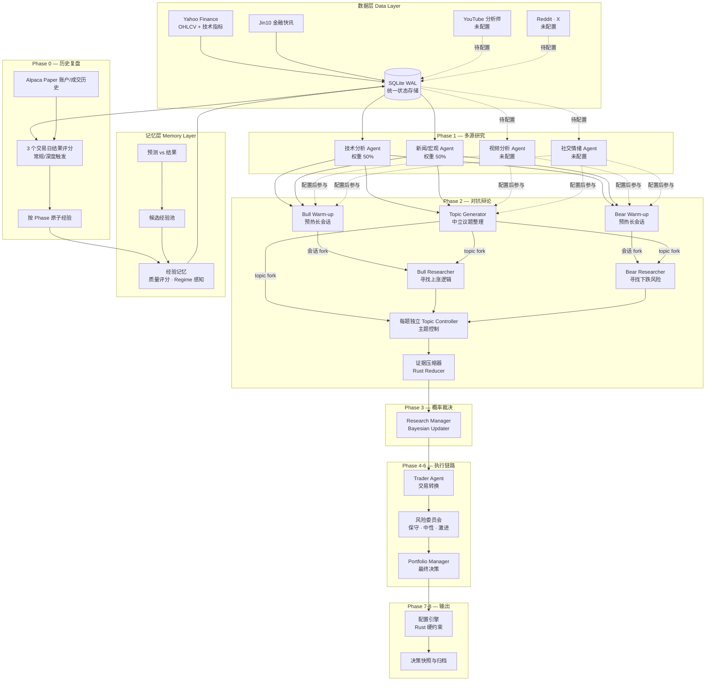

# Akzio Signal Intelligence

Rust-native market-signal research workflow for a small ETF universe. The production path uses Yahoo Finance, Jin10, SQLite WAL, and an OpenAI-compatible LLM gateway. VIX is a regime signal, not an investable asset.

## Current scope

Active Phase 1 analysts are fixed to:

| Role | Source | Weight | Critical |
|---|---|---:|---|
| `analyst.technical` | Yahoo OHLCV and precomputed indicators | 50% | yes |
| `analyst.news_macro` | Jin10 flash news and macro events | 50% | yes |

YouTube and Reddit/X remain explicit extension points, but their ingestion, SQLite
contexts, and Phase 1 roles are currently unconfigured; they are not scheduled or
counted as evidence. A failed critical analyst aborts the run before probability
and allocation phases; it is never converted into a neutral 0.5 vote.

## Workflow



Phase 2 begins with three concurrent LLM calls: the neutral Topic Generator,
Bull warm-up, and Bear warm-up. The Topic Generator uses only the forked Phase 1
index and prior phase summaries; Rust rejects external-fact or schema-breaking
output and retains a deterministic conflict fallback. Each selected topic then
forks Bull and Bear from their warm-up turns and starts its own Topic Controller
from the Topic Generator turn. Topics run concurrently, while turns inside one
topic remain controller-routed. When no material hinge exists, Phase 2 records a
no-debate artifact and still advances to Phase 3.

Trader, the three-perspective risk committee, and Portfolio Manager are
mandatory in the default `legacy` policy. Allocation is always computed and
validated in Rust, and Portfolio Manager `wait` or `downgrade` decisions force a
cash-only allocation. In a non-mock, non-debug run, Phase 0 reads the
project-only Alpaca Paper account, positions, and recent fills. Phase 6 can read
the account and current prices, then submit a paper order constrained
by the Phase 4 position size and the strictest Phase 5 position cap. `--mock`
and `--debug` remove all Alpaca tools from the model and make the tool runtime
reject direct calls.

## Workspace crates

| Crate | Responsibility |
|---|---|
| `orchestrator-core` | Config paths, role registry, ticker parsing, canonical schemas and validators |
| `orchestrator-sql` | WAL schema, ingestion imports, scoped messages, phase summaries and memory storage |
| `orchestrator-llm` | Responses/Chat Completions streaming, bounded agent loop, tool execution and structured-output parsing |
| `orchestrator-ingest` | Yahoo technical ingestion and Jin10 ingestion |
| `orchestrator-workflow` | Phase orchestration, policy gates, reducers, probability and allocation guards |
| `orchestrator-cli` | CLI binaries, reporting, operations, metrics and prompt linting |

There is no long-running service entry point. `orchestrator-exec` is the workflow entry point and opens SQLite through `orchestrator-sql`.

## Requirements

- Rust stable, edition 2021
- Network access to Yahoo Finance and Jin10
- An OpenAI-compatible gateway key for non-mock workflow runs
- `EXA_API_KEY` only when live Exa web search is enabled
- `ALPACA_API_KEY` and `ALPACA_API_SECRET` for Phase 0 account/fill retrieval and Phase 6 Paper Trading execution

Set secrets through the environment. The repository contains no key fallback:

```bash
export LLM_GATEWAY_API_KEY='...'
export LLM_GATEWAY_BASE_URL='https://your-gateway.example/v1'
export EXA_API_KEY='...'
export ALPACA_API_KEY='...'
export ALPACA_API_SECRET='...'
```

`config/config.yaml` maps `orchestrator.alpaca.api_key` and
`orchestrator.alpaca.api_secret` to the two Alpaca environment variables. The
integration intentionally uses `paper-api.alpaca.markets`; no live-brokerage
endpoint, registration, or alternate-account flow is implemented.

Report email credentials are only needed by `report-email`:

```bash
export REPORT_SMTP_USERNAME='...'
export REPORT_SMTP_PASSWORD='...'
export REPORT_SMTP_FROM='...'
export REPORT_SMTP_TO='...'
```

## Ingestion

Ingest real Yahoo data for the configured research universe:

```bash
rtk cargo run -p orchestrator-cli --bin orchestrator-ingest -- \
  --db-path outputs/orchestrator.sqlite \
  technical-indicators \
  --symbols QQQ,SOXX,VIX \
  --start 2026-05-01 \
  --end 2026-07-22 \
  --intervals 1d,3h,20min \
  --sleep 0 \
  --timeout 20
```

Ingest Jin10:

```bash
rtk cargo run -p orchestrator-cli --bin orchestrator-ingest -- \
  jin10-flash --pages 2 --lookback-hours 24 --timeout 20
```

Technical CSV is an ingestion interchange only. With `--db-path`, the CLI atomically replaces the configured ticker/interval window in `technical_bars`, one indexed row per bar. Jin10 always writes its raw preflight feed to `outputs/jin10/YYYY-MM-DD.csv`; `read_jin10_context` reads that CSV, and only items that the news analyst assigns a Jin10 attention score are persisted to `jin10_items`.

Independent Yahoo ticker/interval CSV downloads run concurrently (default: 10). Set `--parallelism N` to adjust the batch size; `--sleep S` waits `S` seconds between batches to manage provider rate limits.

The workflow refreshes both sources during Phase 1. Use `--tech-refresh-enabled=false` only when all required ticker/interval CSVs already exist for preflight import. Jin10 lookback is controlled by `--jin10-refresh-lookback-hours`; its SQLite import remains deferred until the news analyst scores an item.

## Run the workflow

Active prompts are owned by the phase that executes them:

| Directory | Runtime owner |
|---|---|
| `prompts/phase0/` | Historical outcome reflection |
| `prompts/phase_summary/` | Completed-phase summary compressor |
| `prompts/phase1/` | Technical and news/macro analysts |
| `prompts/phase2/` | Topic Generator, Bull, Bear, Topic Controller, and the topic-fork message |
| `prompts/phase3/` | Research Manager |
| `prompts/phase4/` | Trader |
| `prompts/phase5/` | Aggressive, neutral, and conservative risk reviewers |
| `prompts/phase6/` | Portfolio Manager |
| `prompts/common/` | Shared prompt components and contracts |
| `prompts/system/` | Agent-loop and runtime messages |

`prompts/common/analysis_trace.md` is injected into every analytical Phase 2-6
role and the Phase Summary compressor. It adds a top-level, auditable
`analysis_trace` to role artifacts without exposing private chain-of-thought;
the compressor condenses those traces into `summary_json.analysis_process` with
stable source references.

`prompts/common/experience.md` is injected into every Phase 1-6 role. The
runtime preloads `read_experience` per ticker, and each role must trace which
experience IDs it applied or rejected. Experience is advisory and cannot
replace current evidence.

There is deliberately no `phase25` bucket. Phase 2 topic generation is an LLM
role with a Rust-owned evidence gate and runtime envelope; final debate reduction
remains Rust-owned. Phase 7 allocation and Phase 8 decision snapshot/archive are
also Rust-owned stages. After each business phase, the workflow runs the Phase Summary
compressor before starting the next phase.

```bash
rtk cargo run -p orchestrator-cli --bin orchestrator-exec -- \
  --from-phase 0 \
  --to-phase 8
```

Useful options:

- `--db-path PATH`: override the SQLite database.
- `--run-dir PATH`: emit `state.json` and a final summary for inspection.
- `--debug`: print workflow and agent-loop debug logs to the console, and write per-role request/response snapshots plus timing and token JSON arrays.
- `--max-debate-rounds N`: cap conditional debate rounds.
- `--max-topics-per-side N`: cap material conflict topics.

`--mock` exists only for local tests and development. It is not evidence that the production workflow or external services work.

`--from-phase` accepts `0-8` and defaults to `0`; `--to-phase 0` runs only
historical reflection/retrieval. Mock runs skip Alpaca and all learning writes.

## Learning loop

A non-mock default run starts with Phase 0 and records the current decision in
Phase 8:

1. Phase 0 reads Alpaca Paper account, positions, and recent fills while scoring matured
   prior decisions on the third stored trading bar. This is an evaluation
   horizon, not a forced trade or forced close.
2. Every matured outcome receives routine reflection. Loss, benchmark
   underperformance, wrong direction, confidence mismatch, risk violation, or a
   repeated error upgrades it to deep reflection.
3. The reflector reads only the allowlisted prior run's phase-summary indexes
   and details. Rust validates evidence IDs, taxonomy, phase scope, and the
   deterministic pattern key before saving atomic experience.
4. One case remains a low-weight recent episode; two distinct matching runs
   create a repeated warning; three qualify the pattern for active memory.
5. Phase 8 records a three-trading-day decision snapshot for each analyzed
   ticker, including Hold/current-position decisions, without requiring an order.

The current prediction never scores itself, mock runs never write learning
memory, and repeated processing is idempotent. Alpaca order IDs persist with the
exact `run_id`; remote fills are observational only, so attribution remains
limited to this project's locally recorded orders.
Malformed experience writes fail closed, while reflection failure remains
non-blocking for the investment decision. Set
`orchestrator.reflection.enabled: false` to disable retrieval and learning, or
use `promote_mode: review` for manual review.

The `orchestrator-ops` reflection commands remain available for inspection and
explicit reruns of scoring, distillation, or promotion.

## Reliability contracts

- Both Phase 1 roles must cover every requested ticker with non-empty, attributed, timestamped, non-duplicate evidence.
- JSON validity alone never makes an analyst artifact usable.
- Probabilities must be finite, inside `[0,1]`, and long/short must be coherent.
- Manager output cannot replace missing evidence with a default 0.5 result.
- Responses streams require `response.completed`; Chat Completions streams require a terminal `finish_reason`.
- Tool calls require a non-empty `call_id`, name, and valid accumulated JSON arguments.
- Technical tools and downstream phases read SQLite only. The news analyst reads its preflight Jin10 CSV; only attention-scored Jin10 items enter SQLite.
- Tool payload history is bounded to 16,000 characters by default.
- Allocation excludes VIX, rejects missing per-ticker research, enforces non-negative finite weights, per-asset caps, cash constraints, and a total weight of 1.0.
- Post-run learning is outcome-backed, idempotent, and outside the decision-critical research path; only qualified, non-mock experience is admitted to durable memory for a later run.

SQLite connections use versioned, transactional migrations plus WAL, `synchronous=NORMAL`, foreign keys, and a busy timeout. Scoped agent messages carry run/turn/role identity; validated artifacts are written before final run archive state.

Database maintenance is explicit and never runs `VACUUM` during workflow startup:

```bash
# Read-only integrity, density, schema, and query-plan report
rtk cargo run -p orchestrator-cli --bin orchestrator-ops -- db-doctor \
  --db-path outputs/orchestrator.sqlite

# Preview retention changes; pass --dry-run=false to apply
rtk cargo run -p orchestrator-cli --bin orchestrator-ops -- db-cleanup \
  --db-path outputs/orchestrator.sqlite --dry-run=true

# Explicit WAL and file maintenance
rtk cargo run -p orchestrator-cli --bin orchestrator-ops -- db-checkpoint \
  --db-path outputs/orchestrator.sqlite --truncate
rtk cargo run -p orchestrator-cli --bin orchestrator-ops -- db-vacuum \
  --db-path outputs/orchestrator.sqlite
```

## Validation

Run before handing off changes:

```bash
rtk cargo fmt --all -- --check
rtk cargo check --workspace --all-targets
rtk cargo clippy --workspace --all-targets --all-features -- -D warnings
rtk cargo test --workspace --all-features
rtk cargo build --release --workspace
```

Prompt lint:

```bash
rtk cargo run -p orchestrator-cli --bin orchestrator-prompt-lint
```

Generated SQLite files, `outputs/`, debug logs, release artifacts, and credentials must not be committed.
