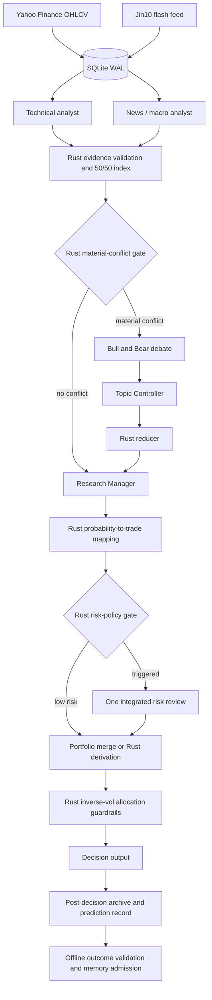

# Akzio Signal Intelligence

Rust-native market-signal research workflow for a small ETF universe. The production path uses Yahoo Finance, Jin10, SQLite WAL, and an OpenAI-compatible LLM gateway. VIX is a regime signal, not an investable asset.

## Current scope

Active Phase 1 analysts are fixed to:

| Role | Source | Weight | Critical |
|---|---|---:|---|
| `analyst.technical` | Yahoo OHLCV and precomputed indicators | 50% | yes |
| `analyst.news_macro` | Jin10 flash news and macro events | 50% | yes |

YouTube, Reddit, X/Twitter, video analysis, and social sentiment are not compiled, scheduled, prompted, persisted, or counted as evidence. A failed critical analyst aborts the run before probability and allocation phases; it is never converted into a neutral 0.5 vote.

## Workflow



The deterministic topic generator only schedules debate for medium/high `direction_conflict`, `confidence_divergence`, or `evidence_contradiction`. Evidence overlap is handled as duplicate evidence in Rust and does not trigger an LLM debate. Risk review is conditional and uses one LLM role. Allocation is always computed and validated in Rust.

## Workspace crates

| Crate | Responsibility |
|---|---|
| `orchestrator-core` | Config paths, role registry, ticker parsing, canonical schemas and validators |
| `orchestrator-sql` | WAL schema, ingestion imports, scoped messages, phase summaries and memory storage |
| `orchestrator-llm` | Responses/Chat Completions streaming, bounded agent loop, tool execution and structured-output parsing |
| `orchestrator-ingest` | Yahoo technical ingestion and Jin10 ingestion |
| `orchestrator-workflow` | Phase orchestration, policy gates, reducers, probability and allocation guards |
| `orchestrator-cli` | CLI binaries, reporting, operations, metrics and prompt linting |

There is no long-running service entry point. `orchestrator-exec` is the workflow entry point and opens SQLite through `orchestrator-sql`.

## Requirements

- Rust stable, edition 2021
- Network access to Yahoo Finance and Jin10
- An OpenAI-compatible gateway key for non-mock workflow runs
- `EXA_API_KEY` only when live Exa web search is enabled

Set secrets through the environment. The repository contains no key fallback:

```bash
export LLM_GATEWAY_API_KEY='...'
export LLM_GATEWAY_BASE_URL='https://your-gateway.example/v1'
export EXA_API_KEY='...'
```

Report email credentials are only needed by `report-email`:

```bash
export REPORT_SMTP_USERNAME='...'
export REPORT_SMTP_PASSWORD='...'
export REPORT_SMTP_FROM='...'
export REPORT_SMTP_TO='...'
```

## Ingestion

Ingest real Yahoo data for the configured research universe:

```bash
rtk cargo run -p orchestrator-cli --bin orchestrator-ingest -- \
  --db-path outputs/orchestrator.sqlite \
  technical-indicators \
  --symbols QQQ,SOXX,VIX \
  --start 2026-05-01 \
  --end 2026-07-22 \
  --intervals 1d,3h,20min \
  --sleep 0 \
  --timeout 20
```

Ingest Jin10:

```bash
rtk cargo run -p orchestrator-cli --bin orchestrator-ingest -- \
  jin10-flash --pages 2 --lookback-hours 24 --timeout 20
```

Technical CSV is an ingestion interchange only. With `--db-path`, the CLI atomically replaces one compact `technical_series` row per ticker/interval. Jin10 always writes its raw preflight feed to `outputs/jin10/YYYY-MM-DD.csv`; `read_jin10_context` reads that CSV, and only items that the news analyst assigns a Jin10 attention score are persisted to `jin10_items`.

The workflow refreshes both sources during Phase 1. Use `--tech-refresh-enabled=false` only when all required ticker/interval CSVs already exist for preflight import. Jin10 lookback is controlled by `--jin10-refresh-lookback-hours`; its SQLite import remains deferred until the news analyst scores an item.

## Run the workflow

```bash
rtk cargo run -p orchestrator-cli --bin orchestrator-exec -- \
  --from-phase 1 \
  --to-phase 8
```

Useful options:

- `--db-path PATH`: override the SQLite database.
- `--run-dir PATH`: emit `state.json` and a final summary for inspection.
- `--debug`: write bounded per-role request/response and timing/token JSONL.
- `--max-debate-rounds N`: cap conditional debate rounds.
- `--max-topics-per-side N`: cap material conflict topics.

`--mock` exists only for local tests and development. It is not evidence that the production workflow or external services work.

## Reliability contracts

- Both Phase 1 roles must cover every requested ticker with non-empty, attributed, timestamped, non-duplicate evidence.
- JSON validity alone never makes an analyst artifact usable.
- Probabilities must be finite, inside `[0,1]`, and long/short must be coherent.
- Manager output cannot replace missing evidence with a default 0.5 result.
- Responses streams require `response.completed`; Chat Completions streams require a terminal `finish_reason`.
- Tool calls require a non-empty `call_id`, name, and valid accumulated JSON arguments.
- Technical tools and downstream phases read SQLite only. The news analyst reads its preflight Jin10 CSV; only attention-scored Jin10 items enter SQLite.
- Tool payload history is bounded to 16,000 characters by default.
- Allocation excludes VIX, rejects missing per-ticker research, enforces non-negative finite weights, per-asset caps, cash constraints, and a total weight of 1.0.
- Reflection/outcome promotion is outside the decision-critical research path; only validated outcomes are admitted to durable memory.

SQLite connections enable WAL and a busy timeout. Scoped agent messages carry run/turn/role identity; validated artifacts are written before final run archive state.

## Validation

Run before handing off changes:

```bash
rtk cargo fmt --all -- --check
rtk cargo check --workspace --all-targets
rtk cargo clippy --workspace --all-targets --all-features -- -D warnings
rtk cargo test --workspace --all-features
rtk cargo build --release --workspace
```

Prompt lint:

```bash
rtk cargo run -p orchestrator-cli --bin orchestrator-prompt-lint
```

Generated SQLite files, `outputs/`, debug logs, release artifacts, and credentials must not be committed.
