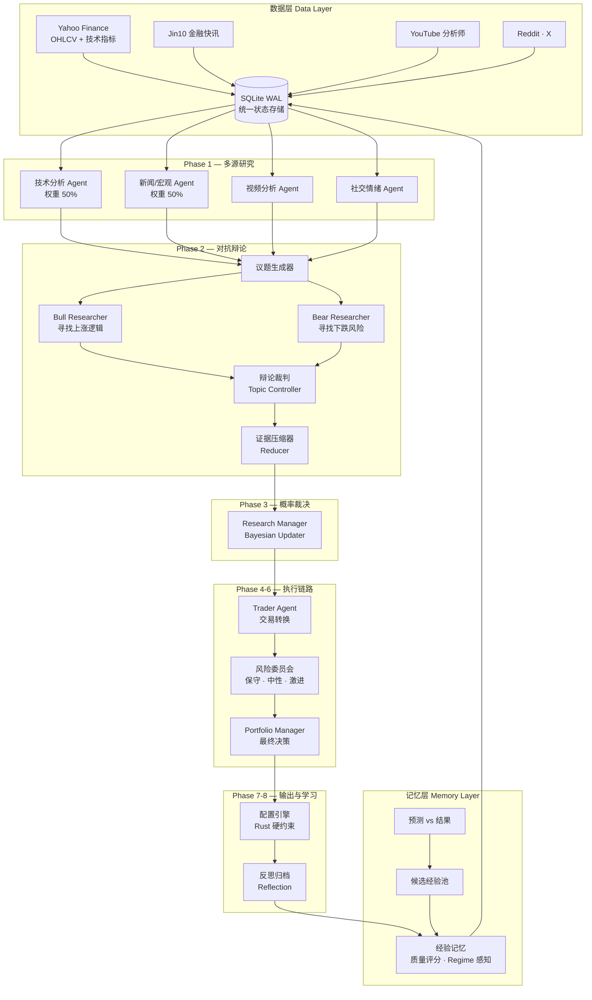

<p align="center">
  <h1 align="center">Akzio Signal Intelligence</h1>
  <p align="center">
    <strong>Rust-native Multi-Agent Investment Research Engine</strong>
  </p>
  <p align="center">
    一个自主运行的 AI 投资研究团队 —— 它辩论、校准概率、管理风险，并从历史决策中持续学习。
  </p>
</p>

<p align="center">
  
  
  
  
  
</p>

---

**免责声明**：本系统是投资研究辅助工具，不构成投资建议。所有输出应作为决策过程中的参考信号之一，而非直接交易指令。

---

## Overview

### 为什么需要这个系统

大语言模型改变了信息处理方式，但将 LLM 直接用于投资决策存在根本性缺陷：

| 问题 | 后果 |
|------|------|
| **单模型观点偏差** | 模型倾向于确认自身假设，没有内部挑战机制 |
| **缺乏反方验证** | 所有证据都被同一个模型解读，confirmation bias 不可避免 |
| **没有概率校准** | "看涨"或"看跌"缺少量化置信度，无法指导仓位 |
| **没有失败复盘** | 错误判断不被记录、不被分析、不改善未来决策 |
| **没有长期经验积累** | 每次分析从零开始，不具备机构记忆 |

Akzio Signal Intelligence 的回答不是"让 AI 更擅长预测"，而是：

> **构建一个具备辩论、校准、风控、记忆能力的 AI 投资研究流程。**

它模拟真实投资机构中的完整决策链路：

```
Research Team → Investment Committee → Risk Committee → Portfolio Manager → Post-Mortem
```

---

## Core Philosophy

### Research ≠ Prediction

本系统不是：

```
Input:  股票代码
Output: 买 / 卖
```

本系统是：

```
Input:   多维市场证据（技术面、宏观、新闻、社交媒体、视频分析）
Process: 多 Agent 独立推理 → 对抗辩论 → 证据加权 → 概率更新
Output:  概率分布 + 置信区间 + 风险约束 + Portfolio Allocation
```

核心问题不是：

> "AI 能不能预测股票？"

而是：

> "AI 能不能构建一个持续学习、自我修正的研究流程？"

---

## System Architecture



---

## Workflow Engine

系统执行确定性 8 阶段流水线。每个阶段可通过 `--from-phase` / `--to-phase` 独立寻址。

### Phase 1 — 多源研究（Multi-Source Research）

**目的**：从多个独立数据源收集市场证据，形成初始分析基础。

**输入**：
- SQLite 中的技术指标数据（60 日窗口）
- 金融快讯（Jin10，24 小时回溯）
- YouTube 分析师视频逐字稿
- Reddit / X 社交媒体内容
- 历史记忆注入（Phase 0 Reflection）

**处理**：
- 多个 Analyst Agent 并行执行（可配置并行度）
- 每个 Agent 具有独立权重
- Preflight 检查确保 SQLite 中存在必需数据
- 关键角色（technical, news_macro）失败触发降级标记

**输出**：
- 结构化分析 Artifact（JSON schema 强约束）
- 每个 Agent 的置信度评分
- 加权后的 Base Probability

| Agent | 数据源 | 默认权重 |
|-------|--------|----------|
| `technical` | Yahoo Finance OHLCV + 指标 | 50% |
| `news_macro` | Jin10 快讯 + Web Search | 50% |
| `youtube` | 视频分析师逐字稿 | 可配置 |
| `reddit` | Subreddit 情绪 | 可配置 |
| `x` | Twitter/X 帖子 | 可配置 |

---

### Phase 2 — 对抗辩论（Adversarial Debate）

**目的**：通过结构化多轮辩论消除单方向偏差，确保每个重要观点都被正反两方检验。

**输入**：
- Phase 1 所有 Agent 的分析 Artifact
- 当前市场 Regime 信息

**处理**：

1. **议题生成** — Mediator 从 Phase 1 证据中提取可辩论议题
2. **多轮辩论** — Bull/Bear Researcher 就每个议题进行 N 轮交锋（默认 3 轮）
3. **辩论裁判** — Topic Controller 评估论据质量，决定何时结束
4. **证据压缩** — Reducer 将辩论输出压缩为加权证据摘要

**输出**：
- 每个议题的净证据方向和强度
- 压缩后的辩论摘要
- Debate Adjustment 值

---

### Phase 3 — 贝叶斯概率裁决（Bayesian Probability Adjudication）

**目的**：将所有证据合成为校准后的概率判断。**不是重新预测市场。**

**输入**：
- Weighted Base Probability（来自 Phase 1 权重加总）
- Debate Adjustment（来自 Phase 2 辩论净值）
- Evidence Strength（各信号的证据强度）
- Market Regime（波动率、趋势、流动性、利率、广度）

**处理**：

```
Final Probability = Base Probability + Debate Adjustment + Evidence Modifier
```

**硬约束**：
- 单信号调整幅度上限 **±8%**
- 最终概率限制在 `[0.05, 0.95]` 区间
- 必须输出 Confidence 评分
- 高波动率 Regime 自动扩大不确定性带

**输出**：

```json
{
  "long_probability": 0.63,
  "short_probability": 0.37,
  "confidence": 0.72,
  "investment_thesis": "...",
  "market_regime": {
    "volatility": "medium",
    "trend": "bullish",
    "liquidity": "normal"
  }
}
```

---

### Phase 4 — 交易转换（Trading Translation）

**目的**：将研究结论转化为可执行的交易参数。

**输入**：Research Plan（Phase 3 输出）

**处理**：
- LLM Trader Agent 生成方向、仓位逻辑、入场条件
- 当 Policy 信号指示高置信度 + 明确方向时，启用 **Rust 规则引擎** 绕过 LLM 进行确定性转换

**输出**：交易意图（方向、凸性、仓位建议）

---

### Phase 5 — 风险辩论（Risk Debate）

**目的**：模拟风险委员会对交易方案的压力测试。

**输入**：Trader 输出 + Research Plan

**处理**：

三位不同风格的风险分析师同时评估：

| 角色 | 视角 |
|------|------|
| `conservative` | 最大回撤、尾部风险、相关性暴露 |
| `neutral` | 风险回报平衡、仓位适当性 |
| `aggressive` | 低配机会成本 |

**输出**：综合风险评估 + 仓位调整建议

---

### Phase 6 — 最终决策（Portfolio Manager）

**目的**：整合交易意图和风险评估，生成人类可读的投资决策。

**输入**：Trade Intent + Risk Assessment

**输出**：Final Trade Decision（含理由链）

---

### Phase 7 — 组合配置（Allocation）

**目的**：Rust 硬约束下的组合构建。

**Rust 层强制执行**：
- 权重归一化至 100%
- 可投资资产宇宙验证（`orchestrator.allocation.investable_assets`）
- 单标的仓位上限
- 现金下限保护

**输出**：

```json
{
  "QQQ": 0.45,
  "SOXX": 0.30,
  "Cash": 0.25
}
```

---

### Phase 8 — 反思归档（Reflection & Archive）

**目的**：记录预测、为未来 Outcome Scoring 播种。

**处理**：
- 持久化结构化 Prediction 记录（ticker、date、probabilities、regime）
- 归档 Run 元数据（耗时、模型版本、降级状态）
- 启动 Reflection Pipeline 的数据准备

---

## Agent Architecture

### 设计原则

每个 Agent 运行在 Agent Loop 中（基于 async-openai + OpenAI Responses API），具备：

- **作用域隔离的 SQLite 上下文** — `read_run_context` 工具提供时间窗口和 Ticker 过滤后的精确数据
- **结构化输出契约** — Prompt 层 JSON Schema 强约束输出格式（通过 `common/` 共享组件标准化）
- **Turn 级持久化** — 每个 Agent Turn 的完整对话上下文、Token 用量和成本存入 `agent_events`
- **优雅降级** — 失败的 Agent 产生 Degraded 标记，后续阶段在降低置信度下继续运行
- **Web Search 能力** — Exa MCP 驱动的实时搜索（可配置 context_size 和 max_result_chars）
- **注意力机制** — `attention_ledger` 记录各角色对关键主题的关注度评分
- **冲突检测** — Trader 输出与 Research 结论的一致性自动校验
- **Plugin 组件系统** — `ComponentRegistry` 支持可组合的 Prompt 组件注入
- **防注入保护** — 所有 Prompt 自动包含 `anti_injection.md` 安全指令

### 角色体系

```
prompts/
├── analysts/                # Phase 1 研究 Agent
│   ├── technical.md         # 技术分析
│   ├── news_macro.md        # 新闻/宏观
│   ├── youtube.md           # 视频分析
│   ├── reddit.md            # Reddit 情绪
│   └── x.md                # Twitter/X
├── researchers/             # Phase 2 辩论 Agent（多阶段 Prompt）
│   ├── bull.md              # 看多系统 Prompt
│   ├── bull_initial.md      # 看多初始立论
│   ├── bull_interaction.md  # 看多对辩交互
│   ├── bull_initial_monitor.md  # Monitor 模式看多
│   ├── bear.md              # 看空系统 Prompt
│   ├── bear_initial.md      # 看空初始立论
│   ├── bear_interaction.md  # 看空对辩交互
│   └── bear_initial_monitor.md  # Monitor 模式看空
├── mediators/               # 辩论编排
│   ├── topic_generation.md  # 议题提取
│   └── topic_controller.md  # 辩论裁判
├── managers/                # 决策综合
│   ├── research_manager.md  # 贝叶斯概率裁决
│   └── portfolio_manager.md # 最终投资决策
├── traders/                 # 交易转换
│   └── trader.md
├── risk/                    # 风险委员会
│   ├── conservative.md
│   ├── neutral.md
│   └── aggressive.md
├── allocation/              # 配置管理
│   └── manager.md
├── common/                  # 共享 Prompt 组件
│   ├── anti_injection.md           # 防注入指令
│   ├── analyst_output_contract.md  # Analyst 输出契约
│   ├── analyst_output_structure.md # 输出结构规范
│   ├── leveraged_etf_rules.md      # 杠杆 ETF 规则
│   ├── research_calibration.md     # 研究校准指导
│   ├── research_drivers.md         # 驱动因子分析框架
│   └── risk_analyst.md             # 风险分析师通用规则
└── components/              # 可组合 Prompt 组件（Plugin 注册）
    └── ticker/
        └── component.md     # Ticker 级上下文注入
```

---

## Decision Engine

### 为什么是 Probability-First，不是 LLM Direct Trading

| 方法 | 失败模式 |
|------|----------|
| "TQQQ 会涨吗？" | 锚定效应、近因偏差、虚构的确定性 |
| "基于这 12 条证据，调整 base probability ±X%" | 有界、可审计、抗单点失效 |

### 决策公式

```
Prior Probability (加权 Analyst 基础概率)
    ×
Evidence Weight (证据强度系数)
    +
Debate Adjustment (辩论净方向)
    =
Posterior Probability (校准后概率)
```

### 职责分离

| 层 | 职责 |
|----|------|
| **LLM** | 推理、证据解读、论据构建 |
| **Rust** | 约束执行、概率边界、权重归一化、Policy 门控 |

LLM 负责 *thinking*，Rust 负责 *decision safety*。

### Workflow Policy 系统

`WorkflowPolicyMode::Selective` 在执行昂贵的 LLM Phase 之前评估信号：

| Policy Reason | 触发条件 | 效果 |
|---------------|----------|------|
| `LOW_CONFIDENCE` | 概率接近 0.5 + 低置信度 | 触发额外审查 |
| `HIGH_VOLATILITY` | VIX 飙升或 Regime 波动率升高 | 自动降低仓位上限 |
| `TRADE_RESEARCH_CONFLICT` | Trader 输出与 Research 矛盾 | 触发冲突调和 |
| `PROBABILITY_NEAR_NEUTRAL` | 方向不明确 | 偏向现金配置 |
| `RESEARCH_DEGRADED` | Phase 1 降级 | 限制下游置信度 |
| `HIGH_CORRELATION` | 标的间高相关性 | 分散化要求 |

---

## Reflection Layer

这是系统的核心竞争力 — **从失败中学习**。

```
┌─────────────┐     ┌─────────────┐     ┌──────────────────┐
│ Prediction  │────▶│   Outcome   │────▶│   Evaluation     │
│             │     │             │     │                  │
│ · 概率判断  │     │ · 实际收益  │     │ · 方向正确？     │
│ · 市场 Regime│     │ · N日后价格 │     │ · 概率误差多大？ │
│ · 置信度    │     │             │     │ · 哪个信号有效？ │
└─────────────┘     └─────────────┘     └──────────────────┘
                                                  │
                                                  ▼
                                        ┌──────────────────┐
                                        │   Candidate      │
                                        │   Experience     │
                                        │                  │
                                        │ · Finding        │
                                        │ · Recommendation │
                                        │ · Effect Size    │
                                        │ · Sample Count   │
                                        └──────────────────┘
                                                  │
                                          Quality Gate
                                          (置信度 + 样本量 + 效应量)
                                                  │
                                                  ▼
                                        ┌──────────────────┐
                                        │  Active Memory   │
                                        │                  │
                                        │ · Regime 标签    │
                                        │ · 质量评分       │
                                        │ · 版本化内容     │
                                        │ · 过期机制       │
                                        └──────────────────┘
                                                  │
                                                  ▼
                                        ┌──────────────────┐
                                        │  Phase 0 注入    │
                                        │  (未来运行)      │
                                        └──────────────────┘
```

### 记忆生命周期

1. **记录预测** — 每次运行存储 ticker、date、概率、regime
2. **结果评分** — `reflection_score` 在 N 日后对比预测与实际收益
3. **候选生成** — `weekly_distill` 聚合评分结果为经验候选
4. **质量门控** — 候选需满足最低样本量、置信度和效应量
5. **晋升激活** — `memory_promote` 将通过审核的候选提升为活跃记忆
6. **检索注入** — 未来运行中按 ticker、scope、当前 regime 兼容性检索相关记忆

### 记忆作用域

| Scope | 示例 |
|-------|------|
| `ticker` | "QQQ 在低波动率 Regime 中 3 日跌幅超 5% 后倾向均值回归" |
| `sector` | "半导体板块在 Fed 利率不确定期表现滞后" |
| `macro` | "市场广度背离通常领先修正 2-3 周" |
| `market_regime` | "高波动率 Regime 偏好小仓位和宽止损" |
| `strategy` | "当 VIX 从低位转中位时动量信号衰减" |
| `agent` | "技术分析 Agent 在震荡市中过度依赖 RSI 背离" |

---

## Database Architecture

单一 SQLite 数据库（WAL 模式，5s busy timeout），设计思想：**一切可追溯、一切可回放**。

### 设计理念

| 模块 | 用途 | 价值 |
|------|------|------|
| **Run Archive** | 保存每次完整研究过程 | 任意历史运行可回放审计 |
| **Agent Turns** | 保存每次 LLM 对话轮次 | Token 用量分析、质量追踪 |
| **Predictions** | 保存当时概率判断 | Outcome Scoring 的基准线 |
| **Outcomes** | 保存实际市场结果 | 验证系统校准度 |
| **Candidate Experiences** | 保存待晋升的学习成果 | 质量门控，防止噪声记忆 |
| **Memory Items** | 保存活跃经验记忆 | 未来运行的先验知识 |
| **Prompt Metrics** | Token 使用、延迟、成本 | 运营成本监控和优化 |
| **Technical Indicators** | 多周期 OHLCV + 指标 | 可重放的数据快照 |

### 核心表结构

```
runs                    ← 运行元数据、状态、耗时
agent_events            ← 每 Turn 完整对话上下文 + Token 用量 + 成本 + 缓存统计
role_turn_summaries     ← 各角色的结构化分析输出
predictions             ← 校准后的概率预测
outcomes                ← 实际收益 vs 预测
memory_items            ← 活跃经验记忆（版本化）
memory_versions         ← 记忆内容版本 + 证据引用
candidate_experiences   ← 预晋升的经验候选
jin10_items             ← Jin10 快讯（id=md5, content_json, attention_score 缓存）
phase_summaries         ← 每阶段压缩总结（运行时权威在内存；run 结束 flush 到 SQLite）
phase_summary_details   ← 详细点 → 所属 summary_id
attention_ledger        ← 统一注意力评分（role/turn_id/subject/score）
```

技术指标不入库：Yahoo 多周期序列写到 `outputs/technical/` CSV（如 `qqq_day.csv`、`qqq_3h.csv`、`vix_20min.csv`），每个级别默认保留最近 60 条 K 线。Jin10 快讯同样支持 CSV 缓存到 `outputs/jin10/`。

时间字段统一使用 Unix 时间戳（INTEGER）存储。

---

## Engineering Design

### 为什么是 Rust

| 特性 | 价值 |
|------|------|
| **类型系统** | 编译期保证 Allocation 权重归一化、概率边界、Policy 枚举完备 |
| **所有权模型** | 长时间运行（8 Phase × 多轮辩论）无内存泄漏 |
| **async/await** | Phase 1 多 Agent 并发调度，不阻塞辩论评估 |
| **零成本抽象** | Workflow Policy 判断在纳秒级完成，不增加 LLM 调用延迟 |
| **Crate 边界** | 强制模块化 — 每个 Crate 有明确职责和公开 API |
| **rusqlite bundled** | 单二进制部署，无外部数据库依赖 |

### Crate 结构

Workspace 包含 6 个成员 crate：

```
crates/
├── orchestrator-core       # 配置、路径、Ticker 解析、Prompt 辅助、Artifact 类型与校验
│                           # Reflection 类型、Token 定价、Plugin Manifest、Role Registry
│                           # 技术指标 CSV / Jin10 CSV 读写
├── orchestrator-sql        # SQLite Schema、数据访问、Context 检索、Memory 操作
│                           # Phase 索引 / 注意力账本 / Phase00 Gate / Prediction & Outcome
├── orchestrator-llm        # LLM 执行（async-openai）、Agent Loop、Web Search（Exa MCP）
│                           # 截断引擎、LLM Judge 自动质量评估
├── orchestrator-ingest     # 数据采集：Yahoo Finance 技术指标、Jin10 快讯
│                           # YouTube / WayinVideo 逐字稿、Reddit / X 社交媒体
├── orchestrator-workflow   # Phase 编排、Policy 引擎、Allocation、冲突检测
│                           # 降级管理、报告生成、Exec 入口
└── orchestrator-cli        # CLI 二进制入口（8 个命令）、Eval 框架、Prompt Lint
                            # 记忆晋升、Reflection 评分、Weekly Distill、SQL CLI
```

---

## Quality Toolchain

### Prompt Lint

`orchestrator-prompt-lint` 对 `prompts/` 目录执行静态分析：

| 检查项 | 说明 |
|--------|------|
| 占位符完整性 | 所有 `{{placeholder}}` 在渲染时有对应值 |
| Schema 引用有效性 | 引用的 JSON Schema 文件存在且合法 |
| 共享组件存在性 | `common/` 下引用的组件文件存在 |
| 孤儿占位符 | 未被任何角色引用的占位符 |
| 文件大小 | Prompt 文件不超过合理上限 |
| 重复内容 | 检测跨文件的冗余内容 |
| 反注入检查 | 验证 `anti_injection.md` 被正确引用 |

支持 `--strict` 模式（warning 视为 error），输出格式 JSON 或 Text。

### Eval Framework

`orchestrator-eval` 提供 Prompt 回归检测：

- 从 `tests/eval/cases/` 加载 JSON 测试用例
- 在 Mock 或 Live 模式下运行，对 Artifact 评分
- 评分维度：JSON 有效性、Schema 合规性、字段完整性、方向合理性、证据质量
- 与 `tests/eval/baseline.json` 对比检测退化，退化时返回非零退出码

### Metrics

`orchestrator-metrics` 查询 SQLite 中的 `agent_events` 表：

- `by-role` — 按角色聚合 Token 消耗和成本
- `by-phase` — 按阶段聚合
- `cache-hit-rate` — Prompt 缓存命中率
- `context-warnings` — 上下文截断告警记录
- `run-summary` — 单次运行的综合摘要

### LLM Judge

`orchestrator-llm` 内置的 `llm_judge` 模块提供自动化质量评估，用于对 Agent 输出进行结构化打分。

---

## Token Efficiency

LLM 调用是系统的主要成本。设计中采用多层策略降低 Token 消耗：

| 策略 | 实现 |
|------|------|
| **Evidence Compression** | Phase 2 Reducer 将多轮辩论压缩为结构化摘要 |
| **Phase Index** | `phase_summaries` 压缩每阶段输出，后续阶段读取摘要而非原文 |
| **Artifact Passing** | Phase 间只传递结构化 Artifact，不传原始对话 |
| **Scoped Context** | `read_run_context` 按时间窗口 + Ticker 精确过滤 |
| **Memory Retrieval** | Phase00 Gate 仅检索当前 Regime 兼容的记忆，不全量注入 |
| **Truncation Engine** | `orchestrator-llm/truncation.rs` 智能截断超长内容 |
| **Prompt Cache** | 支持推理缓存（`cached_tokens` 追踪，`cache-hit-rate` 可查询） |
| **Skip Zero-Weight** | 权重为 0 的 Analyst 在 Phase 1 直接跳过 |
| **Rust Rule Bypass** | 高置信度场景用 Rust 规则代替 LLM Trader |
| **Policy Skip** | Workflow Policy 门控跳过不必要的 LLM Phase |

---

## Example Research Run

```yaml
# 运行命令
# cargo run -p orchestrator-cli --bin orchestrator-exec -- --mode probability

Ticker: QQQ, SOXX
Date: 2026-07-14
Mode: probability
Market Regime:
  volatility: medium
  trend: bullish
  liquidity: normal
  rates: stable

Phase 1 Research Summary:
  technical:  "RSI 62, MACD 金叉确认, 布林带中轨支撑有效"
  news_macro: "Fed 按兵不动, AI 资本开支持续超预期, 中美关系缓和"

Phase 2 Debate Result:
  Bull Case: "Earnings momentum + 资金面宽松 + 半导体周期上行"
  Bear Case: "估值历史高位 + 集中度风险 + 9月季节性弱势"
  Net Adjustment: +3.2%

Phase 3 Probability:
  long_probability:  0.63
  short_probability: 0.37
  confidence: 0.72

Phase 5 Risk Assessment:
  max_drawdown_concern: moderate
  concentration_risk: elevated
  recommendation: "reduce SOXX weight by 5%"

Phase 7 Portfolio Allocation:
  QQQ:  45%
  SOXX: 30%
  Cash: 25%

Policy Applied: selective
Degraded: false
Total Elapsed: 4m 32s
```

---

## Comparison

|  | 传统 LLM Chat | Trading Bot | 量化模型 | **本系统** |
|--|--------------|-------------|----------|-----------|
| Multi-Agent | ❌ 单模型 | ❌ 单策略 | ❌ 单因子模型 | ✅ 8+ 角色协作 |
| 对抗辩论 | ❌ | ❌ | ❌ | ✅ Bull/Bear 多轮 |
| 概率校准 | ❌ 定性判断 | ⚠️ 信号阈值 | ✅ 统计回测 | ✅ Bayesian + 约束 |
| 风险控制 | ❌ | ⚠️ 止损线 | ✅ VaR/CVaR | ✅ 多角色风控委员会 |
| 记忆学习 | ❌ 无状态 | ❌ | ⚠️ 参数更新 | ✅ Reflection Layer |
| 可解释性 | ⚠️ CoT | ❌ 黑盒 | ❌ 因子归因 | ✅ 全链路审计 |
| 自我修正 | ❌ | ❌ | ⚠️ 再训练 | ✅ Outcome → Experience |
| 工程可靠性 | ❌ Python script | ⚠️ | ✅ C++/Rust | ✅ Rust 类型安全 |

---

## Installation

### 前置条件

- Rust 1.75+（2021 edition）
- SQLite 3.35+（通过 `rusqlite` bundled，无需单独安装）
- LLM API 访问（OpenAI 兼容端点，支持 Responses API）

### 构建

```bash
git clone https://github.com/your-org/akzio-signal-intelligence.git
cd akzio-signal-intelligence

cargo build --release
```

### CLI 命令

所有二进制均通过 `orchestrator-cli` crate 统一提供：

#### 核心执行

```bash
# 完整分析运行（需要 LLM_GATEWAY_API_KEY）
# 标的来自 config orchestrator.analysis_universe；可投资池来自 allocation.investable_assets
cargo run -p orchestrator-cli --bin orchestrator-exec

# Mock 模式（无 LLM 调用，使用固定响应）
cargo run -p orchestrator-cli --bin orchestrator-exec -- --mock

# 仅运行特定阶段
cargo run -p orchestrator-cli --bin orchestrator-exec -- --from-phase 3 --to-phase 6

# Monitor 模式（监控而非概率判断）
cargo run -p orchestrator-cli --bin orchestrator-exec -- --mode monitor

# 指定模型和推理强度
cargo run -p orchestrator-cli --bin orchestrator-exec -- --model gpt-5.6-luna --reasoning-effort low

# 调试模式（将 LLM 记录写入 outputs/debug/）
cargo run -p orchestrator-cli --bin orchestrator-exec -- --debug
```

#### 数据采集（orchestrator-ingest）

```bash
# 采集 Jin10 金融快讯
cargo run -p orchestrator-cli --bin orchestrator-ingest -- jin10-flash

# 采集 YouTube 分析师视频逐字稿
cargo run -p orchestrator-cli --bin orchestrator-ingest -- youtube-transcript

# 采集 WayinVideo 逐字稿
cargo run -p orchestrator-cli --bin orchestrator-ingest -- wayinvideo-transcript

# 采集社交媒体上下文（Reddit / X）
cargo run -p orchestrator-cli --bin orchestrator-ingest -- last30days-context

# 下载技术指标数据
cargo run -p orchestrator-cli --bin orchestrator-ingest -- technical-indicators
```

#### 运维操作（orchestrator-ops）

```bash
# 评分历史预测
cargo run -p orchestrator-cli --bin orchestrator-ops -- reflection-score

# 蒸馏经验候选
cargo run -p orchestrator-cli --bin orchestrator-ops -- weekly-distill

# 晋升记忆
cargo run -p orchestrator-cli --bin orchestrator-ops -- memory-promote

# 探测 LLM 网关 strict-schema 支持
cargo run -p orchestrator-cli --bin orchestrator-ops -- probe-strict-schema
```

#### 质量与评估

```bash
# Prompt 模板 Lint（占位符完整性、Schema 引用、反注入检查）
cargo run -p orchestrator-cli --bin orchestrator-prompt-lint
cargo run -p orchestrator-cli --bin orchestrator-prompt-lint -- --strict --format text

# Prompt 回归评估（对比 baseline 检测退化）
cargo run -p orchestrator-cli --bin orchestrator-eval
cargo run -p orchestrator-cli --bin orchestrator-eval -- --live --filter test_id

# Token 用量与成本分析
cargo run -p orchestrator-cli --bin orchestrator-metrics -- by-role
cargo run -p orchestrator-cli --bin orchestrator-metrics -- by-phase
cargo run -p orchestrator-cli --bin orchestrator-metrics -- cache-hit-rate
cargo run -p orchestrator-cli --bin orchestrator-metrics -- context-warnings
cargo run -p orchestrator-cli --bin orchestrator-metrics -- run-summary --run-id <RUN_ID>
```

#### 其他工具

```bash
# SQLite 数据操作
cargo run -p orchestrator-cli --bin orchestrator-sql

# 报告生成与邮件发送
cargo run -p orchestrator-cli --bin report-email
```

### 验证

```bash
cargo fmt --all
cargo test
cargo clippy --workspace --all-targets
```

---

## Configuration

运行时配置位于 `config/config.yaml`：

```yaml
orchestrator:
  analysis_universe: [QQQ, SOXX, VIX]
  phase1_agents: technical,news
  db_path: outputs/orchestrator.sqlite

  runtime:
    lang: zh
    window_days: 60        # 数据检索窗口（K 线条数，非日历天）
    max_debate_rounds: 3

  allocation:
    investable_assets: [QQQ, SOXX]

  workflow:
    agent_timeout_sec: 600
    reducer_timeout_sec: 600

  llm:
    gateway:
      base_url: ${LLM_GATEWAY_BASE_URL}
      api_key: ${LLM_GATEWAY_API_KEY}
    defaults:
      route: responses           # 使用 OpenAI Responses API
      model: gpt-5.6-luna
      reasoning_effort: low      # low | medium | high
      reasoning_summary: auto    # auto | concise | detailed
      tools: read_run_context

  web_search:
    provider: exa
    base_url: https://mcp.exa.ai/mcp
    context_size: medium
    max_result_chars: 12000

  analyst_weights:
    technical: 50.0
    news_macro: 50.0

technical:
  days: 60
  sleep_sec: 1

jin10:
  lookback_hours: 24.0
  pages: 200

youtube:
  default_channel: rhino
  max_videos: 6

report:
  mode: build-and-send
  email:
    smtp_url: smtps://smtp.mail.me.com:465
```

### 环境变量

| 变量 | 用途 |
|------|------|
| `LLM_GATEWAY_API_KEY` | LLM 服务 API Key（live 运行必须） |
| `LLM_GATEWAY_BASE_URL` | OpenAI 兼容端点 URL |
| `ORCH_DB_PATH` | 覆盖默认 SQLite 路径（ops/metrics 命令用） |
| `WAYINVIDEO_USERNAME` / `WAYINVIDEO_PASSWORD` | YouTube 逐字稿服务凭证 |
| `REPORT_SMTP_USERNAME` / `REPORT_SMTP_PASSWORD` | 邮件报告 SMTP 凭证 |
| `REPORT_SMTP_FROM` / `REPORT_SMTP_TO` | 邮件报告发送/接收地址 |
| `LLM_PROBE_MODEL` | `probe-strict-schema` 命令使用的模型 |

---

## Roadmap

| 版本 | 聚焦 | 状态 |
|------|------|------|
| **v0.1** | 核心 Multi-Agent Workflow + 辩论 + 概率引擎 | ✅ 完成 |
| **v0.2** | Memory System + Reflection Scoring + 记忆晋升 | ✅ 完成 |
| **v0.3** | Eval Framework + Prompt Lint + Metrics 工具链 | ✅ 完成 |
| **v0.4** | 统一 CLI（ingest/ops/metrics）+ 数据采集管道 | ✅ 完成 |
| **v0.5** | 注意力机制 + Phase 索引 + 冲突检测 | ✅ 完成 |
| **v0.6** | Self-Improvement — 记忆驱动的 Prompt 自适应 | 📋 规划中 |
| **v0.7** | 多资产相关性推理 + 跨板块传导 | 📋 规划中 |
| **v1.0** | Autonomous Research Organization | 🎯 远景目标 |

---

## Limitations

诚实面对系统的边界：

- **不保证收益** — 概率判断不等于确定结果；所有输出是研究辅助信号
- **数据质量依赖** — 垃圾数据输入必然导致低质量分析
- **LLM 推理错误** — 大模型仍可能产生逻辑谬误、虚构论据
- **Regime 识别滞后** — 市场状态转换的识别总有延迟
- **样本不足** — Reflection 系统需要足够的历史预测才能产出有意义的经验
- **黑天鹅盲区** — 对从未遇到过的极端事件无法产生有效记忆
- **需要人工监督** — 本系统设计为研究辅助，不是自主交易系统

---

## Future Vision

最终目标不是一个交易机器人。

而是：

> **一个持续学习、自我修正的 AI 投资研究组织。**

它具备：
- 机构级的分工与制衡
- 概率驱动的决策纪律
- 从每一次判断中学习的能力
- 对自身局限性的认知

这不是 "AI 预测股票" — 这是 "AI 作为研究基础设施"。

---

## Contributing

1. Fork 仓库
2. 从 `main` 创建 feature branch
3. 确保 `cargo fmt --all && cargo test && cargo clippy --workspace --all-targets` 通过
4. 保持变更在现有 Crate 边界内
5. 优先使用 `orchestrator-core` 和 `orchestrator-sql` 中的现有工具函数
6. 为新功能添加测试
7. 不要提交 SQLite 数据库、API Key 或生成输出

### 添加新 Analyst Agent

1. 在 `prompts/analysts/` 下创建 Prompt 模板（引用 `common/` 中的共享组件）
2. 在 Role Registry（`orchestrator-core/role_registry.rs`）或 Plugin Manifest 中注册角色
3. 在 `orchestrator.phase1_agents` 中添加 Agent Key
4. 在 `orchestrator-ingest` 中实现所需的数据采集
5. 在 `orchestrator.analyst_weights` 中配置权重
6. 在 `tests/eval/cases/` 下添加对应的评估用例
7. 运行 `orchestrator-prompt-lint --strict` 验证 Prompt 合规性

---

## License

MIT
