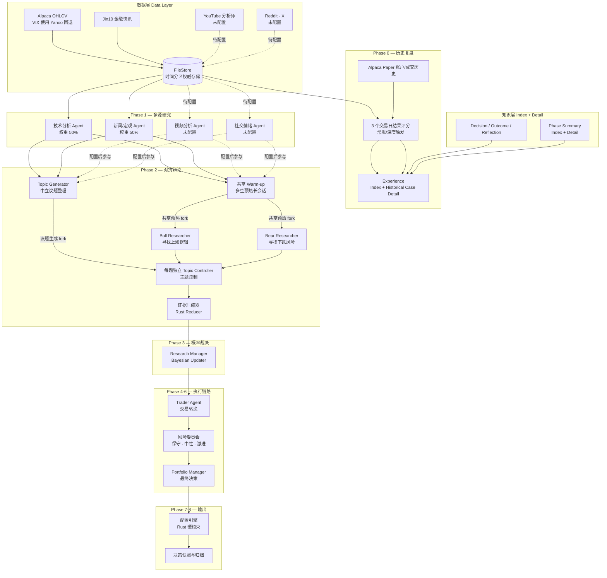

# Akzio Signal Intelligence

Rust-native market-signal research workflow for a small ETF universe. The production path uses Alpaca Market Data, a Yahoo VIX fallback, Jin10, time-partitioned FileStore data, and an OpenAI-compatible LLM gateway. VIX is a regime signal, not an investable asset.

## Current scope

Active Phase 1 analysts are fixed to:

| Role | Source | Weight | Critical |
|---|---|---:|---|
| `analyst.technical` | Alpaca OHLCV (Yahoo for VIX) and precomputed indicators | 50% | yes |
| `analyst.news_macro` | Jin10, Alpaca News, and verified macro/event sources | 50% | yes |

YouTube and Reddit/X remain explicit extension points, but their ingestion,
FileStore readers, and Phase 1 roles are currently unconfigured; they are not scheduled or
counted as evidence. A failed critical analyst aborts the run before probability
and allocation phases; it is never converted into a neutral 0.5 vote.

## Workflow


```mermaid
graph TD
    subgraph "数据层 Data Layer"
        MARKET[Alpaca OHLCV<br/>VIX 使用 Yahoo 回退]
        JIN10[Jin10 金融快讯]
        YT[YouTube 分析师<br/>未配置]
        SOCIAL[Reddit · X<br/>未配置]
        STORE[(FileStore<br/>时间分区权威存储)]
    end

    subgraph "Phase 1 — 多源研究"
        TA[技术分析 Agent<br/>权重 50%]
        NA[新闻/宏观 Agent<br/>权重 50%]
        YA[视频分析 Agent<br/>未配置]
        SA[社交情绪 Agent<br/>未配置]
    end

    subgraph "Phase 0 — 历史复盘"
        HIST[Alpaca Paper 账户/成交历史]
        SCORE[3 个交易日结果评分<br/>常规/深度触发]
        EXP[按 Phase 原子经验]
    end

    subgraph "Phase 2 — 对抗辩论"
        TG[Topic Generator<br/>中立议题整理]
        WARM[共享 Warm-up<br/>多空预热长会话]
        BULL[Bull Researcher<br/>寻找上涨逻辑]
        BEAR[Bear Researcher<br/>寻找下跌风险]
        TC[每题独立 Topic Controller<br/>主题控制]
        RED[证据压缩器<br/>Rust Reducer]
    end

    subgraph "Phase 3 — 概率裁决"
        RM[Research Manager<br/>Bayesian Updater]
    end

    subgraph "Phase 4-6 — 执行链路"
        TR[Trader Agent<br/>交易转换]
        RISK[风险委员会<br/>保守 · 中性 · 激进]
        PM[Portfolio Manager<br/>最终决策]
    end

    subgraph "Phase 7-8 — 输出"
        ALLOC[配置引擎<br/>Rust 硬约束]
        REF[决策快照与归档]
    end

    subgraph "知识层 Index + Detail"
        SUM[Phase Summary<br/>Index + Detail]
        EXP[Experience<br/>Index + Historical Case Detail]
        OUT[Decision / Outcome / Reflection]
    end

    MARKET --> STORE
    JIN10 --> STORE
    STORE --> SCORE
    HIST --> SCORE
    SCORE --> EXP
    SCORE --> EXP
    YT -. 待配置 .-> STORE
    SOCIAL -. 待配置 .-> STORE
    STORE --> TA & NA
    STORE -. 待配置 .-> YA & SA
    TA & NA --> TG & WARM
    YA & SA -. 配置后参与 .-> TG & WARM
    WARM -->|共享预热 fork| BULL & BEAR
    TG -->|议题生成 fork| TC
    BULL & BEAR --> TC
    TC --> RED
    RED --> RM
    RM --> TR
    TR --> RISK
    RISK --> PM
    PM --> ALLOC
    ALLOC --> REF
    OUT --> EXP
    SUM --> EXP
```

Phase 2 begins with one shared Bull/Bear warm-up and an independent neutral
Topic Generator. The generator uses the Phase 1 summary index through
`read_indexes` and expands selected evidence with
`read_index_details`; no warm-up history or Phase 1 artifact is embedded
in its prompt.
After at least one relevant Detail expansion, Topic Generator or Bull/Bear may
delegate one explicit unresolved fact to `research_evidence_gap`. A neutral
`researcher.web_evidence` worker receives only `web.run`; Topic Generator has
two calls per run and Bull/Bear share two calls per topic across rounds.
Rust deduplicates requests, validates and caps the returned source packet,
assigns `web-<md5-3>` evidence IDs, and keeps that evidence in Phase 2 rather
than rewriting Phase 1.
Rust rejects external-fact or schema-breaking output and retains a deterministic
conflict fallback. For each selected topic, Topic Controller forks from the
completed Topic Generator turn, while Bull and Bear each fork from the shared
`准备完毕` warm-up checkpoint and receive the full topic in their new user
instruction. These forks continue saved conversations rather than being
reconstructed from summaries; warm-up itself never runs Phase Summary.
Rust pre-calls `record_phase2_steer` in every topic child turn, so the role,
topic, fork parent, and both `round` and `round_num` are structured control data
rather than fields inferred from free text. After the two seed turns, the Topic
Controller decides whether another round is needed; each continued Bull/Bear
turn receives the latest controller steer before the controller reviews that
round. Debug records retain each turn separately as
`debate-{bull,bear}-round-N.json` and `topic-controller-round-N.json`.
Topics run concurrently, while turns inside one topic remain controller-routed.
When no material hinge exists, Phase 2 records a no-debate artifact and still
advances to Phase 3.

Trader, the three parallel risk reviewers, and Portfolio Manager are
mandatory in the default workflow policy. Phase 6 emits only per-asset semantic
constraints; it cannot read accounts, calculate quantities, or submit orders.
Phase 7 computes and validates target weights in Rust, projects those weights
through the Phase 6 direction/cap/delta constraints, and refreshes current
weights from the project-only Alpaca Paper account when credentials are present
in a non-mock, non-debug run. `--mock` and `--debug` remove all account and
order tools from the model and make the tool runtime reject direct calls.

## Canonical Contract v2 (Phase 4–6)

The file-backed ToolManaged path writes Canonical Contract v2. These changes are
intentional breaking changes: a v2 reader does not silently default, normalize,
or reinterpret a removed field. Older persisted files require an explicit
migration before they can become v2 artifacts.

| Area | Removed | v2 field / allowed values | Defaults and validation | Downstream consumer | Fallback |
|---|---|---|---|---|---|
| Phase 4 `TradeIntent` | `position_size` free-form string | required numeric `position_size_pct_max` in `[0, 1]` | no implicit cap; Hold / `execution_decision=hold` requires `0` | Rust Phase 7 allocation and execution | reject invalid or legacy payload; degrade through the workflow policy, never parse percentage prose |
| Phase 5 `RiskConstraints` | `tight`, `trailing`, `event_based`, `time_based`, and empty `stop_type` | required `stop_type`: `hard`, `soft`, or `none` | no implicit stop type | Phase 6 portfolio constraint builder and report renderer | reject at deserialization; no enum remapping |
| Phase 6 binding controls | `binding_risk_controls: ["free-form text"]` | `binding_risk_controls: [{"control":"…","source_refs":["…"]}]` | control and each source reference are non-empty; provide an explicit empty array when there are none | Rust allocation projection, audit, and report detail | reject string controls or untraceable bindings |
| Phase 1 evidence | `speculation`, `unclassified`, aliases, and string evidence | required `evidence_type`: `fact`, `opinion`, or `inference` | no type inference or alias normalization | evidence reducers and conflict analysis | reject non-v2 evidence; the role may use its normal degraded policy |

Contract validation lives in `orchestrator-core` so builders, finalizers, and
future consumers use the same pure checks. The contract does not retain a
dual-write field or a reader fallback to the legacy representation.

## Workspace crates

| Crate | Responsibility |
|---|---|
| `orchestrator-core` | Config paths, role registry, ticker parsing, canonical schemas and validators |
| `orchestrator-store` | Atomic FileStore persistence for manifests, Index/Detail knowledge, direct market inputs, and execution recovery |
| `orchestrator-llm` | Responses/Chat Completions streaming, bounded agent loop, and read-only evidence tools |
| `orchestrator-ingest` | Alpaca/Yahoo technical ingestion and Jin10 ingestion |
| `orchestrator-workflow` | Phase orchestration, policy gates, reducers, probability and allocation guards |
| `orchestrator-cli` | CLI binaries, reporting, operations, metrics and prompt linting |

There is no long-running service entry point. `orchestrator-exec` is the workflow entry point and persists only under the configured FileStore root (`outputs/store` by default).

## Model output and tools

Phase 0–6 business roles return one normal text response. They may use only
their read-only evidence/input tools. Immediately after each response, the
dedicated `prompts/phaseN/summary.md` compiler extracts the fixed fields; Rust
validates identity, probability, position, and risk constraints and writes one
canonical Index with its Detail. The Summary compiler has no filesystem or
write tool. Phase 7 and Phase 8 are calculated and written directly by Rust.

The completed run layout is:

```text
outputs/store/runs/YYYY-MM-DD/<tickers>-<md5-3>/
├── manifest.json
└── index/
    ├── phase1/idx-<md5-3>.json
    ├── phase2/idx-<md5-3>.json
    └── phase8/idx-<md5-3>.json
```

Each `idx-*.json` archive contains both the Index and its Detail records.
Sessions, temporary state, drafts, and debug files may exist while a run is in
progress, but successful completion removes them.

### Model-visible tools

All active FileStore reads derive their scope from the run, role, phase, and
typed runtime binding; the model cannot supply a filesystem path or choose an
arbitrary source run. Business-role completion is the final assistant text, not
a write-tool call. Phase Summary has no model tools; Rust validates its JSON and
writes the Index directly.

| Category | Tool ID | Purpose and boundary |
|---|---|---|
| Runtime | `think` | Records bounded private reasoning for the current turn; it does not read data or write an Artifact. Enabled only when the role's LLM setting enables it. |
| Runtime | `web.run` | Performs an allowlisted Exa web search and returns citable evidence. It is exposed directly only to the bounded `researcher.web_evidence` worker; Phase 1 event verification uses the same search adapter behind `verify_event`. Its OpenAI-compatible function name is `web_run`. |
| Phase 2 control | `record_phase2_steer` | Records the Rust-bound role, topic, fork parent, and round identity for each Bull/Bear or Topic Controller turn. It accepts no model-selected fields. |
| Phase 2 evidence gap | `research_evidence_gap` | Delegates one explicit gap after a successful Phase 1 Detail expansion. Rust owns role/topic scope, shared call budget, deduplication, output validation, and evidence IDs. |
| Historical reflection | `read_reflection_source` | Reads the Rust-selected historical reflection task source; a model cannot select a different run. |
| Experience | `search_experiences` | Searches eligible historical Experience Index entries for the current role/task. |
| Experience | `read_experience_cases` | Expands selected eligible historical Experience Detail entries. |
| Experience | `record_memory_application` | Records whether and how retrieved experience was applied; it is audit data, not a mutation of the historical case. |
| Knowledge Index + Detail | `read_indexes` | Lists role-visible Index/Phase Summary metadata with Rust-enforced source-phase and pagination rules. |
| Knowledge Index + Detail | `read_index_details` | Expands only visible Index Details, subject to the role's detail budget and evidence policy. |
| Current-run inputs | `read_technical_snapshot` | Reads batch technical data from the stable FileStore path and verifies the run-bound hash. |
| Current-run inputs | `read_technical_detail` | Reads a bounded technical signal/range from the stable FileStore path and verifies the run-bound hash. |
| Current-run inputs | `read_jin10_candidates` | Reads bounded Jin10 events from the stable FileStore path and verifies the run-bound hash. |
| Current-run inputs | `verify_event` | Verifies an explicit news/macro event claim through the configured web-search runtime and reports missing fields. |
| Current-run inputs | `alpaca_get_news` | Fetches Alpaca News for the scoped ticker/time request. It is exposed only when Alpaca market-data access is configured. |

### Active role-scoped access

The table below describes the static business-tool scope. Only the two Phase 1
analysts and the Phase 3 Research Manager receive `search_experiences`,
`read_experience_cases`, and `record_memory_application`. `think` is an optional
runtime helper and is disabled by the checked-in defaults. Runtime bindings may
remove unavailable tools, but never add business authority outside the profile
allowlist.

| Role / profile | Static tools in addition to experience retrieval |
|---|---|
| `reflector.historical` / Historical Reflection | `read_reflection_source`, `read_indexes`, `read_index_details`; Rust commits the validated Summary result |
| `analyst.technical` / Analyst Report | `read_technical_snapshot`, `read_technical_detail`, and eligible Experience reads |
| `analyst.news_macro` / Analyst Report | `read_jin10_candidates`, `verify_event`, optional `alpaca_get_news`, and eligible Experience reads |
| Phase 2 Topic Generator and Bull/Bear | Phase 1-only `read_indexes` / `read_index_details`; Bull/Bear topic turns also receive Rust-bound `record_phase2_steer`; bounded `research_evidence_gap` after Detail |
| Phase 2 warm-up and Topic Controller | Phase 1-only `read_indexes` / `read_index_details`; Controller turns also receive Rust-bound `record_phase2_steer`; no Web delegation |
| `researcher.web_evidence` / Evidence Research | `web.run` only; no Index, Technical, Experience, trading, or write tools |
| `manager.research` / Research Decision | Phase 1–2-only `read_indexes` / `read_index_details` and eligible Experience reads |
| `trader` / Trade Intent | Phase 3-only `read_indexes` / `read_index_details` |
| Phase 5 risk reviewers | Phase 3–4-only `read_indexes` / `read_index_details` |
| `portfolio.manager` / Portfolio Decision | Phase 3–5-only `read_indexes` / `read_index_details` |
| `compressor.phase_summary` / Phase Summary | No model-visible tools; Rust writes the parsed result |

The Responses transport can use OpenAI's native `web_search` only when both
`native_web_search` is enabled and the exact role profile explicitly authorizes
`web.run`. Only the built-in Evidence Research profile currently does so. The
provider-supplied native tool is intentionally separate from project function
dispatch.

The agent loop rejects identical repeated Index/Detail reads, enforces the
profile's Detail expansion budget, and rejects terminal finalization until all
required source phases and successful Detail expansions are present. The
checked-in maximum Detail counts are: Historical Reflection 8, Phase 2 Warm-up
2, other Phase 2 roles 4, Phase 3 6, Phase 4 2, Phase 5 4, and Phase 6 8.

## Requirements

- Rust stable, edition 2021
- Network access to Alpaca Market Data, Yahoo Finance, and Jin10
- An OpenAI-compatible gateway key for non-mock workflow runs
- `EXA_API_KEY` only when live Exa web search is enabled
- `ALPACA_API_KEY` and `ALPACA_API_SECRET` for technical bars, Alpaca News, Phase 0 account/fill retrieval, and the optional Phase 7 account-weight refresh

Set secrets through the environment. The repository contains no key fallback:

```bash
export LLM_GATEWAY_API_KEY='...'
export LLM_GATEWAY_BASE_URL='https://your-gateway.example/v1'
export EXA_API_KEY='...'
export ALPACA_API_KEY='...'
export ALPACA_API_SECRET='...'
```

`config/config.yaml` maps `orchestrator.alpaca.api_key` and
`orchestrator.alpaca.api_secret` to the two Alpaca environment variables.
Market data and news use `data.alpaca.markets`; brokerage actions intentionally
use `paper-api.alpaca.markets`. No live-brokerage endpoint, registration, or
alternate-account flow is implemented.

Report email credentials are only needed by `report-email`:

```bash
export REPORT_SMTP_USERNAME='...'
export REPORT_SMTP_PASSWORD='...'
export REPORT_SMTP_FROM='...'
export REPORT_SMTP_TO='...'
```

## Ingestion

Ingest real technical data for the configured research universe. Alpaca/IEX is
the default; its intraday `3h` and `20min` bars retain pre-market and after-hours
trades. Alpaca daily bars remain regular-session daily bars. VIX automatically
uses the configured Yahoo fallback because Alpaca stock bars do not provide VIX
OHLC:

```bash
rtk cargo run -p orchestrator-cli --bin orchestrator-ingest -- \
  technical-indicators \
  --symbols QQQ,SOXX,VIX \
  --start 2026-05-01 \
  --end 2026-07-22 \
  --intervals 1d,3h,20min \
  --sleep 0 \
  --timeout 20
```

Ingest Jin10:

```bash
rtk cargo run -p orchestrator-cli --bin orchestrator-ingest -- \
  jin10-flash --pages 2 --lookback-hours 24 --timeout 20
```

Technical input is stored directly under the readable lowercase paths
`outputs/store/data/technical/<ticker>/{day,3h,20min}.csv`, for example
`outputs/store/data/technical/qqq/day.csv`. Jin10 is stored as an atomically
replaced date CSV or JSONL file under `outputs/store/data/jin10/`. At run start,
the manifest records each selected input's content hash. Tools read the stable
data path and fail if its content changes during that run; no second CSV copy is
created under the run directory.

Independent ticker/interval downloads run concurrently (default: 10). Set
`technical.source: yahoo` or pass `--source yahoo` for a full Yahoo run.
`technical.alpaca.feed` selects `iex`, `sip`, `boats`, or `otc`; the checked-in
default is free-tier-compatible `iex`.

The workflow refreshes both sources before Phase 1. Use `--tech-refresh-enabled=false` only when all required ticker/interval CSVs already exist. Jin10 lookback is controlled by `--jin10-refresh-lookback-hours`.

## Run the workflow

Active prompts are owned by the phase that executes them:

| Directory | Runtime owner |
|---|---|
| `prompts/phase0/` | Historical outcome reflection and its Summary compiler |
| `prompts/phase1/` | Technical/news analysts and their Summary compiler |
| `prompts/phase2/` | Topic roles, bounded Web evidence researcher, topic-fork message, and Phase 2 Summary compiler |
| `prompts/phase3/` | Research Manager and Phase 3 Summary compiler |
| `prompts/phase4/` | Trader and Phase 4 Summary compiler |
| `prompts/phase5/` | Risk reviewers and Phase 5 Summary compiler |
| `prompts/phase6/` | Portfolio Manager and Phase 6 Summary compiler |
| `prompts/common/` | Shared prompt components and contracts |
| `prompts/system/` | Agent-loop and runtime messages |

Prompt components under `prompts/common/components/` are injected by role. The
analytical trace applies only to Topic Generator and Research Manager; Trader
and Portfolio Manager receive the execution trace; the Phase Summary compressor
receives the summary trace. Bull/Bear packets, Topic Controller, and Phase 5
risk reviewers retain their own compact audit records instead of emitting a
second generic trace.

Historical experience is preloaded only for the two Phase 1 analysts and the
Research Manager. No matching experience is a valid empty result; experience is
advisory and cannot replace current evidence.

There is deliberately no runtime `phase25` bucket. Phase 2 topic generation is
an LLM role with a Rust-owned evidence gate and runtime envelope; final debate
reduction remains Rust-owned and belongs to Phase 2. Phase 7 allocation and
Phase 8 decision snapshot/archive are also Rust-owned stages. Phase Summary runs
after source phases 1 through 7. Phase 8 writes one Rust-owned final-decision
Index per ticker; Phase 0 and the Phase 2 warm-up checkpoint do not produce an
Index.

For Phases 2–6, Phase Summary is the only cross-phase semantic interface.
Prompts receive only current-task packets, Rust-owned deterministic controls,
and a small metadata-only retrieval bootstrap. Each role must list visible
summaries before expanding details; role-specific policies enforce required
source phases, detail budgets, pagination limits, and evidence references to IDs
actually returned in that conversation. One policy failure gets a repair turn;
a second failure produces a degraded artifact. Phase 0 uses the same tools, but
Rust resolves an allowlisted reflection `task_id` to its historical source run,
so the model cannot choose an arbitrary run.

Retrieval limits are configured under `orchestrator.retrieval` in
`config/config.yaml`. Role artifacts record both a `retrieval_audit` and a
`context_manifest`; the latter reports each directly injected context's status,
item count, character count, source, and whether the semantic payload is
retrievable through tools.

```bash
rtk cargo run -p orchestrator-cli --bin orchestrator-exec -- \
  --store-root outputs/store \
  --to-phase 8
```

Useful options:

- `--store-root PATH`: root of the time-partitioned FileStore (default `outputs/store`).
- `--debug`: print workflow and agent-loop debug logs to the console, and write
  request/response records, timing, and token JSON under `outputs/debug/`.
- `--max-debate-rounds N`: cap conditional debate rounds.
- `--max-topics-per-side N`: cap material conflict topics.

`--mock` exists only for local tests and development. It is not evidence that the production workflow or external services work. `--debug` resolves MemoryOS writes to `knowledge/debug/<run-id>/`; it never writes canonical Decision or Outcome data. Replay and migration fixtures use their own namespaces, and replay reads canonical Decisions only through a read-only reader while emitting only replay output.

### Deterministic Outcome materialization

Phase 8 can write a typed `DecisionSnapshotV2` under
`knowledge/evaluation/decisions/` when
`orchestrator.evaluation.enabled` is set. Canonical Decision/Outcome writes
require both Paper/Live purpose and
`orchestrator.evaluation.canonical_memory_writes_enabled: true`; Debug uses an
isolated namespace and Mock writes neither canonical Decision nor Outcome.

Matured outcomes are materialized only from hash-pinned technical CSV exports
under an explicit `Close` or `AdjustedClose` basis and an explicit per-ticker
benchmark mapping. A missing mapping, insufficient sessions, unavailable
market data, or unresolved corporate action produces an auditable gap and does
not block the current investment workflow. The canonical outcome is global
under `knowledge/evaluation/`; evaluation runs only own receipts and batch
reports.

```bash
rtk cargo run -p orchestrator-cli --bin orchestrator-memory -- \
  --evaluation-run-id catchup-2026-07-28 \
  --evaluation-date 2026-07-28 \
  --purpose paper
```

The command reads the same strict project configuration as the workflow. It
cannot accept an arbitrary outcome ID, source run, benchmark, or output path.

`--from-phase` accepts `0-8` and defaults to `0`; `--to-phase 0` runs only
historical reflection/retrieval. Mock runs skip Alpaca and all learning writes.

### FileStore layout

Each run is isolated under `outputs/store/runs/<workflow_date>/<tickers>-<md5-3-bytes>/`;
for example, `runs/2026-07-29/qqq-soxx-vix-a1b2c3/`. Phase Summary and
Experience Index IDs use the same six-hex-character suffix as `idx-a1b2c3`
and `exp-a1b2c3`.
While a run is active, `manifest.json` and `state.json` record recovery state;
independently finalized business units are stored below `artifacts/`;
append-only session turns are below `sessions/`; incomplete writes are below
`drafts/`; and phase summaries live below `index/`. These runtime projections
are removed after a healthy non-debug run completes.
Canonical files contain a schema version and content hash. Temporary files live
beside their destination, are flushed and fsynced, and are atomically renamed.
Store Doctor checks malformed content, hashes, path escape, orphan details,
incomplete Drafts and manifest/file drift; its catalog and experience-level
outputs are rebuildable caches.

After Phase 8 finishes successfully, the run packs each finalized Index
directory into one content-hashed archive, then deletes every other run-local
file. The completed run retains only `manifest.json` and `index/*.json`; the
Phase 8 Index contains the structured final decision and allocation. Canonical
Decisions, MemoryUsage reports, Outcomes, and Experience remain under
`knowledge/`. Partial, incomplete, or failed runs retain inputs, Artifacts,
Sessions, Drafts, and state for recovery. Once Phase 8 completes, normal,
degraded, and `--debug` runs are all compacted to the same final layout; degraded
status and errors remain visible in `manifest.json`. The FileStore assumes one
workflow writer and does not create filesystem lock files.

Preview or apply the same completed-run compaction explicitly:

```bash
rtk cargo run -p orchestrator-cli --bin orchestrator-store-doctor -- \
  --store-root outputs/store \
  compact-run --workflow-date YYYY-MM-DD --run-id RUN_ID

rtk cargo run -p orchestrator-cli --bin orchestrator-store-doctor -- \
  --store-root outputs/store \
  compact-run --workflow-date YYYY-MM-DD --run-id RUN_ID --apply
```

The first command is a dry run. `--apply` is accepted once Phase 8 and the run
manifest are completed; debug and degraded runs use the same compact layout.

Evaluation data is separate: immutable canonical outcomes, revision commits,
heads, market-input manifests, and gaps live under
`knowledge/evaluation/`; `runs/<date>/<evaluation-run>/receipts/materialization/`
and `reports/materialization/` are non-authoritative execution evidence.

## Learning loop

The memory loop is deliberately outside the decision-critical path:

1. Phase 8 records typed, sectioned `DecisionSnapshotV2` data. It never forces a
   trade or manufactures missing thesis, execution, or allocation details.
2. The deterministic materializer turns only matured, benchmark-configured
   Decisions into global canonical Outcomes. Ordinary missing data becomes a
   Materialization Gap; integrity/provenance failures fail closed for that
   Decision without stopping other matured Decisions or the current workflow.
3. Phase 0 schedules only current Outcome revisions. A Task Key binds the
   source run, ticker, Outcome content hash, MemoryPolicy version, reflector
   profile, and builder version. A newer Outcome supersedes unstarted or
   claimed older tasks.
4. The reflector can terminal as `learned`, `no_reusable_memory`, `deferred`,
   or `contested`. `duplicate` is Rust-only idempotency state. Only `learned`
   can append the legacy historical case and an `AddSupport` Experience Event;
   later lifecycle policy may add verified contradictions to an existing
   Pattern, never create a positive Pattern from `contested` alone.
5. Experience Events are append-only authority. Experience Views are rebuilt
   deterministically using independent date/regime clusters, support and
   contradiction counts, utility EMA, and harmful-use rate. Retrieval treats
   historical wording as untrusted data and logs actual search/expand access in
   the current run's MemoryUsage ledger.

The current prediction never scores itself, mock runs never write formal
Decision/Outcome data, and repeated processing is idempotent. Reflection
failures become bounded retry events and remain non-blocking for the investment
decision. Scheduler quotas are configured under `orchestrator.reflection`;
the shipped 6/2/2 new/retry/backlog split is a policy default rather than a
hard-coded invariant.

## Reliability contracts

- Both Phase 1 roles must cover every requested ticker with non-empty, attributed, timestamped, non-duplicate evidence.
- An Artifact exists only after a terminal domain finalizer passes semantic validation.
- Probabilities must be finite, inside `[0,1]`, and long/short must be coherent.
- Manager output cannot replace missing evidence with a default 0.5 result.
- Responses streams require `response.completed`; Chat Completions streams require a terminal `finish_reason`.
- Tool calls require a non-empty `call_id`, name, and valid accumulated JSON arguments.
- Technical/Jin10 tools read stable FileStore data paths and verify the hashes pinned by the run. The news analyst may call Alpaca News; evidence selection is retained in its current-run Artifact and tool audit.
- Tool payload history is bounded to 16,000 characters by default.
- Allocation excludes VIX, rejects missing per-ticker research, enforces non-negative finite weights, per-asset caps, cash constraints, and a total weight of 1.0.
- Post-run learning is outcome-backed, idempotent, and outside the decision-critical research path; only qualified, non-mock Experience Index/Detail entries are reusable later.

## Validation

Run before handing off changes:

```bash
rtk cargo fmt --all -- --check
rtk cargo check --workspace --all-targets
rtk cargo clippy --workspace --all-targets --all-features -- -D warnings
rtk cargo test --workspace --all-features
rtk cargo build --release --workspace
```

Prompt lint:

```bash
rtk cargo run -p orchestrator-cli --bin orchestrator-prompt-lint
```

Generated FileStore data, `outputs/`, debug logs, release artifacts, and credentials must not be committed.
