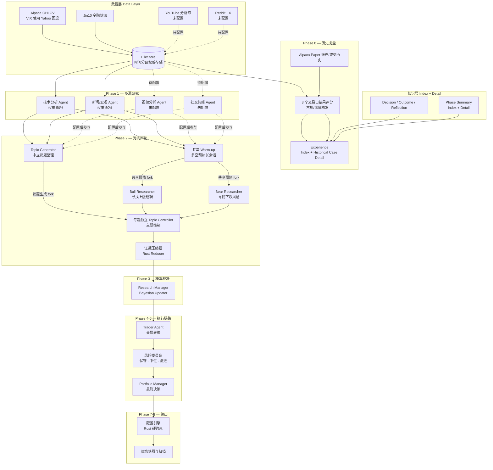

# Akzio Signal Intelligence

Rust-native market-signal research workflow for a small ETF universe. The production path uses Alpaca Market Data, a Yahoo VIX fallback, Jin10, time-partitioned FileStore data, and an OpenAI-compatible LLM gateway. VIX is a regime signal, not an investable asset.

## Current scope

Active Phase 1 analysts are fixed to:

| Role | Source | Weight | Critical |
|---|---|---:|---|
| `analyst.technical` | Alpaca OHLCV (Yahoo for VIX) and precomputed indicators | 50% | yes |
| `analyst.news_macro` | Jin10, Alpaca News, and verified macro/event sources | 50% | yes |

YouTube and Reddit/X remain explicit extension points, but their ingestion,
FileStore readers, and Phase 1 roles are currently unconfigured; they are not scheduled or
counted as evidence. A failed critical analyst aborts the run before probability
and allocation phases; it is never converted into a neutral 0.5 vote.

## Workflow


```mermaid
graph TD
    subgraph "数据层 Data Layer"
        MARKET[Alpaca OHLCV<br/>VIX 使用 Yahoo 回退]
        JIN10[Jin10 金融快讯]
        YT[YouTube 分析师<br/>未配置]
        SOCIAL[Reddit · X<br/>未配置]
        STORE[(FileStore<br/>时间分区权威存储)]
    end

    subgraph "Phase 1 — 多源研究"
        TA[技术分析 Agent<br/>权重 50%]
        NA[新闻/宏观 Agent<br/>权重 50%]
        YA[视频分析 Agent<br/>未配置]
        SA[社交情绪 Agent<br/>未配置]
    end

    subgraph "Phase 0 — 历史复盘"
        HIST[Alpaca Paper 账户/成交历史]
        SCORE[3 个交易日结果评分<br/>常规/深度触发]
        EXP[按 Phase 原子经验]
    end

    subgraph "Phase 2 — 对抗辩论"
        TG[Topic Generator<br/>中立议题整理]
        WARM[共享 Warm-up<br/>多空预热长会话]
        BULL[Bull Researcher<br/>寻找上涨逻辑]
        BEAR[Bear Researcher<br/>寻找下跌风险]
        TC[每题独立 Topic Controller<br/>主题控制]
        RED[证据压缩器<br/>Rust Reducer]
    end

    subgraph "Phase 3 — 概率裁决"
        RM[Research Manager<br/>Bayesian Updater]
    end

    subgraph "Phase 4-6 — 执行链路"
        TR[Trader Agent<br/>交易转换]
        RISK[风险委员会<br/>保守 · 中性 · 激进]
        PM[Portfolio Manager<br/>最终决策]
    end

    subgraph "Phase 7-8 — 输出"
        ALLOC[配置引擎<br/>Rust 硬约束]
        REF[决策快照与归档]
    end

    subgraph "知识层 Index + Detail"
        SUM[Phase Summary<br/>Index + Detail]
        EXP[Experience<br/>Index + Historical Case Detail]
        OUT[Decision / Outcome / Reflection]
    end

    MARKET --> STORE
    JIN10 --> STORE
    STORE --> SCORE
    HIST --> SCORE
    SCORE --> EXP
    SCORE --> EXP
    YT -. 待配置 .-> STORE
    SOCIAL -. 待配置 .-> STORE
    STORE --> TA & NA
    STORE -. 待配置 .-> YA & SA
    TA & NA --> TG & WARM
    YA & SA -. 配置后参与 .-> TG & WARM
    WARM -->|共享预热 fork| BULL & BEAR
    TG -->|议题生成 fork| TC
    BULL & BEAR --> TC
    TC --> RED
    RED --> RM
    RM --> TR
    TR --> RISK
    RISK --> PM
    PM --> ALLOC
    ALLOC --> REF
    OUT --> EXP
    SUM --> EXP
```

Phase 2 begins with one shared Bull/Bear warm-up and an independent neutral
Topic Generator. The generator uses the Phase 1 summary index through
`read_phase_summaries` and expands selected evidence with
`read_phase_summary_details`; no warm-up history or Phase 1 artifact is embedded
in its prompt.
Rust rejects external-fact or schema-breaking output and retains a deterministic
conflict fallback. For each selected topic, Topic Controller forks from the
completed Topic Generator turn, while Bull and Bear each fork from the shared
`准备完毕` warm-up checkpoint and receive the full topic in their new user
instruction. These forks continue saved conversations rather than being
reconstructed from summaries; warm-up itself never runs Phase Summary.
Topics run concurrently, while turns inside one topic remain controller-routed.
When no material hinge exists, Phase 2 records a no-debate artifact and still
advances to Phase 3.

Trader, the three parallel risk reviewers, and Portfolio Manager are
mandatory in the default workflow policy. Phase 6 emits only per-asset semantic
constraints; it cannot read accounts, calculate quantities, or submit orders.
Phase 7 computes and validates target weights in Rust, projects those weights
through the Phase 6 direction/cap/delta constraints, and refreshes current
weights from the project-only Alpaca Paper account when credentials are present
in a non-mock, non-debug run. `--mock` and `--debug` remove all account and
order tools from the model and make the tool runtime reject direct calls.

## Canonical Contract v2 (Phase 4–6)

The file-backed ToolManaged path writes Canonical Contract v2. These changes are
intentional breaking changes: a v2 reader does not silently default, normalize,
or reinterpret a removed field. Older persisted files require an explicit
migration before they can become v2 artifacts.

| Area | Removed | v2 field / allowed values | Defaults and validation | Downstream consumer | Fallback |
|---|---|---|---|---|---|
| Phase 4 `TradeIntent` | `position_size` free-form string | required numeric `position_size_pct_max` in `[0, 1]` | no implicit cap; Hold / `execution_decision=hold` requires `0` | Rust Phase 7 allocation and execution | reject invalid or legacy payload; degrade through the workflow policy, never parse percentage prose |
| Phase 5 `RiskConstraints` | `tight`, `trailing`, `event_based`, `time_based`, and empty `stop_type` | required `stop_type`: `hard`, `soft`, or `none` | no implicit stop type | Phase 6 portfolio constraint builder and report renderer | reject at deserialization; no enum remapping |
| Phase 6 binding controls | `binding_risk_controls: ["free-form text"]` | `binding_risk_controls: [{"control":"…","source_refs":["…"]}]` | control and each source reference are non-empty; provide an explicit empty array when there are none | Rust allocation projection, audit, and report detail | reject string controls or untraceable bindings |
| Phase 1 evidence | `speculation`, `unclassified`, aliases, and string evidence | required `evidence_type`: `fact`, `opinion`, or `inference` | no type inference or alias normalization | evidence reducers and conflict analysis | reject non-v2 evidence; the role may use its normal degraded policy |

Contract validation lives in `orchestrator-core` so builders, finalizers, and
future consumers use the same pure checks. The contract does not retain a
dual-write field or a reader fallback to the legacy representation.

## Workspace crates

| Crate | Responsibility |
|---|---|
| `orchestrator-core` | Config paths, role registry, ticker parsing, canonical schemas and validators |
| `orchestrator-store` | Atomic FileStore persistence for manifests, sessions, typed drafts, canonical artifacts, Index/Detail knowledge, and execution recovery |
| `orchestrator-llm` | Responses/Chat Completions streaming, bounded agent loop, and domain-tool execution |
| `orchestrator-ingest` | Alpaca/Yahoo technical ingestion and Jin10 ingestion |
| `orchestrator-workflow` | Phase orchestration, policy gates, reducers, probability and allocation guards |
| `orchestrator-cli` | CLI binaries, reporting, operations, metrics and prompt linting |

There is no long-running service entry point. `orchestrator-exec` is the workflow entry point and persists only under the configured FileStore root (`outputs/store` by default).

## Requirements

- Rust stable, edition 2021
- Network access to Alpaca Market Data, Yahoo Finance, and Jin10
- An OpenAI-compatible gateway key for non-mock workflow runs
- `EXA_API_KEY` only when live Exa web search is enabled
- `ALPACA_API_KEY` and `ALPACA_API_SECRET` for technical bars, Alpaca News, Phase 0 account/fill retrieval, and the optional Phase 7 account-weight refresh

Set secrets through the environment. The repository contains no key fallback:

```bash
export LLM_GATEWAY_API_KEY='...'
export LLM_GATEWAY_BASE_URL='https://your-gateway.example/v1'
export EXA_API_KEY='...'
export ALPACA_API_KEY='...'
export ALPACA_API_SECRET='...'
```

`config/config.yaml` maps `orchestrator.alpaca.api_key` and
`orchestrator.alpaca.api_secret` to the two Alpaca environment variables.
Market data and news use `data.alpaca.markets`; brokerage actions intentionally
use `paper-api.alpaca.markets`. No live-brokerage endpoint, registration, or
alternate-account flow is implemented.

Report email credentials are only needed by `report-email`:

```bash
export REPORT_SMTP_USERNAME='...'
export REPORT_SMTP_PASSWORD='...'
export REPORT_SMTP_FROM='...'
export REPORT_SMTP_TO='...'
```

## Ingestion

Ingest real technical data for the configured research universe. Alpaca/IEX is
the default; its intraday `3h` and `20min` bars retain pre-market and after-hours
trades. Alpaca daily bars remain regular-session daily bars. VIX automatically
uses the configured Yahoo fallback because Alpaca stock bars do not provide VIX
OHLC:

```bash
rtk cargo run -p orchestrator-cli --bin orchestrator-ingest -- \
  technical-indicators \
  --symbols QQQ,SOXX,VIX \
  --start 2026-05-01 \
  --end 2026-07-22 \
  --intervals 1d,3h,20min \
  --sleep 0 \
  --timeout 20
```

Ingest Jin10:

```bash
rtk cargo run -p orchestrator-cli --bin orchestrator-ingest -- \
  jin10-flash --pages 2 --lookback-hours 24 --timeout 20
```

Technical input is stored as atomically replaced CSV snapshots under
`outputs/store/data/technical/<ticker>/<interval>.csv`. Jin10 is stored as an
atomically replaced date CSV or JSONL snapshot under `outputs/store/data/jin10/`.
At run start, the manifest records each selected input's content hash; tools read
that snapshot for the entire run and fail if it changes.

Independent ticker/interval downloads run concurrently (default: 10). Set
`technical.source: yahoo` or pass `--source yahoo` for a full Yahoo run.
`technical.alpaca.feed` selects `iex`, `sip`, `boats`, or `otc`; the checked-in
default is free-tier-compatible `iex`.

The workflow refreshes both sources before Phase 1. Use `--tech-refresh-enabled=false` only when all required ticker/interval CSVs already exist. Jin10 lookback is controlled by `--jin10-refresh-lookback-hours`.

## Run the workflow

Active prompts are owned by the phase that executes them:

| Directory | Runtime owner |
|---|---|
| `prompts/phase0/` | Historical outcome reflection |
| `prompts/phase_summary/` | Completed-phase summary compressor |
| `prompts/phase1/` | Technical and news/macro analysts |
| `prompts/phase2/` | Topic Generator, Bull, Bear, Topic Controller, and the topic-fork message |
| `prompts/phase3/` | Research Manager |
| `prompts/phase4/` | Trader |
| `prompts/phase5/` | Aggressive, neutral, and conservative risk reviewers |
| `prompts/phase6/` | Portfolio Manager |
| `prompts/common/` | Shared prompt components and contracts |
| `prompts/system/` | Agent-loop and runtime messages |

Prompt components under `prompts/common/components/` are injected by role. The
analytical trace applies only to Topic Generator and Research Manager; Trader
and Portfolio Manager receive the execution trace; the Phase Summary compressor
receives the summary trace. Bull/Bear packets, Topic Controller, and Phase 5
risk reviewers retain their own compact audit records instead of emitting a
second generic trace.

Historical experience is preloaded only for the two Phase 1 analysts and the
Research Manager. No matching experience is a valid empty result; experience is
advisory and cannot replace current evidence.

There is deliberately no runtime `phase25` bucket. Phase 2 topic generation is
an LLM role with a Rust-owned evidence gate and runtime envelope; final debate
reduction remains Rust-owned and belongs to Phase 2. Phase 7 allocation and
Phase 8 decision snapshot/archive are also Rust-owned stages. Phase Summary runs
after a completed source phase 1 through 7; it does not run for Phase 0, Phase 8,
or the Phase 2 warm-up checkpoint.

For Phases 2–6, Phase Summary is the only cross-phase semantic interface.
Prompts receive only current-task packets, Rust-owned deterministic controls,
and a small metadata-only retrieval bootstrap. Each role must list visible
summaries before expanding details; role-specific policies enforce required
source phases, detail budgets, pagination limits, and evidence references to IDs
actually returned in that conversation. One policy failure gets a repair turn;
a second failure produces a degraded artifact. Phase 0 uses the same tools, but
Rust resolves an allowlisted reflection `task_id` to its historical source run,
so the model cannot choose an arbitrary run.

Retrieval limits are configured under `orchestrator.retrieval` in
`config/config.yaml`. Role artifacts record both a `retrieval_audit` and a
`context_manifest`; the latter reports each directly injected context's status,
item count, character count, source, and whether the semantic payload is
retrievable through tools.

```bash
rtk cargo run -p orchestrator-cli --bin orchestrator-exec -- \
  --store-root outputs/store \
  --to-phase 8
```

Useful options:

- `--store-root PATH`: root of the time-partitioned FileStore (default `outputs/store`).
- `--debug`: print workflow and agent-loop debug logs to the console, and write
  request/response records, timing, and token JSON under `outputs/debug/`.
- `--max-debate-rounds N`: cap conditional debate rounds.
- `--max-topics-per-side N`: cap material conflict topics.

`--mock` exists only for local tests and development. It is not evidence that the production workflow or external services work.

`--from-phase` accepts `0-8` and defaults to `0`; `--to-phase 0` runs only
historical reflection/retrieval. Mock runs skip Alpaca and all learning writes.

### FileStore layout

Each run is isolated under `outputs/store/runs/<workflow_date>/<run_id>/`.
`manifest.json` and `state.json` record recovery state; independently finalized
business units are stored below `artifacts/`; append-only session turns are
below `sessions/`; incomplete writes are below `drafts/`; phase summaries live
below `index/`; and learning and execution data use their own directories.
Canonical files contain a schema version and content hash. Temporary files live
beside their destination, are flushed and fsynced, and are atomically renamed.
Store Doctor checks malformed content, hashes, path escape, orphan details,
incomplete Drafts and manifest/file drift; its catalog and experience-level
outputs are rebuildable caches.

## Learning loop

A non-mock default run starts with Phase 0 and records the current decision in
Phase 8:

1. Phase 0 reads Alpaca Paper account, positions, and recent fills while scoring matured
   prior decisions on the third stored trading bar. This is an evaluation
   horizon, not a forced trade or forced close.
2. Every matured outcome receives routine reflection. Loss, benchmark
   underperformance, wrong direction, confidence mismatch, risk violation, or a
   repeated error upgrades it to deep reflection.
3. The reflector reads only the allowlisted prior run's phase-summary indexes
   and details. Rust validates evidence IDs, taxonomy, phase scope, and the
   deterministic pattern key before saving atomic experience.
4. One source run is a `recent_episode`; two matching source runs are a
   `repeated_warning`; three are an `active_policy`. The level is computed from
   Experience Details and is never separately promoted or versioned.
5. Phase 8 records a three-trading-day decision snapshot for each analyzed
   ticker, including Hold/current-position decisions, without requiring an order.

The current prediction never scores itself, mock runs never write experience,
and repeated processing is idempotent. Before an Alpaca submission, the workflow
persists an intent; after a restart it queries the remote order before attempting
any submission, so a missing local receipt cannot duplicate an order.
Malformed experience writes fail closed, while reflection failure remains
non-blocking for the investment decision. Set
`orchestrator.reflection.enabled: false` to disable retrieval and learning.

## Reliability contracts

- Both Phase 1 roles must cover every requested ticker with non-empty, attributed, timestamped, non-duplicate evidence.
- An Artifact exists only after a terminal domain finalizer passes semantic validation.
- Probabilities must be finite, inside `[0,1]`, and long/short must be coherent.
- Manager output cannot replace missing evidence with a default 0.5 result.
- Responses streams require `response.completed`; Chat Completions streams require a terminal `finish_reason`.
- Tool calls require a non-empty `call_id`, name, and valid accumulated JSON arguments.
- Technical/Jin10 tools read the run's hash-pinned FileStore input snapshots. The news analyst may call Alpaca News; evidence selection is retained in its current-run Artifact and tool audit.
- Tool payload history is bounded to 16,000 characters by default.
- Allocation excludes VIX, rejects missing per-ticker research, enforces non-negative finite weights, per-asset caps, cash constraints, and a total weight of 1.0.
- Post-run learning is outcome-backed, idempotent, and outside the decision-critical research path; only qualified, non-mock Experience Index/Detail entries are reusable later.

## Validation

Run before handing off changes:

```bash
rtk cargo fmt --all -- --check
rtk cargo check --workspace --all-targets
rtk cargo clippy --workspace --all-targets --all-features -- -D warnings
rtk cargo test --workspace --all-features
rtk cargo build --release --workspace
```

Prompt lint:

```bash
rtk cargo run -p orchestrator-cli --bin orchestrator-prompt-lint
```

Generated FileStore data, `outputs/`, debug logs, release artifacts, and credentials must not be committed.
