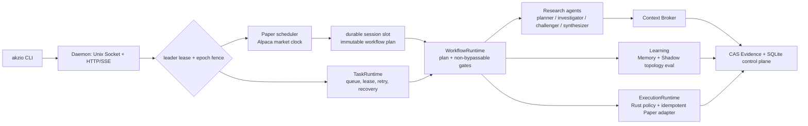

# Akzio Signal Intelligence v2

Akzio v2 是一个本地常驻、Rust 受控的 Multi-Agent Research System。它只研究并可在 Alpaca **Paper** 账户执行 `TQQQ`、`QQQ`、`SOXX`、`SOXL`；Live Trading 不在本版本范围内。

这是 v2-only 仓库：不读取、不迁移也不兼容旧 `orchestrator-*` crate、Phase 0–8、FileStore、Prompt 或 `outputs/store` 格式。使用新的 Store Root。

## 架构


```mermaid
flowchart LR
    CLI[akzio CLI] --> D[Daemon: Unix Socket + HTTP/SSE]
    D --> L{leader lease + epoch fence}
    L --> S[Paper scheduler\nAlpaca market clock]
    S --> SLOT[durable session slot\nimmutable workflow plan]
    L --> Q[TaskRuntime\nqueue, lease, retry, recovery]
    SLOT --> W[WorkflowRuntime\nplan + non-bypassable gates]
    Q --> W
    W --> R[Research agents\nplanner / investigator / challenger / synthesizer]
    R --> C[Context Broker]
    C --> E[CAS Evidence + SQLite control plane]
    W --> X[ExecutionRuntime\nRust policy + idempotent Paper adapter]
    W --> M[Learning\nMemory + Shadow topology eval]
    M --> E
    X --> E
```

Rust is the authority for task state, leases, agent contracts, allowed context, evidence provenance, risk gates, topology promotion, execution policy and broker idempotency. Models only produce schema-validated research artifacts and planner proposals.

## Workspace

| Crate | Responsibility |
| --- | --- |
| `akzio-domain` | Versioned IDs, contracts, schemas, workflow and policy types |
| `akzio-store` | SQLite control plane, CAS blobs, event stream, task leases, schedule slots, Store Doctor |
| `akzio-context` | Provenance-aware Context Broker and document access rules |
| `akzio-ingest` | Seals market/account inputs before they reach research or execution |
| `akzio-model` | Responses-compatible model transport and fixtures |
| `akzio-research` | Contract registry, planner and research task execution |
| `akzio-runtime` | Workflow compiler, planner patch gate, task lifecycle and recovery |
| `akzio-execution` | Rust-owned decision/execution gates and Alpaca Paper adapter |
| `akzio-learning` | Experience memory, outcomes, Shadow pairs and topology promotion/rollback |
| `akzio-daemon` | Leader election, worker pool, scheduler, local HTTP/SSE and Unix socket control plane |
| `akzio-cli` | `akzio` commands and TOML validation |

## Data and learning model

`V2Store` keeps immutable content-addressed blobs and a SQLite graph. Raw/normalized evidence, semantic detail, claims, decisions, execution context, memory and evaluations reference sources by document ID; compaction cannot invalidate a canonical decision's evidence chain.

Paper outcomes feed two bounded loops:

- Memory: `Candidate → Active/Proven → Contested/Retired` under Rust policy.
- Topology: Candidate research graphs receive paired Shadow outcomes and move through `Candidate → Canary10 → Canary25 → Canary50 → Active`; weaker risk recall or evidence completeness rolls them back immediately. Each promotion needs a fresh 12-pair window.

Debug and Paper Dry Run runs never enter canonical learning.

## Daemon and automatic Paper execution

`auto_paper = true` is the default in [`config/akzio.toml`](config/akzio.toml). The elected daemon leader polls Alpaca Paper's `/v2/clock` once per minute. It creates at most one Paper run per broker-reported open-session date.

Before creating the run, the daemon stores a session slot containing the exact, content-addressed workflow plan. If the process crashes after reservation, a replacement leader resumes the same run ID and task IDs. A stale leader cannot submit or mark a slot because every write is fenced by the daemon lease epoch.

Direct `Paper` submissions and Paper retries are intentionally rejected. This prevents an operator command from producing a second broker execution path for the same session. Use Paper Dry Run for manual validation.

Paper execution is still non-bypassable: Rust checks universe, gross/correlation exposure, turnover, account state, quote freshness, blockers, plan hash and idempotency before sending an Alpaca Paper order. Live endpoints are rejected by the adapter.

## Configuration and environment

The default config is [`config/akzio.toml`](config/akzio.toml). Its `execution.assets` must remain exactly `TQQQ`, `QQQ`, `SOXX`, `SOXL`.

Production daemon inputs:

```bash
export AKZIO_DAEMON_TOKEN='local-control-token'
export LLM_GATEWAY_BASE_URL='https://gateway.example/v1'
export LLM_GATEWAY_API_KEY='...'
export AKZIO_MODEL='...'
export ALPACA_API_KEY='...'
export ALPACA_API_SECRET='...'
# Optional; defaults to https://paper-api.alpaca.markets
export ALPACA_PAPER_BASE_URL='https://paper-api.alpaca.markets'
```

Set `auto_paper = false` only for local daemon development or a manual Paper Dry Run. It does not enable Live Trading.

## Commands

Use the Headroom RTK wrapper in this workspace.

```bash
# No credentials or daemon required; isolated fixture store run.
rtk cargo run -p akzio-cli -- run fixture-debug

# Start local control plane. With auto_paper=true, this can execute Paper
# automatically during an open Alpaca-reported market session.
rtk cargo run -p akzio-cli -- daemon serve

# Control the running daemon over its Unix socket.
rtk cargo run -p akzio-cli -- daemon health
rtk cargo run -p akzio-cli -- run submit debug
rtk cargo run -p akzio-cli -- run submit paper-dry-run
rtk cargo run -p akzio-cli -- run events <run-id>
rtk cargo run -p akzio-cli -- run cancel <run-id>

# Verify blobs, references, leases, commitments and scheduled Paper slots.
rtk cargo run -p akzio-cli -- store doctor
```

The configured Store Root defaults to `outputs/v2-store`. It contains `control.sqlite3`, CAS blobs and the Unix socket; it is generated state and must not be committed.

## Verification

```bash
rtk cargo fmt --all
rtk cargo check --workspace
rtk cargo clippy --workspace --all-targets
rtk cargo test --workspace
rtk cargo run -p akzio-cli -- run fixture-debug
rtk cargo run -p akzio-cli -- store doctor
```

`fixture-debug` proves the deterministic Debug path only. It does not prove gateway availability, broker connectivity, market-open state or Paper execution.
