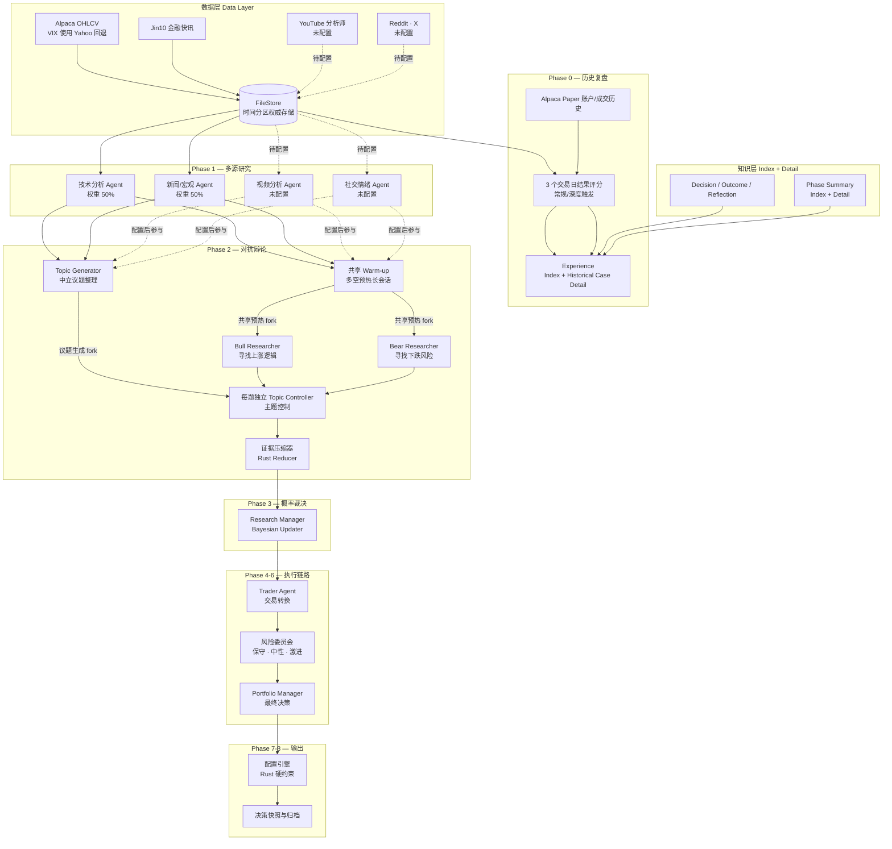

# Akzio Signal Intelligence

面向小型 ETF 标的池的 Rust 原生市场信号研究工作流。生产路径使用 Alpaca Market Data、Yahoo VIX 回退、金十(Jin10)、按时间分区的 FileStore 数据,以及 OpenAI 兼容的 LLM 网关。VIX 是市场状态(regime)信号,不是可投资资产。

## 当前范围

活跃的 Phase 1 分析师固定为:

| 角色 | 数据源 | 权重 | 关键角色 |
|---|---|---:|---|
| `analyst.technical` | Alpaca OHLCV(VIX 使用 Yahoo)及预计算指标 | 50% | 是 |
| `analyst.news_macro` | 金十、Alpaca News 以及经核实的宏观/事件源 | 50% | 是 |

YouTube 与 Reddit/X 仍是明确的扩展点,但其数据摄取、FileStore 读取器和
Phase 1 角色目前均未配置;它们不会被调度,也不计入证据。任一关键分析师失败
都会在概率与配置阶段之前中止本次运行;绝不会被转换为中性的 0.5 投票。

## 工作流


```mermaid
graph TD
    subgraph "数据层 Data Layer"
        MARKET[Alpaca OHLCV<br/>VIX 使用 Yahoo 回退]
        JIN10[Jin10 金融快讯]
        YT[YouTube 分析师<br/>未配置]
        SOCIAL[Reddit · X<br/>未配置]
        STORE[(FileStore<br/>时间分区权威存储)]
    end

    subgraph "Phase 1 — 多源研究"
        TA[技术分析 Agent<br/>权重 50%]
        NA[新闻/宏观 Agent<br/>权重 50%]
        YA[视频分析 Agent<br/>未配置]
        SA[社交情绪 Agent<br/>未配置]
    end

    subgraph "Phase 0 — 历史复盘"
        HIST[Alpaca Paper 账户/成交历史]
        SCORE[3 个交易日结果评分<br/>常规/深度触发]
        EXP[按 Phase 原子经验]
    end

    subgraph "Phase 2 — 对抗辩论"
        TG[Topic Generator<br/>中立议题整理]
        WARM[共享 Warm-up<br/>多空预热长会话]
        BULL[Bull Researcher<br/>寻找上涨逻辑]
        BEAR[Bear Researcher<br/>寻找下跌风险]
        TC[每题独立 Topic Controller<br/>主题控制]
        RED[证据压缩器<br/>Rust Reducer]
    end

    subgraph "Phase 3 — 概率裁决"
        RM[Research Manager<br/>Bayesian Updater]
    end

    subgraph "Phase 4-6 — 执行链路"
        TR[Trader Agent<br/>交易转换]
        RISK[风险委员会<br/>保守 · 中性 · 激进]
        PM[Portfolio Manager<br/>最终决策]
    end

    subgraph "Phase 7-8 — 输出"
        ALLOC[配置引擎<br/>Rust 硬约束]
        REF[决策快照与归档]
    end

    subgraph "知识层 Index + Detail"
        SUM[Phase Summary<br/>Index + Detail]
        EXP[Experience<br/>Index + Historical Case Detail]
        OUT[Decision / Outcome / Reflection]
    end

    MARKET --> STORE
    JIN10 --> STORE
    STORE --> SCORE
    HIST --> SCORE
    SCORE --> EXP
    SCORE --> EXP
    YT -. 待配置 .-> STORE
    SOCIAL -. 待配置 .-> STORE
    STORE --> TA & NA
    STORE -. 待配置 .-> YA & SA
    TA & NA --> TG & WARM
    YA & SA -. 配置后参与 .-> TG & WARM
    WARM -->|共享预热 fork| BULL & BEAR
    TG -->|议题生成 fork| TC
    BULL & BEAR --> TC
    TC --> RED
    RED --> RM
    RM --> TR
    TR --> RISK
    RISK --> PM
    PM --> ALLOC
    ALLOC --> REF
    OUT --> EXP
    SUM --> EXP
```

Phase 2 以一个共享的多空(Bull/Bear)预热会话和一个独立的中立 Topic
Generator 开始。生成器通过 `read_indexes` 使用 Phase 1 摘要索引,并用
`read_index_details` 展开选中的证据;其提示词中不嵌入任何预热历史或
Phase 1 产物。
在至少一次相关 Detail 展开之后,Topic Generator 或 Bull/Bear 可以把一个
明确的未解决事实委托给 `research_evidence_gap`。中立的
`researcher.web_evidence` 工作角色只接收有界的 Web 搜索能力;它可使用项目
`web.run` (Exa),或在明确配置后使用 Responses 原生 `web_search`;Topic Generator 每次
运行有两次调用额度,Bull/Bear 每个议题的各轮次共享两次调用额度。
Rust 负责请求去重、校验并限制返回的来源包(source packet),分配
`web-<md5-3>` 证据 ID,并把该证据保留在 Phase 2 中,而不是改写 Phase 1。
Rust 拒绝外部事实或破坏 schema 的输出,并保留确定性的冲突回退。对每个选中
的议题,Topic Controller 从已完成的 Topic Generator 轮次 fork,而 Bull 与
Bear 分别从共享的「准备完毕」预热检查点 fork。这些 fork 延续已保存的会话,
而不是从摘要重建;预热本身从不运行 Phase Summary。Topic Generator、
Bull/Bear 与 Topic Controller 均返回自由文本。
每次 Summary 之后,Rust 将规范化后的议题或辩论结果记录到运行本地内存中。
随后 Rust 在每个议题子轮次中预调用 `record_phase2_context`,使该工具结果
成为当前议题、既往辩论、最新 Controller 路由、fork 父节点以及 `round` 和
`round_num` 的唯一动态传递通道。这些字段从不从自由文本推断,也不在提示词
中重复。两个种子轮次之后,由 Topic Controller 决定是否需要新一轮;每个后续
Bull/Bear 轮次在 Controller 审查该轮之前,先从同一上下文工具读取最新的
Controller 路由。每个轮次的完整会话仍以 FileStore Session 为准；Debug 只写入
Rust-owned 的 Phase 2 汇总视图（`summary/debate_process_summary.json` 和每个议题
的 `debate-{bull,bear}.json`、`topic-controller.json`）。
各议题并发运行,而单个议题内部的轮次仍由 Controller 路由。
当不存在实质性分歧点时,Phase 2 记录一个无辩论(no-debate)产物,并仍然
推进到 Phase 3。

在默认工作流策略中,Trader、三个并行风险审查员和 Portfolio Manager 均为
必选。Phase 6 只输出按资产的语义约束;它不能读取账户、计算数量或提交订单。
`analysis_universe` 是单个角色的完整对话范围:配置
`[QQQ, SOXX, VIX]` 时,角色在一次对话中同时比较三者。
`allocation.investable_assets` 是更小的决策范围:配置 `[QQQ, SOXX]`
时,只有 QQQ 和 SOXX 可以获得 rating、action、风险上限、目标权重或
Decision snapshot;VIX 始终只是 context-only regime signal。Phase 1
每个 Analyst role 各运行一次,Phase 3、4、6 各运行一次,Phase 5
每个风险 stance 各运行一次。
Phase 7 在 Rust 中计算并校验目标权重,将这些权重投影到 Phase 6 的
方向/上限/增量约束上。普通 Paper 运行先从 Alpaca Paper 读取账户和持仓,
生成带确定性 `client_order_id` 的市价单计划。只有配置
`orchestrator.alpaca.order_submission_enabled=true` **且**命令显式提供
`--submit-orders` 时,才会在持久化计划后调用
`paper-api.alpaca.markets/v2/orders`;重试会先按 `client_order_id` 查询,
避免重复下单。受约束分配校验失败时 Rust 只记录阻断结果,绝不生成或提交
订单。`--debug` 固定模拟 10,000 美元现金/净值/购买力和零仓位,
输出同样的订单计划并记录 `simulated_filled`,不会访问 Alpaca。`--mock`
保持禁用下单。账户与订单能力都由 Rust Runtime 拥有,不暴露给模型。

## Canonical Contract v2(Phase 4–6)

基于文件的 ToolManaged 路径写入 Canonical Contract v2。这些变更是有意的
破坏性变更:v2 读取器不会对已移除字段做静默默认、归一化或重新解释。旧的
持久化文件需要显式迁移之后才能成为 v2 产物。

| 范围 | 已移除 | v2 字段 / 允许值 | 默认值与校验 | 下游消费者 | 回退 |
|---|---|---|---|---|---|
| Phase 4 `TradeIntent` | `position_size` 自由文本字符串 | 必填数值 `position_size_pct_max`,取值 `[0, 1]` | 无隐式上限;Hold / `execution_decision=hold` 要求为 `0` | Rust Phase 7 配置与执行 | 拒绝无效或旧格式载荷;通过工作流策略降级,绝不解析百分比文字 |
| Phase 5 `RiskConstraints` | `tight`、`trailing`、`event_based`、`time_based` 以及空 `stop_type` | 必填 `stop_type`:`hard`、`soft` 或 `none` | 无隐式止损类型 | Phase 6 组合约束构建器与报告渲染器 | 反序列化即拒绝;不做枚举重映射 |
| Phase 6 绑定控制 | `binding_risk_controls: ["free-form text"]` | `binding_risk_controls: [{"control":"…","source_refs":["…"]}]` | control 与每个来源引用均非空;没有时提供显式空数组 | Rust 配置投影、审计与报告明细 | 拒绝字符串控制或不可追溯的绑定 |
| Phase 1 证据 | `speculation`、`unclassified`、别名及字符串证据 | 必填 `evidence_type`:`fact`、`opinion` 或 `inference` | 不做类型推断或别名归一化 | 证据压缩器与冲突分析 | 拒绝非 v2 证据;角色可使用其正常降级策略 |

契约校验位于 `orchestrator-core`,使构建器、终结器和未来的消费者共用同一套
纯函数检查。契约不保留双写字段,也没有读取器对旧表示的回退。

## Workspace crate

| Crate | 职责 |
|---|---|
| `orchestrator-core` | 配置路径、角色注册表、ticker 解析、规范 schema 与校验器 |
| `orchestrator-store` | 原子化 FileStore 持久化:manifest、Index/Detail 知识、直接市场输入与执行恢复 |
| `orchestrator-llm` | Responses/Chat Completions 流式执行、有界 agent 循环与只读证据工具 |
| `orchestrator-ingest` | Alpaca/Yahoo 技术数据摄取与金十摄取 |
| `orchestrator-workflow` | 阶段编排、策略闸门、压缩器、概率与配置守卫 |
| `orchestrator-cli` | CLI 可执行文件、报告、运维、指标与提示词 lint |

不存在常驻服务入口。`orchestrator-exec` 是工作流入口,只在配置的 FileStore
根目录(默认 `outputs/store`)下持久化数据。

## 模型输出与工具

Phase 0–6 的业务角色返回一条普通文本响应。它们只能使用各自的只读证据/输入
工具。每次响应之后,专用的 `prompts/phaseN/summary.md` 编译器立即提取固定
字段;Rust 校验身份、概率、仓位与风险约束,并写入一份规范 Index 及其
Detail。Summary 编译器没有文件系统或写入工具。Phase 7 与 Phase 8 由 Rust
直接计算并写入。
多资产 Phase 只写一个聚合 Index:固定字段使用 `per_ticker`、`decisions`、
`plans` 或 `per_asset` map,完整的跨资产自由文字只保存一次 Detail。

完成后的运行目录布局为:

```text
outputs/store/runs/YYYY-MM-DD/<tickers>-<md5-3>/
├── manifest.json
└── index/
    ├── phase1/idx-<md5-3>.json
    ├── phase2/idx-<md5-3>.json
    └── phase8/idx-<md5-3>.json
```

每个 `idx-*.json` 归档同时包含 Index 及其 Detail 记录。运行进行期间可能存在
Session、临时状态、Draft 与调试文件,但成功完成后会将它们移除。

### 模型可见工具

所有活跃的 FileStore 读取都从运行、角色、阶段和类型化的运行时绑定推导其
范围;模型不能提供文件系统路径,也不能选择任意来源运行。业务角色的完成
标志是最终的 assistant 文本,而不是写入工具调用。Phase Summary 没有模型
工具;Rust 校验其 JSON 并直接写入 Index。

| 类别 | 工具 ID | 用途与边界 |
|---|---|---|
| 运行时 | `think` | 记录当前轮次的有界私有推理;不读取数据,也不写入 Artifact。仅当角色的 LLM 设置启用时才可用。 |
| 运行时 | `web.run` | 执行白名单内的 Exa 网络搜索并返回可引用证据。仅直接暴露给有界的 `researcher.web_evidence` 工作角色;Phase 1 事件核实通过 `verify_event` 使用同一搜索适配器。其 OpenAI 兼容函数名为 `web_run`。Responses 原生 `web_search` 仅在该角色显式启用时替代这个函数路径。 |
| Phase 2 上下文 | `record_phase2_context` | 为每个 Bull/Bear 或 Topic Controller 轮次记录并暴露 Rust 绑定的角色、议题、辩论历史、最新 Controller 路由、fork 父节点与轮次身份。不接受模型选择的字段,也不写入文件。 |
| Phase 2 证据缺口 | `research_evidence_gap` | 在一次成功的 Phase 1 Detail 展开后委托一个明确缺口。Rust 负责角色/议题范围、共享调用额度、去重、输出校验与证据 ID。 |
| 历史反思 | `read_reflection_source` | 读取由 Rust 选定的历史反思任务来源;模型不能选择其他运行。 |
| 经验 | `search_experiences` | 为当前角色/任务搜索符合条件的历史 Experience Index 条目。 |
| 经验 | `read_experience_cases` | 展开选中的符合条件的历史 Experience Detail 条目。 |
| 经验 | `record_memory_application` | 记录检索到的经验是否以及如何被应用;这是审计数据,不是对历史案例的修改。 |
| 知识 Index + Detail | `read_indexes` | 列出角色可见的 Index/Phase Summary 元数据,由 Rust 强制来源阶段与分页规则。 |
| 知识 Index + Detail | `read_index_details` | 只展开可见的 Index Detail,受角色的 Detail 额度与证据策略约束。 |
| 当前运行输入 | `read_technical_snapshot` | 从稳定的 FileStore 路径读取批量技术数据并校验运行绑定的哈希。 |
| 当前运行输入 | `read_technical_detail` | 从稳定的 FileStore 路径读取有界的技术信号/区间并校验运行绑定的哈希。 |
| 当前运行输入 | `read_jin10_candidates` | 从稳定的 FileStore 路径读取有界的金十事件并校验运行绑定的哈希。 |
| 当前运行输入 | `verify_event` | 通过配置的网络搜索运行时核实明确的新闻/宏观事件声明,并报告缺失字段。 |
| 当前运行输入 | `alpaca_get_news` | 按限定的 ticker/时间请求获取 Alpaca News。仅在配置了 Alpaca 市场数据访问时暴露。 |

### 活跃角色的访问范围

下表描述静态业务工具范围。只有两个 Phase 1 分析师和 Phase 3 Research
Manager 获得 `search_experiences`、`read_experience_cases` 与
`record_memory_application`。`think` 是可选的运行时辅助工具,签入的默认
配置将其禁用。运行时绑定可以移除不可用工具,但绝不会在配置允许列表之外
增加业务权限。

| 角色 / 配置档 | 经验检索之外的静态工具 |
|---|---|
| `reflector.historical` / Historical Reflection | `read_reflection_source`、`read_indexes`、`read_index_details`;Rust 提交校验后的 Summary 结果 |
| `analyst.technical` / Analyst Report | `read_technical_snapshot`、`read_technical_detail` 以及符合条件的经验读取 |
| `analyst.news_macro` / Analyst Report | `read_jin10_candidates`、`verify_event`、可选的 `alpaca_get_news` 以及符合条件的经验读取 |
| Phase 2 Topic Generator 与 Bull/Bear | 仅限 Phase 1 的 `read_indexes` / `read_index_details`;Bull/Bear 议题轮次还接收 Rust 绑定的 `record_phase2_context`;Detail 之后可用有界的 `research_evidence_gap` |
| Phase 2 预热与 Topic Controller | 仅限 Phase 1 的 `read_indexes` / `read_index_details`;Controller 轮次还接收 Rust 绑定的 `record_phase2_context`;无 Web 委托 |
| `researcher.web_evidence` / Evidence Research | 仅有界 Web 搜索:默认 `web.run`/Exa;显式启用时为 Responses 原生 `web_search`;无 Index、Technical、Experience、交易或写入工具 |
| `manager.research` / Research Decision | 仅限 Phase 1–2 的 `read_indexes` / `read_index_details` 以及符合条件的经验读取 |
| `trader` / Trade Intent | 仅限 Phase 3 的 `read_indexes` / `read_index_details` |
| Phase 5 风险审查员 | 仅限 Phase 3–4 的 `read_indexes` / `read_index_details` |
| `portfolio.manager` / Portfolio Decision | 仅限 Phase 3–5 的 `read_indexes` / `read_index_details` |
| `compressor.phase_summary` / Phase Summary | 无模型可见工具;Rust 写入解析结果 |

只有当 `native_web_search` 启用、`route: responses`、`web_search.mode: live`，且
对应角色配置档明确授权 `web.run` 时，Responses 传输层才能使用原生
`web_search`。目前只有内置的 Evidence Research 配置档满足条件；Phase 1 的
`verify_event` 仍使用受限的 Exa 路径，其他 Phase 不会得到直接联网工具。
原生搜索会把实际的 URL citation 写入 FileStore，并只接受这些 Rust 观察到的
URL 作为 Phase 2 证据来源。`allowed_domains` 会传给原生工具；原生工具无法保证
`blocked_domains`，因此配置了后者会拒绝启动而不是静默放宽策略。

若网关和模型支持 Responses 原生网页搜索，可在用户自己的角色覆盖中启用它（本仓库
不会替你改写 `config/config.yaml`）：

```yaml
orchestrator:
  llm:
    roles:
      researcher.web_evidence:
        route: responses
        native_web_search: true
```

未启用该覆盖时，所有既有的联网行为继续使用 Exa。

Agent 循环会拒绝完全重复的 Index/Detail 读取,强制配置档的 Detail 展开
额度,并在所有必需来源阶段和成功的 Detail 展开齐备之前拒绝终局输出。
签入的最大 Detail 数为:Historical Reflection 8、Phase 2 Warm-up 2、其他
Phase 2 角色 4、Phase 3 6、Phase 4 2、Phase 5 4、Phase 6 8。

## 运行要求

- Rust stable,edition 2021
- 可访问 Alpaca Market Data、Yahoo Finance 与金十的网络
- 非 mock 工作流运行需要 OpenAI 兼容网关密钥
- 仅在启用实时 Exa 网络搜索时需要 `EXA_API_KEY`;Responses 原生 `web_search` 不使用 Exa，但要求 LLM 网关实现 `/v1/responses` 和该托管工具
- `ALPACA_API_KEY` 和 `ALPACA_API_SECRET` 用于技术 K 线、Alpaca News、
  Phase 0 账户/成交检索以及 Phase 7 Alpaca Paper 账户、持仓与下单

通过环境变量设置密钥。仓库中不包含任何密钥回退:

```bash
export LLM_GATEWAY_API_KEY='...'
export LLM_GATEWAY_BASE_URL='https://your-gateway.example/v1'
export EXA_API_KEY='...'
export ALPACA_API_KEY='...'
export ALPACA_API_SECRET='...'
```

`config/config.yaml` 将 `orchestrator.alpaca.api_key` 和
`orchestrator.alpaca.api_secret` 映射到上述两个 Alpaca 环境变量。市场数据
与新闻使用 `data.alpaca.markets`;券商操作有意使用
`paper-api.alpaca.markets`。未实现任何实盘券商端点、注册或备用账户流程。
`orchestrator.alpaca.order_submission_enabled` 是部署级安全开关，默认关闭。
普通 Paper 运行还必须显式使用 `--submit-orders` 才会真正提交已持久化的
订单计划；`debug_starting_cash` 只控制 debug 模拟账户。

报告邮件默认关闭，渲染报告不会发送任何外部消息。发送需要同时满足
`report.email.enabled=true`、显式 `report-email --mode build-and-send`（或
`run-daily-tqqq-report --send-report`），以及健康完成、非 degraded 的 Phase 8
运行。报告邮件凭证只有显式发送时需要:

```bash
export REPORT_SMTP_USERNAME='...'
export REPORT_SMTP_PASSWORD='...'
export REPORT_SMTP_FROM='...'
export REPORT_SMTP_TO='...'
```

## 数据摄取

为配置的研究标的池摄取真实技术数据。Alpaca/IEX 为默认来源;其日内 `3h` 和
`20min` K 线保留盘前与盘后成交。Alpaca 日线仍为常规交易时段日线。由于
Alpaca 股票 K 线不提供 VIX OHLC,VIX 自动使用配置的 Yahoo 回退:

```bash
rtk cargo run -p orchestrator-cli --bin orchestrator-ingest -- \
  technical-indicators \
  --symbols QQQ,SOXX,VIX \
  --start 2026-05-01 \
  --end 2026-07-22 \
  --intervals 1d,3h,20min \
  --sleep 0 \
  --timeout 20
```

摄取金十:

```bash
rtk cargo run -p orchestrator-cli --bin orchestrator-ingest -- \
  jin10-flash --pages 2 --lookback-hours 24 --timeout 20
```

技术输入直接存储在可读的小写路径
`outputs/store/data/technical/<ticker>/{day,3h,20min}.csv` 下,例如
`outputs/store/data/technical/qqq/day.csv`。金十以原子替换的日期 CSV 或
JSONL 文件存储在 `outputs/store/data/jin10/` 下。运行开始时,manifest 记录
每个选中输入的内容哈希。工具从稳定数据路径读取,且当内容在运行期间发生
变化时会失败;不会在运行目录下创建第二份 CSV 副本。

相互独立的 ticker/周期下载并发执行(默认:10)。设置
`technical.source: yahoo` 或传入 `--source yahoo` 可完全使用 Yahoo。
`technical.alpaca.feed` 可选 `iex`、`sip`、`boats` 或 `otc`;签入的默认值
是兼容免费档的 `iex`。

工作流在 Phase 1 之前刷新两个数据源。仅当所有必需的 ticker/周期 CSV 已存在时才使用 `--tech-refresh-enabled=false`。金十回看窗口由 `--jin10-refresh-lookback-hours` 控制。

## 运行工作流

活跃提示词归其执行阶段所有:

| 目录 | 运行时归属 |
|---|---|
| `prompts/phase0/` | 历史结果反思及其 Summary 编译器 |
| `prompts/phase1/` | 技术/新闻分析师及其 Summary 编译器 |
| `prompts/phase2/` | 议题角色、有界 Web 证据研究员与 Phase 2 Summary 编译器 |
| `prompts/phase3/` | Research Manager 与 Phase 3 Summary 编译器 |
| `prompts/phase4/` | Trader 与 Phase 4 Summary 编译器 |
| `prompts/phase5/` | 风险审查员与 Phase 5 Summary 编译器 |
| `prompts/phase6/` | Portfolio Manager 与 Phase 6 Summary 编译器 |
| `prompts/common/` | 共享提示词组件与契约 |
| `prompts/system/` | Agent 循环与运行时消息 |

`prompts/common/components/` 下的提示词组件按角色注入。分析轨迹
(analytical trace)只用于 Topic Generator 和 Research Manager;Trader 和
Portfolio Manager 接收执行轨迹(execution trace);Phase Summary 压缩器
接收摘要轨迹(summary trace)。Bull/Bear 数据包、Topic Controller 和
Phase 5 风险审查员保留各自的紧凑审计记录,而不是再输出一份通用轨迹。

历史经验只为两个 Phase 1 分析师和 Research Manager 预加载。没有匹配的
经验是合法的空结果;经验仅供参考,不能替代当前证据。

有意不设运行时 `phase25` 桶。Phase 2 议题生成是一个 LLM 角色,配以 Rust
拥有的证据闸门与运行时封套;最终的辩论压缩仍由 Rust 拥有并属于 Phase 2。
Phase 7 配置和 Phase 8 决策快照/归档也是 Rust 拥有的阶段。Phase Summary
在来源阶段 1 至 7 之后运行。Phase 8 写入一个 Rust 拥有的最终决策 Index,
只覆盖可投资资产;Phase 0 和 Phase 2 预热检查点不产生 Index。

对 Phase 2–6 而言,Phase Summary 是唯一的跨阶段语义接口。提示词只接收
当前任务数据包、Rust 拥有的确定性控制以及一个小型的仅元数据检索引导。
每个角色必须先列出可见摘要再展开明细;各角色策略强制必需来源阶段、Detail
额度、分页上限,以及证据引用必须指向本次对话中实际返回的 ID。策略失败
一次给予一次修复轮次;第二次失败则产生降级产物。Phase 0 使用相同工具,但
由 Rust 将允许列表中的反思 `task_id` 解析为其历史来源运行,因此模型无法
选择任意运行。

检索限制在 `config/config.yaml` 的 `orchestrator.retrieval` 下配置。角色
产物同时记录 `retrieval_audit` 和 `context_manifest`;后者报告每个直接注入
上下文的状态、条目数、字符数、来源,以及其语义载荷是否可通过工具检索。

```bash
rtk cargo run -p orchestrator-cli --bin orchestrator-exec -- \
  --store-root outputs/store \
  --to-phase 8
```

常用选项:

- `--store-root PATH`:FileStore 的根目录(默认 `outputs/store`)。普通运行位于
  `runs/<日期>/`; Debug 运行固定在 `runs/debug/<ticker>-debug/`。
- `--debug`:将工作流、agent 循环和 `async-openai` HTTP 调试日志打印到控制台，
  包括脱敏后的 request JSON、response 状态/headers、耗时、请求指纹以及 typed
  Responses/Chat SSE 事件。旧的 LLM 请求/响应投影已删除；`outputs/debug/` 只保留
  `phaseN/<role>.jsonl` 中的上述 async-openai 日志，例如
  `outputs/debug/phase1/news_macro.jsonl`、`technical.jsonl`；Rust-owned 阶段/Reducer
  记录以及耗时、token 指标仍按既有目录保存。Authorization、API key、Cookie 不会打印；
  SSE body 由 SDK 流继续消费，不在 HTTP middleware 中读取。Phase 7 同时在控制台输出订单计划和
  模拟执行结果,固定为 10,000 美元、零仓位且不访问 Alpaca。运行 ID 不含日期或
  配置哈希，例如 `QQQ/SOXX/VIX` 固定为 `qqq-soxx-vix-debug`，所以
  `--debug --from-phase X --to-phase X` 会重开同一份 Index、会话与状态。若只需要
  HTTP 层日志，可使用 `RUST_LOG=orchestrator_llm::http=debug,orchestrator_llm=info`。
- `--max-debate-rounds N`:限制条件辩论轮数。
- `--max-topics-per-side N`:限制每个 Bull/Bear 侧参与的实质性冲突议题数
  (默认 3)。Rust 会在进入辩论前确定性截断 Topic Generator 的结果,并在
  `topic_generation_artifact.selection` 记录生成数、选中数与截断数。
- `--submit-orders`:仅限非 mock、非 debug 的 Paper 运行。它是实际下单的
  显式命令授权；仍需要配置中的 `order_submission_enabled=true`。
- `--provider-contract`:在启动正式工作流前，用当前 Gateway/模型配置执行
  Responses/Chat SSE、Reasoning、Function Call、Native Web Search 与 JSON
  Object 能力预检。该路径不创建 FileStore、不读取市场数据、不执行工具；
  报告脱敏输出到 stdout，任一能力失败时退出码为 1。只有报告通过后才可
  发布严格 Typed Responses provider 路径。可附加 `--debug` 查看同一份
  async-openai HTTP request/response 元数据和 typed SSE 事件。

`--mock` 仅用于本地测试与开发,不能证明生产工作流或外部服务可用。`--debug` 将 MemoryOS 写入解析到 `knowledge/debug/<run-id>/`;它绝不写入规范的 Decision 或 Outcome 数据。回放与迁移夹具使用各自的命名空间,回放只通过只读读取器读取规范 Decision,且只输出回放结果。

### 确定性 Outcome 物化

当设置了 `orchestrator.evaluation.enabled` 时,Phase 8 可以在
`knowledge/evaluation/decisions/` 下写入类型化的 `DecisionSnapshotV2`。
规范 Decision/Outcome 写入需要同时满足 Paper/Live 用途和
`orchestrator.evaluation.canonical_memory_writes_enabled: true`;Debug 使用
隔离命名空间,Mock 既不写规范 Decision 也不写 Outcome。

已到期的结果只能从哈希固定的技术 CSV 导出物化,并需明确的 `Close` 或
`AdjustedClose` 价格基准以及明确的按 ticker 基准映射。缺失映射、交易日
不足、市场数据不可用或未解决的公司行动会产生可审计的缺口,但不会阻塞当前
投资工作流。规范结果全局存放在 `knowledge/evaluation/` 下;评估运行只拥有
回执与批量报告。

```bash
rtk cargo run -p orchestrator-cli --bin orchestrator-memory -- \
  --evaluation-run-id catchup-2026-07-28 \
  --evaluation-date 2026-07-28 \
  --purpose paper
```

该命令读取与工作流相同的严格项目配置。它不能接受任意的 outcome ID、来源
运行、基准或输出路径。

`--from-phase` 接受 `0-8`,默认为 `0`;`--to-phase 0` 只运行历史反思/检索。
Mock 运行跳过 Alpaca 与所有学习写入。

### FileStore 布局

每次运行隔离在 `outputs/store/runs/<workflow_date>/<tickers>-<md5-3-bytes>/` 下;
例如 `runs/2026-07-29/qqq-soxx-vix-a1b2c3/`。Phase Summary 与 Experience
Index ID 使用与 `idx-a1b2c3`、`exp-a1b2c3` 相同的六位十六进制后缀。
运行进行期间,`manifest.json` 和 `state.json` 记录恢复状态;独立终结的业务
单元存放在 `artifacts/` 下;只追加的会话轮次存放在 `sessions/` 下;未完成
写入存放在 `drafts/` 下;阶段摘要位于 `index/` 下。这些运行时投影会在健康
的非 debug 运行完成后被移除。
规范文件包含 schema 版本与内容哈希。临时文件位于目标位置旁,经过 flush 与
fsync 后原子重命名。Store Doctor 检查格式错误内容、哈希、路径逃逸、孤立
Detail、未完成 Draft 与 manifest/文件漂移;其目录和经验级输出是可重建的
缓存。

Phase 8 成功结束后,健康的普通运行会将每个终结的 Index 目录打包为一个
内容哈希归档。归档完成并更新 manifest 后，才允许删除其余运行本地文件；
完成的运行只保留 `manifest.json` 和 `index/*.json`。Phase 8 Index 包含
结构化的最终决策与配置。规范 Decision、MemoryUsage 报告、Outcome 和
Experience 保留在 `knowledge/` 下。部分完成、失败、降级和 `--debug` 运行
始终保留输入、Artifact、Session、Draft 与状态以供恢复和诊断。FileStore
目前假定单工作流写入者，不创建文件系统锁文件。

显式预览或应用同样的完成运行压实:

```bash
rtk cargo run -p orchestrator-cli --bin orchestrator-store-doctor -- \
  --store-root outputs/store \
  compact-run --workflow-date YYYY-MM-DD --run-id RUN_ID

rtk cargo run -p orchestrator-cli --bin orchestrator-store-doctor -- \
  --store-root outputs/store \
  compact-run --workflow-date YYYY-MM-DD --run-id RUN_ID --apply
```

第一条命令是 dry run。Phase 8 与运行 manifest 完成后即可接受 `--apply`;
debug 与降级运行使用相同的压实布局。

评估数据是分离的:不可变的规范结果、修订提交、head、市场输入 manifest 与
缺口位于 `knowledge/evaluation/` 下;
`runs/<date>/<evaluation-run>/receipts/materialization/` 和
`reports/materialization/` 是非权威的执行证据。

## 学习闭环

记忆闭环刻意置于决策关键路径之外:

1. Phase 8 记录类型化、分节的 `DecisionSnapshotV2` 数据。它绝不强制交易,
   也不编造缺失的论点、执行或配置细节。
2. 确定性物化器只将已到期、配置了基准的 Decision 转化为全局规范 Outcome。
   普通的数据缺失成为 Materialization Gap;完整性/溯源失败对该 Decision
   失败关闭(fail closed),但不阻止其他到期 Decision 或当前工作流。
3. Phase 0 只调度当前 Outcome 的修订。Task Key 绑定来源运行、ticker、
   Outcome 内容哈希、MemoryPolicy 版本、reflector 配置档与 builder 版本。
   更新的 Outcome 会取代未开始或已认领的旧任务。
4. Reflector 可以以 `learned`、`no_reusable_memory`、`deferred` 或
   `contested` 终结。`duplicate` 是仅 Rust 的幂等状态。只有 `learned` 可以
   追加旧版历史案例和一个 `AddSupport` Experience Event;后续生命周期策略
   可以向既有 Pattern 添加经核实的反例,但绝不能仅凭 `contested` 创建正面
   Pattern。
5. Experience Event 是只追加的权威数据。Experience View 使用独立的日期/
   状态聚类、支持与反驳计数、效用 EMA 及有害使用率进行确定性重建。检索将
   历史措辞视为不可信数据,并在当前运行的 MemoryUsage 台账中记录实际的
   搜索/展开访问。

当前预测绝不为自己评分,mock 运行绝不写入正式 Decision/Outcome 数据,重复
处理是幂等的。反思失败成为有界重试事件,且对投资决策保持非阻塞。调度器
配额在 `orchestrator.reflection` 下配置;交付的 6/2/2 新任务/重试/积压比例
是策略默认值,而非硬编码不变量。

## 可靠性契约

- 两个 Phase 1 角色必须用非空、有归属、有时间戳且不重复的证据覆盖每个请求的 ticker。
- Artifact 只有在终局领域终结器通过语义校验后才存在。
- 概率必须有限、位于 `[0,1]` 内,且多空必须自洽。
- Manager 输出不能用默认 0.5 结果替代缺失证据。
- Responses 流要求 `response.completed`;Chat Completions 流要求终局 `finish_reason`。
- 工具调用要求非空 `call_id`、名称以及有效的累积 JSON 参数。
- Technical/金十工具从稳定的 FileStore 数据路径读取并校验运行固定的哈希。新闻分析师可以调用 Alpaca News;证据选择保留在其当前运行 Artifact 与工具审计中。
- 工具载荷历史默认限制为 16,000 字符。
- 配置排除 VIX,拒绝缺失的按 ticker 研究,强制非负有限权重、按资产上限、现金约束以及总权重为 1.0。
- 运行后学习是结果背书、幂等且在决策关键研究路径之外的;只有合格的、非 mock 的 Experience Index/Detail 条目可供后续复用。

## 验证

交付变更前运行:

```bash
rtk cargo fmt --all -- --check
rtk cargo check --workspace --all-targets
rtk cargo clippy --workspace --all-targets --all-features -- -D warnings
rtk cargo test --workspace --all-features
rtk cargo build --release --workspace
```

提示词 lint:

```bash
rtk cargo run -p orchestrator-cli --bin orchestrator-prompt-lint
```

生成的 FileStore 数据、`outputs/`、调试日志、发布产物与凭证不得提交。
