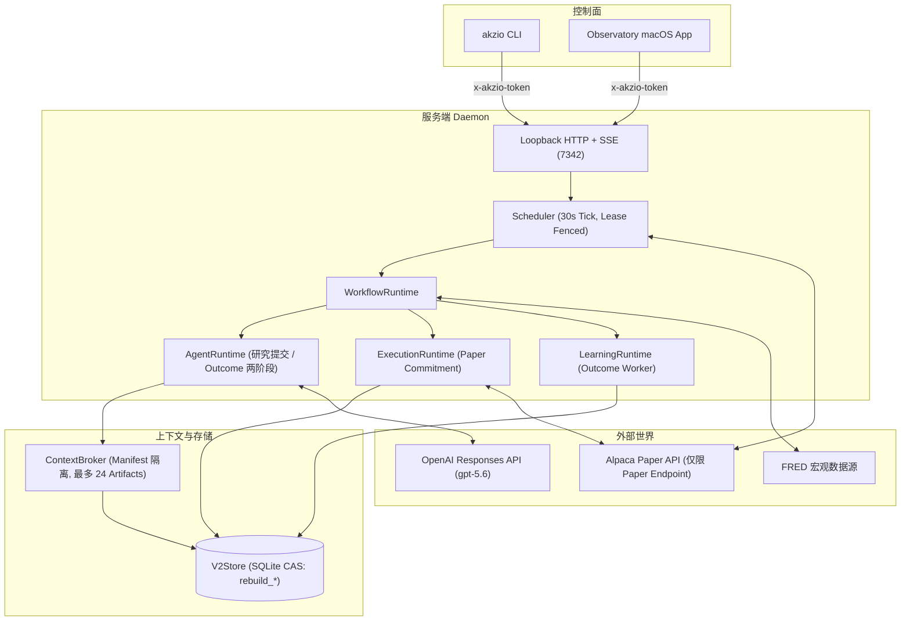

# Akzio Signal Intelligence v2

> **本地常驻、Rust 受控、Alpaca Paper 专用的多智能体量化投研系统**  
> 标的资产严格限定为 4 只美股流动性 ETF：`TQQQ`、`QQQ`、`SOXX`、`SOXL`。物理绝缘实盘交易（Live Trading 永不实现）。

---

## 目录

- [一、核心设计哲学：双并行时间轴](#一核心设计哲学双并行时间轴)
- [二、系统目标架构与数据流向](#二系统目标架构与数据流向)
- [三、全生命周期运行流程](#三全生命周期运行流程)
- [四、智能体系统与受控沙箱](#四智能体系统与受控沙箱)
- [五、Rust 决策与执行双闸门](#五rust-决策与执行双闸门)
- [六、统一 CAS 内容寻址存储架构](#六统一-cas-内容寻址存储架构)
- [七、初次运行三大关键现象与排坑指南](#七初次运行三大关键现象与排坑指南)
- [八、快速开始与环境配置](#八快速开始与环境配置)
- [九、CLI 操作与运维指令大全](#九cli-操作与运维指令大全)
- [十、Observatory 桌面应用](#十observatory-桌面应用)
- [十一、代码规范与验证矩阵](#十一代码规范与验证矩阵)

---

## 一、核心设计哲学：双并行时间轴

理解 Akzio v2 的关键在于其独特的**双并行时间轴（Dual Timeline）**。系统绝非“运行一次并阻塞等待 5 天才能进行下一次交易”，而是由两条独立解耦的时间轴并发运转：

```text
时间轴 A：每个交易日运行一次全新 Paper 投研决策 (T0)
─────────────────────────────────────────────────────────────────────────────►
  Session 0 (T0 投研 & 交易)
      │
      ├──► Session 1 (全新 T0 投研 & 交易)
      │        │
      │        ├──► Session 2 (全新 T0 投研 & 交易)
      │        │        │
      │        │        └──► ... 每个交易日只要市场开市，独立发起全新 Run

时间轴 B：每个历史 Run 独立经历 T+1 / T+3 / T+5 评估与复盘
─────────────────────────────────────────────────────────────────────────────►
  Run 0 产出
      ├──► T+1 交易日：计算首个评估窗口，由 Outcome Worker 生成阶段复盘 (Partial Outcome)
      ├──► T+3 交易日：计算第二评估窗口，生成阶段复盘 (Partial Outcome)
      └──► T+5 交易日：计算第三评估窗口，正式密封 (Sealed Outcome)，生成复盘；满足研究、风险和叙事资格后才进入学习评估
```

### 并行推进实例
在任意一个交易日 Session $S_n$ 中，后台调度器会并发处理：
- **执行当天全新的 T0 完整投研流水线**（EvidenceGate → Analyst → Critic → Synthesizer → DecisionGate → ExecutionGate → 下单）；
- **推进昨天 Run 的 T+1 评估**；
- **推进 3 天前 Run 的 T+3 评估**；
- **推进 5 个共同 Session 前 Run 的 T+5 封存，并检查学习资格**。

> **注**：T+1、T+3、T+5 严格按四只 ETF **共同完成的实际美股交易 Session 数**累计，周末与法定节假日自动跳过。

---

## 二、系统目标架构与数据流向

系统以 **Rust 2021/2024 (固定版本 `1.96.0`)** 为绝对权威，模型仅作为无副作用的研究计算单元：


```mermaid
flowchart TD
    subgraph 控制面
        CLI["akzio CLI"]
        App["Observatory macOS App"]
    end

    subgraph 服务端 Daemon
        API["Loopback HTTP + SSE (7342)"]
        Sch["Scheduler (30s Tick, Lease Fenced)"]
        WR["WorkflowRuntime"]
        AR["AgentRuntime (研究提交 / Outcome 两阶段)"]
        XR["ExecutionRuntime (Paper Commitment)"]
        LR["LearningRuntime (Outcome Worker)"]
    end

    subgraph 上下文与存储
        CB["ContextBroker (Manifest 隔离, 最多 24 Artifacts)"]
        Store[("V2Store (SQLite CAS: rebuild_*)")]
    end

    subgraph 外部世界
        OpenAI["OpenAI Responses API (gpt-5.6)"]
        Alpaca["Alpaca Paper API (仅限 Paper Endpoint)"]
        FRED["FRED 宏观数据源"]
    end

    CLI -->|x-akzio-token| API
    App -->|x-akzio-token| API
    API --> Sch
    Sch --> WR
    WR --> AR
    WR --> XR
    WR --> LR
    AR --> CB
    CB --> Store
    XR --> Store
    LR --> Store
    AR <--> OpenAI
    XR <--> Alpaca
    Sch <--> Alpaca
    WR <--> FRED
```

---

## 三、全生命周期运行流程

每个交易日的标准 Paper 周期包含以下十个阶段：

| 步骤 | 处理组件 | 性质 | 核心工作与产物 |
|---|---|---|---|
| **1. Tick 探测** | `Scheduler` | Rust | 每 30s 探测 Alpaca 市场钟；校验交易日 Session 槽位排他性与 Paper 审批令牌 |
| **2. 固化证据** | `EvidenceGate` | Rust | 保留 **40 项 Session EvidenceNeed**；前置只采集 34 项研究资料，6 项执行安全需求延迟到 ExecutionGate |
| **3. 拓扑装配** | `WorkflowRuntime` | Rust | Rust 编译固定研究拓扑；后续复用经过当前 Contract 校验的 Proposal |
| **4. 证据研判** | `Analyst Agent` | LLM | 基于至多 24 个授权 Artifact，提交单一 Horizon 的结构化 `Claim` 与 deliberation |
| **5. 交叉审查** | `Structured Critic` | LLM | 独立审查 Claim；若缺乏跨域支撑或存在矛盾，标记 `blocker: true`，生成 `Critique` |
| **6. 预测综合** | `Synthesizer Agent`| LLM | 强制综合 **4 资产 × 3 期限 = 12 个 Forecast**；缺证据项强制设为中性，生成 `DecisionProposal` |
| **7. 组合决策** | `DecisionGate` | Rust | 依据置信度、风险预算与校准模型计算目标组合；未配置校准时默认目标头寸为 0 |
| **8. 执行闸门** | `ExecutionGate` | Rust | 检查购买力、最新报价、流动性；产出 `ExecutionVerdict`，向 SQLite 持久化唯一 `client_order_id` |
| **9. 纸盘报单** | `PaperCommitment` | Rust | 调用 Alpaca Paper 下单 API，完成成交回报对账 (`Reconciliation`) |
| **10. 评估排期**| `Evaluate` | Rust | 原子写入 `OutcomeSchedule` 并派生独立的 `learning.outcome_worker` Durable 任务 |

---

## 四、智能体系统与受控沙箱

### 4.1 智能体分工与预算

系统通过统一模型网关调用 **OpenAI Responses** 协议模型：

| 智能体角色 | 模型 Route | Reasoning Effort | 预算约束 (Input / Output / 超时 / 工具数) | 产出物 |
|---|---|---|---|---|
| **Analyst** | `research.analyst` | `high` | 1M / 1M / 180s / Submit | `ArtifactKind::Claim` |
| **Critic** | `research.critic` | `high` | 1M / 1M / 180s / Submit | `ArtifactKind::Critique` |
| **Synthesizer** | `research.synthesizer`| `high` | 1M / 1M / 180s / Submit | `ArtifactKind::DecisionProposal` |
| **Outcome Worker** | `learning.outcome_worker`| `medium` | 1M / 4,000 / 180s / 受控读取 | `RetrospectiveDraft` |

正式 Paper 默认由 Rust 编译三个 Analyst/Critic 对，分别负责 T1、T3、T5；每个 Analyst 仍只提交一个 Claim，允许对四资产声明有界 grounds。Synthesizer 直接依赖三份 Claim 和三条 Critic 路径，即使 Critic 返回 NoOutput，Claim 仍保留。非中性研究预测逐资产、逐 horizon 检查已验证且方向一致的 price/macro 支撑；新闻保留为 coverage 与执行风险资料。缺口只阻断其声明范围；无法支撑的 slot 必须中性。显式现金研究配置始终可以表达；非零配置必须引用对应资产、期限的看多支持与正预期收益。上表为新 Run 默认冻结预算；覆盖配置、工具授权与累计用量边界见 [预算配置](docs/agent-budget-configuration.md)。

### 4.2 研究提交与 Outcome 两阶段协议

Paper、PositionPlan、Shadow 的 Analyst、Critic、Synthesizer、ProposalReviewer 使用 Contract 67 / PromptBundle 37：模型直接调用 `submit_result` 提交 `result + deliberation`，输入只含授权 projections，不提供独立 Draft、读取或搜索工具。Rust 校验引用闭包、方向资格和补采范围，并绑定交易日历。Outcome 保持 Contract 63 / PromptBundle 35 与冻结哈希，继续 Draft → 受控读取 → Submit。

Outcome Draft 使用最多一半输出预算与 70% 墙钟时限，必须先保存 Memo 才能提交。读取遵循“持久化 ToolCall → 执行读取 → 持久化 ToolResult”。所有协议共享原有任务预算、调用审计和恢复机制，阶段转换不清零用量。退休范围和历史边界见 [研究协议迁移清单](docs/research-protocol-retirement.md)。

### 4.3 Outcome 的受控 Context 读取

运行时 Agent 不具备网络、Shell、本地文件系统、数据库和下单权限。研究角色只提交结果；Outcome 可按其冻结 Contract 使用以下沙箱工具：
- `read_document(artifact_id)`：读取授权文档全文。
- `read_range(artifact_id, start_byte, end_byte)`：切片读取，单次上限 32 KiB。
- `search_context(query, max_results)`：**转小写后的子串包含匹配，而非向量搜索**（`text.to_lowercase().contains(&needle)`），需使用精确标的代码或专有名词。
- `read_claim_evidence(artifact_id)`：读取 Claim 以及其引用且已授权的标准化证据，不开放 RawEvidence。
- `compare_sources(artifact_ids)`：横向对比 2～4 个数据源。

---

## 五、Rust 决策与执行双闸门

### 5.1 DecisionGate (投研到决策)
- **12 个 Forecast 完整性**：Synthesizer 必须产出全部 12 个 Forecast（4 资产 × 3 期限）。任何缺少跨域直接支撑项，必须填充中性（`positive_return_probability_ppm = 500000`, `expected_return = 0`）。
- **默认 Fail-Closed 策略**：Store 没有已激活的预校准 `DecisionPolicy` 时，默认可用样本数为 0，**执行目标仓位强制为 0**。零目标不直接授权平仓；只有原审批及全部 ExecutionGate 检查通过后才能生成订单，缺审批的冷启动保留 `NoOrder`，不进入 Allocator。canonical Store 数据库不存在时由 Rust 自动初始化 schema，但不会自动生成 policy；运行时仅接受 SQL Store 的 active head。候选 Policy 由 SQL 校准流程生成，操作员显式按 Artifact ID 执行 `calibration activate`；PositionPlan 不从文件导入 Policy。

### 5.2 ExecutionGate (决策到执行)
- **原子幂等 Commitment**：在实际向 Alpaca 发起请求前，Rust 先向 SQLite 写入确定性 `client_order_id` 与 `ExecutionCommitment`。即便进程崩溃重启，也能保证不发生重复下单。
- **无订单仍予评估**：即使执行判定为 `NoOrder`，其预测仍会被封装为 `OutcomeSchedule`，在 T+1/T+3/T+5 进行真实市场表现校验。

### 5.3 校准数据准备与政策状态

默认 `DecisionPolicy` 是 fail-closed 的未配置状态；研究完成不等于校准或执行资格就绪。先读取已有 canonical Store 的缺口：

```bash
target/debug/akzio calibration readiness --store ~/.akzio/store --min-samples 30
```

风险限制、校准数据集和候选 Policy 均为 SQL Store/CAS Artifact。通过 `set-risk-limits` 写入操作员明确给定的风险限制，再依次使用 `collect → build → inspect → validate → activate`；参数引用 Store Artifact ID。`collect` / `build` 不激活 Policy，旧 JSON 导入、`calibration export` 和 `export-active` 入口已删除。完整命令和必填条件见 [开发 Workflow](docs/development-workflow.md)。

`collect` 只接受 canonical Store 的真实 Decision、密封 Outcome 和四资产共同交易 Session 标签，同时检查模型身份、Contract、训练窗口及价格序列。有效 Synthesizer 路由必须有可核实的 `release_date` 与 `knowledge_cutoff`。缺少样本或条件时保持阻断，不用目标仓位、事后总结或合成样本填充。`activate` 校验模型与当前 Synthesizer Contract 后，原子更新同一 Policy Artifact 的激活历史和 active head。

隔离 Debug 和原生 Alpaca Paper 入口 `python3 scripts/position_plan_run.py --paper` 可以验证正式图，但其运行不能计入正式校准；readiness 明确报告 `isolated_debug_store`，等待 Outcome 不会改变资格。旧 `-fakerOnline` 已删除。Paper 入口按真实交易时段、原审批和全部 Gate 执行；`NoOrder` 可表示流程已完成，不能据此宣称 Policy 已校准或发生 Paper 下单、成交。扩展时段、待成交恢复和归档边界见 [开发 Workflow](docs/development-workflow.md)。

---

## 六、统一 CAS 内容寻址存储架构

系统彻底摒弃了传统业务表（无 `claims`, `forecasts`, `orders` 等独立表），整套系统基于统一的**内容寻址存储（Content-Addressed Storage）**体系构建：

```text
.akzio/store/akzio.sqlite3
  ├── rebuild_blobs                # 原始 JSON 正文（经过 Zstd 高效压缩）
  ├── rebuild_artifacts            # Artifact 统一定义（kind, hash, lifecycle, provenance）
  ├── rebuild_artifact_refs        # 产物全生命周期 DAG 依赖拓扑血缘
  ├── rebuild_runs                 # Run 级别状态跟踪与图索引
  ├── rebuild_tasks                # 任务 Contract 调度与租约
  ├── rebuild_attempts             # 尝试与重试生命周期
  ├── rebuild_attempt_outputs      # 成功 Attempt 产生的正式输出映射
  ├── rebuild_session_slots        # 每个交易日的原子排他 Slot 与订单绑定
  ├── rebuild_policy_*             # T+5 评估记录与决策策略演进
  └── rebuild_lesson_*             # 质性复盘提炼的经验与证据
```

---

## 七、初次运行三大关键现象与排坑指南

首次部署运行系统时，请务必注意以下三个由系统严格规则引发的**正常设计行为**：

1. **默认不会自动发起 Paper Session**：
   - 示例配置中 `daemon.auto_paper = false`。直接启动只会开启 HTTP/SSE 守护进程与存储服务，不会连接 Alpaca Paper 调度。只有显式配置 `auto_paper = true` 且提供合规凭据与市场钟处于开盘期时，调度器才会工作。
2. **默认策略下不会建立多头头寸**：
   - 缺省决策策略时，校准样本不足，Rust 决策闸门遵循 Fail-Closed 原则将目标头寸设定为 0。若账户为空仓，系统产出 `NoOrder`；若账户原有多头，系统会自动触发卖出平仓至 0 敞口。
3. **初次运行会产出大量中性预测**：
   - 正式 Paper 与 PositionPlan 共享固定三组 Analyst/Critic，分别覆盖 T1/T3/T5。资料获取成功不等于方向命题获得支持；没有对应资产、期限和方向的充分依据时，Forecast 必须保持中性。不能把中性输出解释为只有单个 Analyst，也不能强迫模型产生非零仓位。

---

## 八、快速开始与环境配置

### 8.1 环境依赖
- **Rust Toolchain**：固定使用 `1.96.0`（通过 `rust-toolchain.toml` 锁定）。
- **SQLite3**：本地嵌入式存储。
- **Alpaca Paper 账号**：获取 API Key 与 Secret（禁止使用实盘 Endpoint）。
- **FRED API Key**：用于获取宏观无风险利率与波动率序列。
- **OpenAI 兼容端点**：支持 OpenAI Responses 协议的高阶模型（如 `gpt-5.6`）。

### 8.2 配置文件设置

App 首次启动时使用 [Observatory 模板](config/akzio.observatory.toml) 初始化 `~/.akzio/config.toml`，之后在 App Settings 中配置模型端点、模型和凭据。已有用户配置不会被初始化流程覆盖。

仅使用 CLI 时，可调用同一个初始化入口：

```bash
cargo run --locked -p akzio-cli -- observatory-config \
  --config "$HOME/.akzio/config.toml" init \
  --template config/akzio.observatory.toml \
  --store-root "$HOME/.akzio/store"
```

初始化使用 `paper-engineering` profile，默认 `auto_paper=false`。模板中的模型端点与密钥占位符从 `LLM_GATEWAY_BASE_URL`、`LLM_GATEWAY_API_KEY` 解析；Alpaca 与 FRED 凭据分别从 `ALPACA_API_KEY`、`ALPACA_API_SECRET`、`FRED_API_KEY` 读取，也可在初始化后通过 Settings 配置。

`paper-research` 与 `historical-eval` 是独立研究 profile，切换时仍须满足 Rust 对精确模型身份、发布日期、知识截止时间及评估条件的校验；不能使用示例日期代替实际模型元数据。启用正式 Paper 调度仍需既有审批与全部 Gate。运行及验证入口见 [开发 Workflow](docs/development-workflow.md)。

---

## 九、CLI 操作与运维指令大全

常驻服务的控制与查询通过认证的回环 HTTP API 完成，通信令牌存放于 Store Root 的 `.daemon-token`（权限 0600）。离线 `debug verify-fixture` 在新隔离 Store 内直接验证正式拓扑：

```bash
# 1. 启动本地守护进程（监听 127.0.0.1:7342）
cargo run -p akzio-cli -- daemon serve

# 2. 检查守护进程健康状态与租约
cargo run -p akzio-cli -- daemon health

# 3. 正式 PositionPlan 九节点离线验证，自动创建 .akzio 下的新 Store
cargo run --locked -p akzio-cli -- debug verify-fixture

# 4. 控制接口测试服务；通过 debug prepare 创建正式 Paper / PositionPlan 图
cargo run --locked -p akzio-cli -- --config config/debug-controller-fixture.toml debug serve-fixture

# 5. 从耐久事件重放并验证指定 Run（只读诊断）
cargo run -p akzio-cli -- run replay <run-id>

# 6. 监听 Run 的实时生命周期事件流 (SSE)
cargo run -p akzio-cli -- run events <run-id>

# 7. 系统紧急冻结与解冻（安全干预）
cargo run -p akzio-cli -- daemon freeze "操作员维护"
cargo run -p akzio-cli -- daemon unfreeze "恢复运行"

# 8. 本地统一 CAS 数据库完整性巡检
cargo run -p akzio-cli -- store doctor
```

---

### 分流程 Debug

完整设计、命令与验证边界见 [分流程 Debug 基础设施](docs/debug-control.md)。新入口使用隔离 Core，正式业务 DAG 不变，控制状态持久化在 V2Store。

```bash
# 仅离线验证控制器，不调用外部模型或券商。保持此 Core 运行。
cargo run -p akzio-cli -- --config config/debug-controller-fixture.toml debug serve-fixture
# 另一个终端：创建正式拓扑但保持暂停；加 --fixture-controller 则仅验证旧 CI 控制器。
cargo run -p akzio-cli -- --config config/debug-controller-fixture.toml debug prepare --session 2026-09-09
# 查看唯一 Task ID 后执行精确单步；具体运行实例见报告。
cargo run -p akzio-cli -- --config config/debug-controller-fixture.toml debug --help
```

真实模型阶段使用新隔离 Store、`debug_control=true`、`auto_paper=false` 和原生产模型配置启动 `daemon serve`。`debug prepare` 默认禁止 Broker 写入。修改代码/Contract/模型路由后不能继续消费旧身份的 permit，应创建新实验。旧 `run retry` 是新 Run，不等于 Debug resume。

App 可通过 `AKZIO_DEBUG_ENDPOINT` 与 `AKZIO_DEBUG_STORE_ROOT` 连接显式选择的隔离 Core；这一模式不启动默认 `~/.akzio/store` Core。演示 Store 位于 `.akzio/debug-controller-store`，不随打包中间产物清理。

## 十、Observatory 桌面应用

项目包含配套的原生 macOS 管理应用（基于 SwiftUI 构建）：

- **打包构建**：运行 `scripts/update_app_and_submit_debug.sh` 生成已签名的分发包 `apps/dist/akzio.app`，并保留构建产物。已有 Bundle 不会被覆盖；再次构建须通过 `AKZIO_APP_BUNDLE` 指定新路径，示例见 [开发 Workflow](docs/development-workflow.md)。
- **Core 嵌入机制**：App 启动时会通过 `RustCoreSupervisor` 自动将内嵌的 `akzio-core` 启动为 `daemon serve`，无缝读取 `~/.akzio/config.toml`。
- **状态监控**：若界面显示 `Paper scheduler waiting: broker market is closed`，表明系统正在正常等待下一个美股开盘窗口。

---

## 十一、代码规范与验证矩阵

在任何代码交付或向主干提交前，必须依次通过以下层级的本地离线严格验证：

```bash
# 格式化检查
cargo fmt --all -- --check

# 全工作区静态分析与全目标 Clippy
cargo check --workspace
cargo clippy --workspace --all-targets -- -D warnings

# 单元测试与集成测试
cargo test --workspace

# 正式九节点离线验证，包含 Store Doctor 和证据导出；不依赖真实模型配置
cargo run --locked -p akzio-cli -- debug verify-fixture
# 独立 store doctor 命令要求对应配置的认证 daemon 正在运行
cargo run -p akzio-cli -- store doctor
```

### 交付报告分级标准
- **implemented**：功能代码完成并通过本地语法检查。
- **offline-verified**：通过全套离线测试与 `debug verify-fixture` 验证。
- **real-Paper-verified**：在真实 Alpaca Paper 环境下完成至少 1 个完整开市周期的报单与对账。
- **outcome/learning-verified**：完成 T+5 交易日封存并成功生成完整的 Evaluated Experience。


## 十二、当前修复语义与版本

下面描述代码实现，不能代替运行验收。当前约束见 [运行时契约](docs/agent-runtime-contract.md)，验证入口与证据等级见 [开发 Workflow](docs/development-workflow.md)。

- **双时间轴**：Run 的终态描述 T0；Outcome 是同一 Run 的后续任务。Worker 数不少于 2 时分别为 Session、Outcome 保留服务能力；单 Worker 交错处理。每个 Outcome 独立租约，普通争用和未到期均为 Deferred，不消耗失败预算。
- **交易时间与数据**：Rust 用交易所 calendar 的美东收盘时间（含 DST、提前收盘）加 20 分钟可用性余量判断已完成日线。T+N 是 baseline 之后四资产共同 Session 的第 1/3/5 个。T0 日线按倒序分页选最近 252 根，再升序计算特征；Outcome 读取有界 raw 日线。刚下载不代表内容新鲜。40 项需求分别记录研究成功、缺口和执行 Deferred；执行安全只在 ExecutionGate 即时刷新后 fail closed，研究缺口仍进入原有有界降级。
- **阶段隔离**：先查询已完成 horizon，再选择最早待处理阶段。补跑 T1 时只提供 T1 截止前的价格事实及更早复盘。模型只写定性 RetrospectiveDraft；Rust 校验 staged blob，fenced commit 后才能按 Artifact ID 引用。
- **Outcome 上下文**：projection v2 保留 Rust 聚合指标和十二项预测，标明省略的路径/依据细节；原文保留在既有 128 KiB / 24 Artifact 沙箱内（估算上限 32k tokens）。模型 Draft、Submit 和工具回读仍共用 12k 输入预算，未放宽任意文件或 RawEvidence 权限。
- **Canary 交接**：仅登记的三个 Shadow 可读取父 EvidenceGate 已提交的冻结 NormalizedEvidence，并沿原 OutcomeSchedule 复用基线执行来源。等待或中断时保留密封数值和已完成 subject；恢复按 subject/outcome 去重，不重采已封存事实，不提前发布成功 Attempt 输出。未知风险仍导致 Defer。
- **收益口径**：从初始股数、现金、去重成交和费用重建执行后敞口，再按冻结敞口计算 Outcome。具有原基线报价与成交记录的新观察执行路径标注 `frozen_post_execution_exposure_v3`，分列价格效应、实施差额、初始估值差额和估算费用；旧 V2 与未观察执行的估计路径保留各自语义。实际账户 NAV 为 unavailable，因为没有后续订单与外部现金流完整账本。计价窗口内发现公司行动或无法确认一致价格口径时数值不可用；窗口外行动保留证据并允许早期阶段继续，不用 adjusted bar 猜测收益。
- **成本与身份**：Decision production cost 从其依赖任务闭包重建，包含该路径失败/重试；Outcome/叙事成本单独累计，生命周期总成本为另一读数。Experience 分开记录原研究 Contract 集、Workflow revision 与 evaluator Contract，原 DecisionContext 保留模型、policy 与 execution lineage。
- **学习资格**：市场窗口完整、12-slot 研究充分、复盘有效、风险真值已测量是独立条件。Rust-only T5 可以封存数值和 ModelUnavailable 复盘，不能据此晋升。`run repair-narrative <run-id>` 在原 Run 上有界补写叙事 revision，保留原数值 Outcome；重新进入原资格检查和 Evaluation 事务，条件不足保持当前状态。LessonProposal 必须带资产、horizon、排除条件和来源，只生成 Draft/quarantine。
- **查询与兼容**：`run replay` 返回 execution、各阶段叙事、数值封存、学习状态和成本分项。Store v15 新增按 Run/kind 的 Artifact 索引；v16 增加隔离 Debug 调度 head 和 RunScoped DebugRecord；v17 增加 DecisionPolicy 的不可变安装记录、激活链和 active head，不改变既有 CAS 或 Commitment。Domain schema 保持 10；研究 Contract 67、Prompt bundle 37、freshness candidate 68；Outcome Contract 63、Prompt bundle 35；Outcome metric V3（V2 仍可读取）、evaluation context v1，benchmark definition 仍为 1。旧缺失字段保留 unknown 语义，旧任务不自动换 Contract。升级与旧任务阻断规则见运行时契约。

验证结果按每次任务的实际执行范围报告；fixture 检查不构成真实 LLM/Paper、跨交易日学习或生产压力验收。

研究与执行边界：现有 `RunPurpose::PositionPlan` 表示 research + Decision / target position plan，无 ExecutionGate、PaperCommit、Reconcile 或 Evaluate；`RunPurpose::Paper` 使用同一 `approved_research_proposal` 三组 T1/T3/T5 Analyst/Critic 和 Synthesizer，再进入原执行链。没有新增 RunMode。Paper 的 account / positions / open_orders / fills / quotes / clock Need 保留 scheduler identity 与 provenance，前置只记录 Deferred，执行时才刷新。PositionPlan 执行显示 N/A，Debug manual/continuous、Broker policy、learning scope 仍是独立控制维度。补充研究保留冻结 Session 日期及原 future-data/cutoff 校验，不再要求市场当前开放。NewsWeb acquisition purpose mapping 和 policy hash 未改，缺失或未验证的方向证据不得变成有效 grounds。
