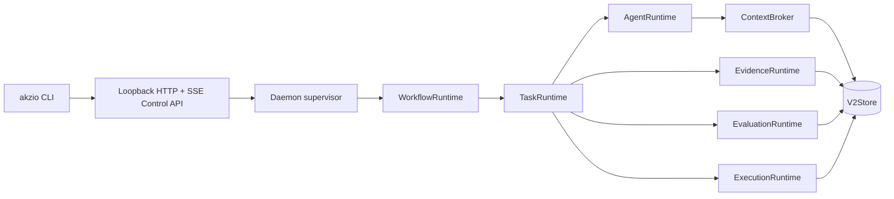

# Akzio Signal Intelligence v2

Akzio v2 是本地常驻、Rust 受控、Paper-only 的 Multi-Agent Research System。可执行资产严格为 `TQQQ`、`QQQ`、`SOXX`、`SOXL`；Live Trading 永不实现。

这是 source-incompatible 的 v2-only 重构：不读取、迁移或兼容旧 `orchestrator-*`、Phase 0–8、FileStore、旧 prompt 或 `outputs/store`。canonical 状态只属于 `V2Store`，新的 Store Root 是 `outputs/akzio-v2-rebuild`。

## 目标架构


```mermaid
flowchart LR
  CLI["akzio CLI"] --> API["Loopback HTTP + SSE Control API"]
  API --> D["Daemon supervisor"]
  D --> WR["WorkflowRuntime"]
  WR --> TR["TaskRuntime"]
  TR --> AR["AgentRuntime"]
  TR --> IR["EvidenceRuntime"]
  TR --> ER["EvaluationRuntime"]
  TR --> XR["ExecutionRuntime"]
  AR --> CB["ContextBroker"]
  CB --> S[("V2Store")]
  IR --> S
  ER --> S
  XR --> S
```

Rust 是状态、权限、Contract、预算、workflow gate、持久化、学习迁移和执行策略的唯一权威。模型不能访问任意文件、HTTP、Raw Evidence、SQLite 或交易凭据；`ContextManifest` 与 task/attempt-bound `ReadGrant` 是唯一资料通道。Debug、Replay、Shadow 与 Paper Dry Run 永远 noncanonical；只有 sealed Paper Outcome 可推动 memory 或 topology。

## 操作面

唯一业务控制面是带 `x-akzio-token` 认证的 loopback HTTP/SSE。CLI 和未来本地 UI 都调用它；没有 socket 回退、直接 Store 写入或 direct Paper submit/retry。

```bash
# 令牌只从环境变量读取；不要写入配置文件或提交到 Git。
cargo run -p akzio-cli -- daemon serve
cargo run -p akzio-cli -- daemon health
cargo run -p akzio-cli -- daemon freeze "operator reason"
cargo run -p akzio-cli -- daemon unfreeze "operator reason"
cargo run -p akzio-cli -- run submit debug
cargo run -p akzio-cli -- run replay <run-id>
cargo run -p akzio-cli -- run events <run-id>
cargo run -p akzio-cli -- run cancel <run-id>
cargo run -p akzio-cli -- run retry <run-id>
```

`run submit` 只接受 `debug` 或 `paper-dry-run`。Paper 创建和 Paper retry 只能由带 lease/epoch fencing 的注入 scheduler loop 完成；普通 `daemon serve` 不会从配置构造真实 Paper loop，并对缺少适配器或不合规配置 fail closed。

`run replay` 从耐久事件重建并校验 run snapshot；它是只读诊断，不创建 workflow、memory 或 execution state。`run fixture-debug` 是明确标记的本地 fixture diagnostic，不访问市场、模型或 broker。`store doctor` 是本地 V2Store 完整性诊断；旧 Store Root 会报不兼容错误，不会迁移或读取。

## 重构状态

R0–R10 的当前源码与离线验收已完成；尚未完成的是独立真实 Paper sandbox、真实 Paper Outcome sealing 和最终人工上线审批。

- [v2 invariants](docs/architecture/AKZIO_V2_INVARIANTS.md)
- [test matrix](docs/architecture/AKZIO_V2_TEST_MATRIX.md)
- [deletion graph](docs/architecture/AKZIO_V2_DELETION_GRAPH.md)
- [goal execution plan](docs/architecture/AKZIO_V2_R0_R10_GOAL_EXECUTION_PLAN.md)
- [final offline review](docs/architecture/AKZIO_V2_R0_R10_FINAL_REVIEW.md)
- [Paper runbook](docs/operations/AKZIO_V2_PAPER_RUNBOOK.md)

所有本地 fixture 结果只说明离线代码路径，不证明市场、broker、模型或真实 Paper execution。
