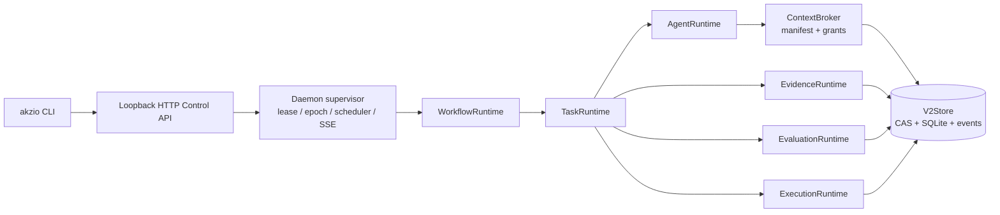

# Akzio Signal Intelligence v2

Akzio v2 是本地常驻、Rust 受控、Paper-only 的 Multi-Agent Research System。可执行资产严格为 `TQQQ`、`QQQ`、`SOXX`、`SOXL`；Live Trading 永不实现。

这是 source-incompatible 的 v2-only 重构：不读取、迁移或兼容旧 `orchestrator-*`、Phase 0–8、FileStore、旧 prompt 或 `outputs/store`。canonical 状态只属于 `V2Store`，新的 Store Root 是 `outputs/akzio-v2-rebuild`。

## 目标架构


```mermaid
flowchart LR
  CLI[akzio CLI] --> API[Loopback HTTP Control API]
  API --> D[Daemon supervisor\nlease / epoch / scheduler / SSE]
  D --> WR[WorkflowRuntime]
  WR --> TR[TaskRuntime]
  TR --> AR[AgentRuntime]
  TR --> IR[EvidenceRuntime]
  TR --> ER[EvaluationRuntime]
  TR --> XR[ExecutionRuntime]
  AR --> CB[ContextBroker\nmanifest + grants]
  CB --> S[(V2Store\nCAS + SQLite + events)]
  IR --> S
  ER --> S
  XR --> S
```

Rust 是状态、权限、Contract、预算、workflow gate、持久化、学习迁移和执行策略的唯一权威。模型只能输出 schema 限制的研究提案、证据需求、claim、critique 与 decision draft；它没有任意文件、HTTP、Raw Evidence、SQLite 或交易权限。

`ContextManifest` 与 task/attempt-bound `ReadGrant` 是 Agent 获得资料的唯一通道。Debug、Replay、Shadow 与 Paper Dry Run 永远 noncanonical；只有 sealed Paper Outcome 可推动 memory 或 topology 状态。

## 当前重构状态

R0 已验证；不变量、测试矩阵和删除图仍是当前执行入口：

- [v2 invariants](docs/architecture/AKZIO_V2_INVARIANTS.md)
- [test matrix](docs/architecture/AKZIO_V2_TEST_MATRIX.md)
- [deletion graph](docs/architecture/AKZIO_V2_DELETION_GRAPH.md)

当前 tree 已不再保留 domain/store/context/runtime/research 的 `rebuild.rs` 原型集合；仅 `crates/akzio-learning/src/rebuild.rs` 仍在删除清单中。它不是 v2 完成证据。阶段状态以 Goal 执行计划为准：R1/R2 为 complete pending regression，R3/R4 为 partial，R5 为 core complete 且 replay pending，R6 为 complete，R7 为 in progress。当前 Unix transport 仍是待删除的内部过渡实现：它不是 v2 public control plane，也不得为它新增调用者或兼容层。

> 2026-08-11 checkpoint: the phase-status sentence immediately above is superseded by the Goal plan: R0 verified; R1–R3 narrow regression verified; R4 durable catalogue lifecycle pending; R5 event-reducer replay pending; R6 awaits R10 final review; R7 remains in progress.

## 安全边界

- `AlpacaPaper::new` 必须在发起任何 HTTP I/O 前拒绝非 Paper endpoint。
- Paper commitment 仅归 scheduler 所有；每个 broker session 最多一个 durable slot，且所有 slot 写入均以 daemon lease owner/epoch fenced。
- Rust 可自动 freeze；只能通过 loopback operator HTTP API 或经该 API 的 CLI unfreeze。
- 不存在 direct CLI/API Paper submit 或 retry 路径。

R0 配置把 `auto_paper` 默认关闭。后续只有 R7/R8 的 decision gate、scheduler fencing 和恢复测试全部通过后，才可在受控本地环境显式启用自动 Paper；本仓库的 fixture 验证从不构成真实市场、模型或 Paper order 验证。

## R0 refresh local baseline

```bash
cargo metadata --offline --format-version 1 --no-deps
cargo test --offline -p akzio-store workflow_commit_accepts_out_of_order_nodes_and_preserves_dependencies
cargo test --offline -p akzio-runtime planner_graph_gets_non_bypassable_terminal_gates
```

以上是当前 tree 可重复的窄 v2 基线，不等同于完整验收。全 workspace、`fixture-debug` 与 `store doctor` 仍是 R10 终局 gate；R7 in progress 时不得把它们表述为已通过。任何 fixture 结果都不证明 gateway 可用、broker 连通、市场状态或 Paper execution。
