# Akzio v2 Deletion Graph — R10 completion

状态：R10 的实现、删除和当前树离线验证已完成。该图记录替换关系，不授权恢复任何旧接口或兼容层。

```mermaid
flowchart LR
  R0["R0: invariants and baseline"] --> R1["R1: domain vocabulary"]
  R1 --> R2["R2: V2Store transactions"]
  R2 --> R3["R3: Context and Evidence"]
  R3 --> R4["R4: Contract and AgentRuntime"]
  R4 --> R5["R5: Workflow and TaskRuntime"]
  R5 --> R6["R6: Evaluation and Learning"]
  R6 --> R7["R7: Decision and Execution"]
  R7 --> R8["R8: Daemon and HTTP/SSE"]
  R8 --> R9["R9: HTTP-only CLI/config"]
  R9 --> R10["R10: replay, audit, deletion"]
```

## Removal ledger

| Removed surface | Final replacement | Exit evidence |
| --- | --- | --- |
| Stringly role/task and self-asserted document semantics | Typed v2 IDs, artifacts, contracts and validation in `akzio-domain` | Domain validation and workspace suite |
| Split workflow/document writes and unpermitted artifact registration | `V2Store` CAS/SQLite transaction and `TaskWritePermit` APIs | Atomicity, permit, lease/epoch and Doctor tests |
| Run-wide implicit context and arbitrary raw reads | `ContextManifest` plus task/attempt-bound `ReadGrant` | Context closure, expiry and grant-denial tests |
| Fixed role/indexed research loop | Versioned contract catalogue, `AgentRuntime` and recipe catalogue | Contract, capability-ceiling and structured-turn tests |
| Fixed lifecycle/phase flow | `WorkflowRuntime` proposal lowering and `TaskRuntime` recovery | Gate, patch, retry/cancel and replay tests |
| Purpose-only or mutable learning attribution | Sealed Paper outcomes and immutable policy histories | Canonicality, shadow-pair and promotion/rollback tests |
| Weak decision/execution input and permissive broker endpoint | Rust Decision/Execution gates and strict Alpaca Paper adapter | Fail-closed endpoint, idempotency and reconciliation tests |
| Cross-domain policy in daemon dispatch | Owner-crate APIs; daemon coordinates leases, scheduling and transport | Daemon worker/scheduler integration tests |
| Unix JSON-line transport and Unix CLI client | Authenticated loopback HTTP/SSE control API | HTTP route, CLI/config and negative former-socket-config tests |
| Old Store Root/default compatibility claims | Fresh `outputs/akzio-v2-rebuild`; incompatible roots fail closed | Store-root incompatibility and Doctor tests |
| `legacy.rs`, `rebuild.rs`, `Rebuild*` public APIs and unused dependencies | Direct v2 module/file names and final public facades | Source inventory, compilation and workspace tests |

## Final inventory rules

- No active Rust source file is named `legacy.rs` or `rebuild.rs`; no active Rust symbol is named `Rebuild*`.
- A search result is allowed only when it is a negative test, an explicit fail-closed incompatibility check, or a historical architecture record. It never re-enables an old transport, Store Root, role, phase or execution path.
- The former `unix_socket` setting occurs only in the CLI rejection test. The old database filename occurs only in the Store incompatibility fixture.
- Existing data directories are neither read nor migrated. They remain outside the v2 authority boundary.

## No compatibility exceptions

There is no v1/v2 bridge, old Store importer, Unix fallback, direct CLI/API Paper submit or retry, legacy prompt/role adapter, Live trading path, or parallel JSON state authority.
