# Akzio v2 Deletion Graph — R9 checkpoint

状态：R9 complete。该图指定删除顺序；它不授权提前删除仍由 active path 使用的代码，也不允许新增 compatibility wrapper。

```mermaid
flowchart LR
  R0["R0: freeze + baseline"] --> R1["R1: domain vocabulary"]
  R1 --> R2["R2: V2Store transactions"]
  R2 --> R3["R3: Context + Evidence"]
  R3 --> R4["R4: Contract + AgentRuntime"]
  R4 --> R5["R5: Workflow + TaskRuntime"]
  R5 --> R6["R6: Evaluation + Learning"]
  R6 --> R7["R7: Decision + Execution"]
  R7 --> R8["R8: Daemon + HTTP/SSE"]
  R8 --> R9["R9: CLI/config; delete Unix"]
  R9 --> R10["R10: remove prototypes/dead code"]
```

## Legacy removal ledger

| Legacy / transitional surface | Current evidence | Replacement | Delete phase | Exit proof |
| --- | --- | --- | --- | --- |
| stringly role/task and self-asserted document semantics | active crate `lib.rs` surfaces | typed v2 ids/artifacts/contracts | R1 | no active old role/task types or callers |
| monolithic Store methods and unpermitted artifact registration | `crates/akzio-store/src/lib.rs` | transaction facade + permit-bound APIs | R2 | all state writers use V2Store transaction surface |
| run-wide implicit context / arbitrary raw access | current context active path | Manifest + ReadGrant + repair | R3 | denial tests and no bypass caller |
| fixed role/indexed research loop | active research/daemon dispatch | versioned Contract catalogue + AgentRuntime | R8, after R5 TaskRuntime cutover | no role-specific authority path in active daemon dispatch |
| fixed lifecycle compiler / phase-like task flow | active runtime/daemon flow | proposal lowering + TaskRuntime recovery | R5 | mandatory gates prove non-bypassable |
| mutable or purpose-only learning attribution | active learning path | sealed Outcome + immutable state history | R6 | noncanonical and transition tests |
| direct decision/execution input, weak endpoint validation | active execution/daemon flow | Rust DecisionGate + strict Paper adapter | R7 | fail-closed and idempotency tests |
| daemon dispatch owns cross-domain policy | `akzio-daemon` dispatch modules | owner-crate runtime APIs | R8 | daemon only coordinates/dispatches |
| Unix JSON-line business transport and UnixStream CLI | Removed from Daemon, CLI, config and README; CLI rejects the former socket setting | loopback HTTP/SSE control API | R9 | HTTP client tests plus static inventory have no Unix transport implementation or caller |
| `outputs/v2-store` and old output compatibility claim | README/config active default | fresh `outputs/akzio-v2-rebuild`; old root rejects | R9 | incompatibility test and zero active defaults |
| remaining compatibility-named implementation | current tree only retains `crates/akzio-learning/src/rebuild.rs`; the former cross-crate prototype set is gone | active v2 modules | R10 | remaining file removed or renamed only after its owner replacement is active; no re-export/dead code |
| old `orchestrator-*`, Phase 0–8, FileStore, old prompts/docs | source/docs inventory | none | R10 | static inventory has zero active support claims |

## R0 inventory policy

- `rg -n -i 'orchestrator|phase[[:space:]]*[0-8]|filestore|outputs/(store|v2-store)|unix|direct.*paper'` is an inventory, not a deletion command.
- Each hit is classified as: historical architecture evidence, temporary transitional code with the above phase, or a defect. Only the first may remain after R10.
- Historical R0 material recorded a cross-crate `rebuild.rs` prototype set. That inventory is no longer current: only `crates/akzio-learning/src/rebuild.rs` remains. The remaining file is not v2 completion evidence and stays in the deletion inventory until its owner replacement is active and covered by target tests.
- No data migration is permitted. Existing output directories stay untouched; the final Store API rejects the old root rather than reading or importing it.

## Source-audited R1 boundary correction

The original R1 exit wording required every downstream crate to consume the new domain before R2. Current source proves that this cannot be done without inventing a compatibility path: the old fixed-role research loop consumes the old Context/Store/Execution values, while its replacement is defined by R2–R7 owner crates.

R1 therefore freezes the new domain vocabulary, makes model-originated authority values non-deserializable, and marks the old authority vocabulary `Legacy*`. Each active old consumer is removed only in the phase that owns its replacement: Store in R2, Context/Evidence in R3, AgentRole in R4, fixed workflow in R5, learning records in R6, and decision/execution records in R7. This is a deletion schedule, not an adapter or compatibility promise.

## R4 deletion timing correction

`akzio-daemon` currently dispatches the fixed-role research loop directly. R4 therefore proves the target Contract/AgentRuntime independently; deleting its active `AgentRole` caller must wait for the R5 TaskRuntime replacement and the R8 daemon cutover. This does not authorize an adapter or fallback path.

## No compatibility exceptions

There is no v1/v2 bridge, old Store importer, Unix fallback, direct CLI/API Paper retry, or legacy prompt/role adapter. A call site moves to its replacement in the phase listed above, then the old surface is deleted in that same phase or R10 when its replacement has become active.
