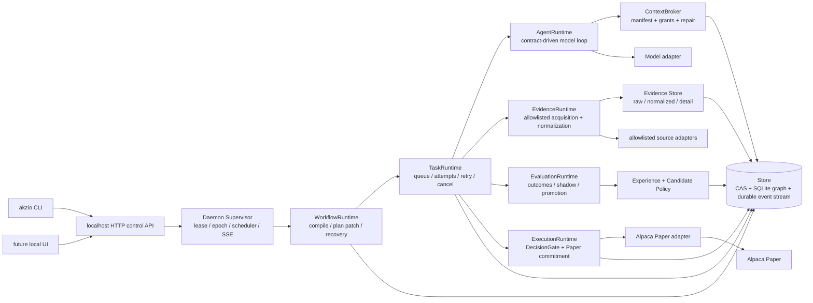

# Akzio v2 最大力度重构执行计划

> 状态：可执行设计基线。此计划明确放弃旧 Store Root、旧 CLI/Unix 协议、固定
> Phase 风格生命周期、固定角色拓扑和所有兼容适配层。

## 1. Outcome

Akzio becomes a local, Paper-only, four-ETF multi-agent research system that is:

- explainable: every decision, source, context selection, turn, tool result,
  policy verdict, order, and outcome has an immutable trace;
- self-improving: the system evaluates bounded candidate contracts/topologies
  through replay and paired Shadow, then automatically promotes or retires them;
- durable: task ownership, event history, recovery, scheduling, and queue state
  are transactional and daemon-owned;
- safe by construction: Rust gates all authority and automatic Paper execution.

The executable universe remains exactly `TQQQ`, `QQQ`, `SOXX`, `SOXL`.
Live Trading is unsupported and must fail closed at adapter construction.

## 2. Final architecture



### Runtime ownership

| Runtime | Owns | Must not own |
| --- | --- | --- |
| AgentRuntime | model turns, tool invocation, schema validation, produced artifacts | task lease state, SQL, execution approval |
| TaskRuntime | queue claim, lease/epoch, heartbeat, timeout, retry, cancellation | business dispatch, model prompt construction |
| WorkflowRuntime | graph lowering, planner patches, terminal gates, recovery | raw evidence or broker orders |
| ContextRuntime (`akzio-context`) | manifests, grants, selection, compaction/repair | model calls and durable task state |
| EvaluationRuntime (`akzio-learning`) | experience, outcome materialization, calibration, candidate transition | direct order changes |
| ExecutionRuntime | decision/policy gate, commitment, reconciliation | model-directed authority or topology promotion |

## 3. Workspace and module boundaries

Keep the existing package names where they still describe a deep module; replace
their internal public interfaces rather than add shallow wrapper crates.

| Crate | Rebuilt modules / sole interface | Delete from current design |
| --- | --- | --- |
| `akzio-domain` | `ids`, `contract`, `artifact`, `workflow`, `decision`, `evaluation`, `execution`, `event` | stringly role/task semantics and self-asserted hashes |
| `akzio-store` | `schema`, `transaction`, `artifacts`, `runs`, `tasks`, `events`, `leases`, `doctor` | split writes and unpermitted artifact registration |
| `akzio-context` | `broker`, `manifest`, `grant`, `selection`, `repair` | all-run implicit selection and arbitrary-ID raw access |
| `akzio-ingest` | `evidence_runtime`, `adapter`, `normalize`, `freshness` | task-specific ingestion branching in daemon |
| `akzio-model` | `client`, `response`, `fixture` | policy/contract logic |
| `akzio-runtime` | `workflow_runtime`, `task_runtime`, `planner_runtime`, `recovery` | fixed lifecycle compiler and execution business code |
| `akzio-research` | `catalogue`, `agent_runtime`, `tools`, `outputs` | fixed `AgentRole` / role-indexed registry |
| `akzio-learning` | `experience`, `outcome`, `eval`, `candidate`, `topology` | memory summary as the only learning primitive |
| `akzio-execution` | `policy`, `decision_gate`, `paper_runtime`, `reconcile` | disconnected order-only risk policy |
| `akzio-daemon` | `server`, `supervisor`, `scheduler`, `dispatch` | Unix JSON business control plane and cross-domain reducers |
| `akzio-cli` | HTTP client, config validation, diagnostic/replay commands | Unix socket client and legacy Store assumptions |

## 4. New data model

### 4.1 Artifact graph

Every persistent value is an immutable `Artifact` with a content hash, media type,
producer, creation time, lifecycle, provenance, and typed source references.

- `RawEvidence`: bytes exactly acquired from an adapter; CAS key is its SHA-256.
- `NormalizedEvidence`: typed source representation referencing raw content.
- `SemanticDetail`: a loss-bounded extraction whose source closure points to raw or
  normalized evidence.
- `Claim`, `Critique`, `DecisionContext`, `ExecutionContext`, `Experience`,
  `Outcome`, `Evaluation`, and `Contract`: immutable typed JSON artifacts.
- A canonical Decision holds only immutable artifact references. Compaction may add
  summaries but can never delete an artifact reachable from a canonical Decision,
  commitment, outcome, or active candidate.

`ArtifactId` is content-addressed; `RunId`, `TaskId`, and `AttemptId` identify
execution instances, not content. The Store rejects any reference whose artifact
kind, lifecycle, provenance, or source closure violates its type policy.

### 4.2 Write permits and atomicity

`TaskWritePermit { run_id, task_id, attempt_id, lease_id, epoch, contract_hash }`
is minted only for a running attempt. Artifact writes, task completion, and their
events are committed in one SQLite transaction and validate that permit.

`Store::commit_workflow` atomically persists Run, frozen Plan, initial Tasks,
dependencies, and `workflow.created`. No recovery path reconstructs a partially
submitted graph.

### 4.3 Contract

`AgentContract` is a canonical Rust structure:

```
identity + version + purpose + input policy + evidence access policy + tool grants
+ output schema + prompt template + task budget + retry policy + termination policy
+ failure policy + contract_hash
```

The hash is recomputed from canonical JSON excluding `contract_hash`; it covers
prompt and schema blob hashes. The catalogue installs Active versions only.
Candidate contracts are data, cannot widen authority, and need replay/Shadow
evaluation before automatic activation.

### 4.4 Context and tool grants

A task receives `ContextManifest` plus `ReadGrant` records. A grant lists a
manifest closure, permitted artifact kinds, source families, byte ceiling, and
expiry. Raw reread is possible only when a grant names the raw artifact through
the manifest's source closure. Context repair produces another immutable Detail
and event; it never mutates or silently replaces context.

### 4.5 Dynamic research graph

Planner output is `WorkflowProposal`, not `TaskSpec`. It names preinstalled
`TaskRecipeId`s, questions, dependencies, priority, desired evidence, and stop
reason. `WorkflowRuntime` lowers it under graph, budget, authority, depth, and
terminal-gate invariants.

Initial active topology uses four contract purposes:

1. `research.planner` — chooses recipes and evidence gaps;
2. `research.analyst` — produces evidence-linked claims, in parallel shards;
3. `research.critic` — conditionally attacks material claims or gaps;
4. `research.synthesizer` — returns a decision proposal plus typed blockers.

Only three of these run on the current `active` topology. `insert_structured_critic`
is gated on `STRUCTURED_CRITIQUE_CANDIDATE_TOPOLOGY_ID`, so the critic is reachable
only through a candidate topology under a canary or shadow campaign; an `active`
Paper session never critiques its own claims, whatever the materiality or conflict
thresholds say. The planner may not schedule the critic itself
(`RuntimeError::PlannerSchedulesCritic`).

These are contract purposes rather than a closed Rust role enum. Candidate topology
may merge, remove, split, or add a contract recipe only within the approved
capability grammar. Rust risk and execution gates are not agent contracts.

### 4.6 Evaluation and learning

`Experience` binds Decision, Decision Context, Execution Context, policy verdict,
topology, contract versions, and later Outcome. `EvaluationRuntime` calculates:

- outcome utility versus QQQ, calibration, evidence completeness, risk recall;
- contract/task marginal value through ablation and paired Shadow;
- token, latency, tool, and failure cost;
- candidate state: `Candidate -> Active -> Proven -> Contested -> Retired`.

Only canonical Paper outcomes can affect active learning. Debug, Dry Run, replay,
and unsealed future data create diagnostics but have no promotion path.

### 4.7 Automatic Paper execution

The execution gate consumes typed HardBlockers, SoftWarnings, evidence freshness,
claim/material-conflict status, confidence/calibration state, account, quotes,
factor exposure, turnover, plan hash, and idempotency state.

- Any HardBlocker creates an audited `NoOrder` outcome.
- Four ETFs form one global leveraged-equity gross bucket plus Nasdaq and
  semiconductor factor limits; TQQQ/QQQ and SOXL/SOXX also have pair constraints.
- The daemon owns one commit slot per Alpaca broker session. Research can refresh
  continuously, but only the current accepted Intent may commit in that slot.
- A durable local `freeze` switch stops new Paper commitments. Live endpoint or
  non-Paper host always errors before HTTP I/O.

## 5. Store and configuration migration

There is no data migration. The default Store Root becomes
`outputs/akzio-v2-rebuild`; the database has a single explicit schema version.
Opening an existing `outputs/v2-store` must return `IncompatibleStoreRoot` with
a remediation message. Existing output is preserved untouched as a diagnostic
fixture, never imported into canonical learning.

Configuration is rewritten around:

- daemon HTTP bind/token, worker count, scheduler window, and freeze state;
- four-asset execution/factor budgets;
- contract catalogue location and candidate policy bounds;
- allowlisted evidence adapter configuration;
- model provider configuration.

Secrets remain environment-only. Config parsing rejects any asset universe other
than exactly the four supported symbols and any non-loopback HTTP bind by default.

## 6. Ordered implementation tasks

### R0 — Freeze the new contract and test matrix

- **Goal:** establish the new source-incompatible target before implementation.
- **Add:** architecture decision document, invariants checklist, test matrix.
- **Modify:** workspace README/config examples to name the rebuilt Store Root.
- **Delete:** claims that old output or Unix command paths are supported.
- **Depends on:** none.
- **Tests:** baseline workspace tests and Store Doctor; static old-name inventory.
- **Accept:** every later task has an owning crate, invariant, and test category.

### R1 — Replace domain vocabulary with canonical contracts and artifacts

- **Goal:** make domain types expressive enough that runtime code cannot restore
  the fixed-role design through strings.
- **Add:** canonical hash encoding, `ArtifactKind`, provenance/closure types,
  `ContractPurpose`, `TaskRecipe`, `WorkflowProposal`, typed blockers, evaluation
  and factor-exposure types.
- **Modify:** Decision, policy, event, and task types to reference content and
  permits explicitly.
- **Delete:** `AgentRole`, `PlannedResearchRole`, unvalidated `output_type`, and
  self-trusting contract hash fields.
- **Depends on:** R0.
- **Tests:** deterministic hash, serde round-trip, malformed contract, invalid
  lifecycle, unsupported asset, graph/budget/property tests.
- **Accept:** no model-originated value can represent new tool/execution authority.

### R2 — Rebuild Store schema and transaction surface

- **Goal:** make all durable state transactional, content-addressed, and lease-safe.
- **Add:** schema-v2 initializer, atomic workflow commit, task write permit,
  artifact graph indexes, cursor event stream, active reachability/compaction
  checks, Store Doctor checks for every invariant.
- **Modify:** task claim/retry/recovery and daemon lease interfaces to use a single
  transaction API.
- **Delete:** `register_document` without permit, split workflow writes, old
  database compatibility/migration code, UUID-first artifact identity.
- **Depends on:** R1.
- **Tests:** crash injection between all old write boundaries, stale worker write
  rejection, duplicate CAS writes, reference closure, doctor corruption fixtures,
  concurrent Run/lease fencing.
- **Accept:** no partial Run graph or stale-attempt artifact can be observed.

### R3 — Rebuild Context Broker and Evidence Runtime

- **Goal:** separate data plane layers and ensure context is bounded/replayable.
- **Add:** source adapter trait, acquisition request, Raw/Normalized/Detail
  pipeline, grants, manifest closure validator, selection/repair events.
- **Modify:** Alpaca acquisition to seal every response through the Evidence
  Runtime; context request receives recipes rather than a run-wide document scan.
- **Delete:** `documents_for_run` implicit inclusion and arbitrary durable-ID raw
  rereads.
- **Depends on:** R1, R2.
- **Tests:** raw de-duplication, manifest-only reads, closure rejection, detail
  provenance, stale source rejection, adapter fixture replay.
- **Accept:** model code has no filesystem/network route and cannot read an
  artifact outside its current grant.

### R4 — Rebuild Task and Workflow Runtime

- **Goal:** replace fixed lifecycle compilation with a dynamic graph and fixed
  Rust gates.
- **Add:** recipe catalogue resolver, Planner proposal compiler, graph patch
  transaction, terminal gate templates, recovery/replay reducer.
- **Modify:** task execution ownership, cancellation, retry, and recovery to use
  R2 permits/events.
- **Delete:** singleton Phase-like `TaskKind` sequencing, lifecycle special cases,
  static Plan/Investigate/Challenge/Synthesize restrictions.
- **Depends on:** R1, R2, R3.
- **Tests:** parallel DAG, rejected topology/capability expansion, bounded fanout,
  graph recovery after process death, cancel/retry, deterministic replay.
- **Accept:** Planner can vary research topology but cannot omit DecisionGate,
  ExecutionGate, audit persistence, or terminal reconciliation.

### R5 — Replace Research with Contract-driven AgentRuntime

- **Goal:** make prompt, schema, tools, budgets and results derive from one
  installed contract.
- **Add:** catalogue loader, canonical contract installer, turn trace, typed output
  validator, recipe execution, evidence-need output, candidate contract proposal.
- **Modify:** model integration and fixture client to produce structured turns.
- **Delete:** `AgentRole` map, default four hard-coded definitions, free-form
  planner task translation, prompt/schema duplication.
- **Depends on:** R1–R4.
- **Tests:** contract hash mismatch, output schema failure/retry, tool grant scope,
  termination, planner fanout, fixture full research run.
- **Accept:** each Agent task can be reconstructed from its contract hash,
  manifest, turns, tool events, and output artifact.

### R6 — Rebuild Eval, Experience, and automated topology policy

- **Goal:** transform outcome history into bounded automatic learning.
- **Add:** Experience builder, outcome schedules/materializer, calibration,
  ablation metric, candidate policy state machine, paired Shadow evaluator and
  immutable promotion/rollback events.
- **Modify:** memory overlay to query only active/proven priors through Context;
  scheduler to create Shadow after a canonical Paper decision.
- **Delete:** one-summary-per-decision memory model, baseline-only topology,
  noncanonical learning entry points.
- **Depends on:** R1–R5.
- **Tests:** Debug/Dry Run rejection, duplicate outcome idempotency, promotion,
  contested/retired transitions, risk-recall rollback, ablation attribution.
- **Accept:** automatic activation is impossible without fresh canonical paired
  evidence and policy limits; all influences appear in Decision Context.

### R7 — Rebuild execution and Alpaca Paper boundary

- **Goal:** make automatic Paper safe, idempotent, and explainable.
- **Add:** typed gate verdict, HardBlocker/SoftWarning handling, factor exposure,
  durable freeze, session intent, exact Paper endpoint parser, reconciliation
  state machine.
- **Modify:** order planner to consume Decision Context and Execution Context;
  commitment/reprice policy to record every broker-visible transition.
- **Delete:** order planning that only receives targets, URL `contains` Paper
  detection, any manual confirmation dependence, Dry Run topology effects.
- **Depends on:** R1, R2, R3, R6.
- **Tests:** blocker no-order, stale quote/account/turnover/factor rejection,
  duplicate commit/restart, single reprice lineage, fake Alpaca reconciliation,
  non-Paper endpoint rejection.
- **Accept:** an order cannot reach Alpaca without a typed accepted verdict and a
  durable one-per-session commitment.

### R8 — Rebuild Daemon and CLI around one local protocol

- **Goal:** provide persistent, observable multi-Run operation without duplicate
  command surfaces.
- **Add:** HTTP run/control API, authenticated SSE cursor subscription, scheduler,
  daemon supervisor, freeze endpoint, replay/diagnostic endpoints, HTTP CLI.
- **Modify:** worker dispatch to thin routing into R3–R7 deep modules.
- **Delete:** Unix JSON-line server/client, path deletion behavior, command logic
  duplicated between CLI and HTTP.
- **Depends on:** R2, R4–R7.
- **Tests:** auth, SSE resume, HTTP cancel/retry, two-daemon epoch fencing, crash
  recovery, multi-run concurrency, scheduler slot uniqueness, freeze persistence.
- **Accept:** CLI and future UI exercise identical localhost APIs and all state is
  replayable from Store events/artifacts.

### R9 — Remove superseded code and prove the product

- **Goal:** leave only one coherent v2 implementation.
- **Add:** fixture data for isolated Store Root, e2e harness, Doctor fixtures,
  upgrade notes documenting intentional incompatibility.
- **Modify:** README, config examples, all tests and CI commands.
- **Delete:** old types/modules/tests, unused workspace dependencies, legacy
  outputs assumptions, dead adapters, dead feature flags.
- **Depends on:** R1–R8.
- **Tests:** full workspace suite, clippy, isolated Debug, crash/recovery,
  concurrency, evidence integrity, learning transitions, Paper Dry Run, Doctor.
- **Accept:** `rg` finds no v1/orchestrator/Phase/FileStore compatibility source;
  Cargo has no unused direct dependency and the full command set below passes.

## 7. Parallel workstreams

| Worker | Work | Join point |
| --- | --- | --- |
| A | R1 domain + R2 Store | public canonical types and atomic Store interface |
| B | R3 Context/Evidence + R5 Agent contracts | depends on A's artifact/permit interfaces |
| C | R7 Execution/Paper + config policy | depends on A's decision/blocker types |
| D | R4 Runtime + R6 Eval/Shadow | depends on A, then B for context and C for execution facts |
| E | R8 daemon/CLI + R9 e2e harness | joins after B/C/D public interfaces stabilize |

Parallelism is only across stable interfaces; no worker edits another workstream's
schema without an explicit interface update.

## 8. Final acceptance commands

All commands use a newly-created isolated Store Root and must be reported
separately from fixture/mock versus real Paper assertions:

```bash
cargo fmt --all -- --check
cargo check --workspace
cargo clippy --workspace --all-targets -- -D warnings
cargo test --workspace

# New root; never reuse outputs/v2-store.
export AKZIO_STORE_ROOT="$(mktemp -d)/akzio-v2-rebuild"
cargo run -p akzio-cli -- store doctor
cargo run -p akzio-cli -- run fixture-debug
cargo run -p akzio-cli -- test crash-recovery
cargo run -p akzio-cli -- test concurrent-runs
cargo run -p akzio-cli -- test evidence-integrity
cargo run -p akzio-cli -- test learning-transitions
cargo run -p akzio-cli -- run paper-dry-run
cargo run -p akzio-cli -- store doctor
```

The Paper Dry Run uses a fake/fixture Alpaca adapter unless explicitly configured
with Paper credentials. A green dry run is never described as a Live or real-money
validation.

