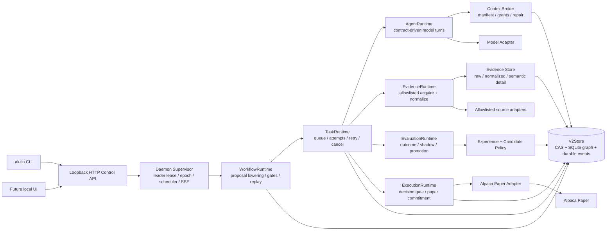
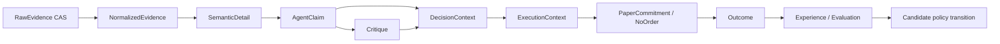
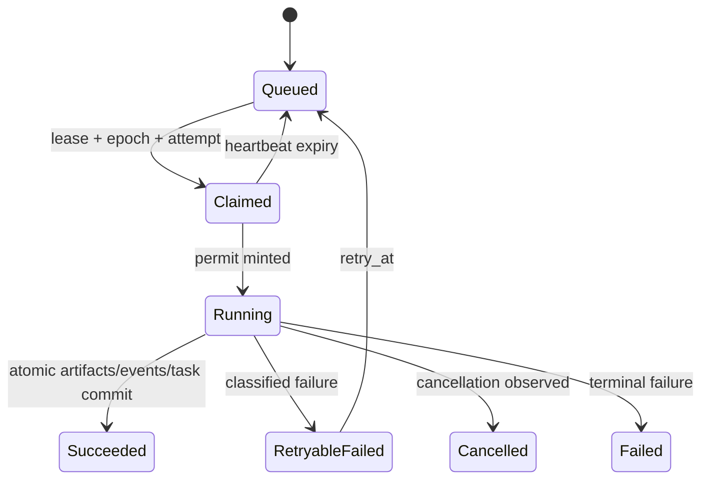

# Akzio v2 最大力度重构执行计划-续

> 状态：**待用户确认后实施**。本文是 source-incompatible 的最终目标设计，不保留旧 Store、旧 Phase、旧 CLI 协议或兼容适配层。它吸收了此前的《Akzio v2 最大力度重构执行计划》，并以当前工作树审计为准。

## 0. 决策摘要

Akzio 应被重构为一个本地常驻、Rust 受控、仅能对 `TQQQ`、`QQQ`、`SOXX`、`SOXL` 执行 Alpaca Paper 的多 Agent 研究系统。模型只产生受 Schema 限制的研究提案、证据需求、Claim、Critique 与 Decision Draft；Rust 是状态、权限、契约、预算、工作流 Gate、学习状态迁移和订单提交的唯一权威。

本计划直接采用下列默认决定：

1. Evidence 采用受治理的多源体系：Alpaca、SEC EDGAR、FRED、显式配置的 News/Web Adapter；Agent 不拥有 HTTP、文件系统或原始证据任意读取权。
2. 每个 Alpaca broker session 最多一次组合 Paper commitment；研究可刷新，但不会产生日内连续下单。
3. 学习采用风险优先的字典序目标：先 Risk Recall / 违规率，再 Evidence Completeness / Calibration，最后比较相对 QQQ 的 T+1、T+3、T+5 Outcome Utility。
4. 自动优化只能晋升或降级 Prompt、预算、Contract 版本和候选研究拓扑；不得自动扩大数据源、工具或执行权限。
5. Rust Policy 可以自动冻结 Paper；只有 loopback operator HTTP API / CLI 能解除冻结。模型只能报告 blocker。
6. Debug、Replay、Shadow、Paper Dry Run 全部 noncanonical：绝不促进 Memory、Topology 或 Active Contract。

## 1. 已验证的当前问题

下列不是抽象担忧，而是当前工作树中的源码事实：

| 问题 | 代码证据 | 重构结论 |
| --- | --- | --- |
| 角色是闭集 | `crates/akzio-research/src/lib.rs:35` 的 `AgentRole` | 删除角色枚举驱动的拓扑；改为版本化 Contract + Recipe Catalogue。 |
| 工作流仍是固定骨架 | `crates/akzio-runtime/src/lib.rs:281` 的 `WorkflowCompiler` | 重写为受 Rust 固定 Gate 限制的动态 DAG Compiler。 |
| 提交不是原子事务 | `WorkflowRuntime::submit` 从 `crates/akzio-runtime/src/lib.rs:372` 起依次创建 run、plan、task、dependency、event | 用一次 `Store::commit_workflow` 提交完整图和 `workflow.created` 事件。 |
| Context 跨 Run 宽泛扩张 | `crates/akzio-research/src/lib.rs` 的 `documents_for_run` 路径 | 删除隐式 run-wide gather；只允许 `ContextManifest` 的 source closure。 |
| 文档写入无 attempt/lease permit | `crates/akzio-store/src/lib.rs:260` 的 `register_document` | 删除裸写入；所有语义 artifact 写入必须验证 `TaskWritePermit`。 |
| `DocumentRecord::validate` 只做 envelope 校验 | `crates/akzio-domain/src/lib.rs` 的 `DocumentRecord::validate` | 增加 kind-specific payload、provenance、lifecycle 与 source-closure 验证。 |
| 控制面双轨 | `crates/akzio-daemon/src/lib.rs:571` 的 HTTP/SSE 与 `:583` 的 Unix；`crates/akzio-cli/src/main.rs:239` 使用 UnixStream | 删除 Unix JSON-line 业务协议；CLI/UI 均走 localhost HTTP + SSE。 |
| Paper Dry Run 与学习/拓扑边界不集中 | daemon/learning 中 `PaperDryRun` 参与 topology 初始化的路径 | 以单一 Rust canonicality policy 一次性拒绝 noncanonical promotion。 |
| 现有执行输入不足以稳定拒单 | `crates/akzio-execution/src/runtime.rs` 的 Gate 只覆盖部分输入 | 用 typed blocker、freshness、claim conflict、factor exposure、plan hash 和 reconciliation 组成不可绕过执行 Gate。 |

### 1.1 保留、重写、删除

**保留原则，不保留实现：**

- `akzio-domain` 的封闭资产集合与整数/定点组合计算。
- `akzio-store` 的 CAS、SQLite、append-only event、lease、Store Doctor 思路。
- `akzio-context` 的“Agent 只能由 Broker 获得材料”原则。
- `akzio-execution` 的确定性 allocation、Paper endpoint fail-closed、broker reconciliation 思路。
- `akzio-learning` 的 Outcome-backed history、paired Shadow 与风险召回回滚原则。
- `akzio-daemon` 的常驻 scheduler、epoch fencing、SSE replay、worker pool 思路。

**必须整体重写：** domain vocabulary、Store transaction surface、Context Broker、Evidence ingest、Agent Contract、Workflow/Task Runtime、Eval/learning policy、Execution gate、Daemon control plane、CLI/config 和 E2E harness。

**必须删除：** 固定 `AgentRole` / `PlannedResearchRole`、Phase 风格 `TaskKind` 编排特例、旧 `WorkflowCompiler` 生命周期骨架、裸 `register_document`、run-wide document scan、任意 DocumentId Raw reread、Unix JSON command server/client、旧 Store Root 兼容/迁移、所有 Debug/Dry Run 到 canonical learning/topology 的路径，以及旧 `orchestrator-*` / Phase / FileStore 兼容材料。

当前 tree 已包含五个 `rebuild.rs` 原型和对应的 crate 导出。它们可以作为设计参考，但没有接入 daemon/CLI/active execution path；实施时不要“补接线”，而应在新模块落地后删除或用测试证明替换。

## 2. 最终目标架构



### 2.1 不可绕过的 Rust Gate

Planner 不能移除、替换或直接调用下列 Gate：

1. `EvidenceGate`：所有网络读由 Rust adapter acquire、seal、normalize；模型只能输出 `EvidenceNeed`。
2. `ContractGate`：Recipe、Contract hash、tool grant、budget、termination/retry 都由安装的 Rust Contract 校验。
3. `WorkflowGate`：Planner proposal 只能引用预安装 Recipe，受最大 fan-out、depth、cost、source family、terminal path 约束。
4. `DecisionGate`：只接受完整 Evidence/Claim/Critique/DecisionContext；将 material conflict 和硬 blocker 转化为拒绝理由。
5. `ExecutionGate`：只接受 `AcceptedDecisionContext`、fresh quote/account、factor exposure、turnover、session slot、plan hash 与 idempotency state。
6. `CanonicalityGate`：只允许 sealed Paper outcome 写入 active experience/topology/contract policy。

## 3. 新 workspace 与模块边界

不新增“薄 wrapper crate”；保持现有 crate 名称，彻底替换其 public interface。

| Crate | 目标模块 | 唯一职责 |
| --- | --- | --- |
| `akzio-domain` | `ids`, `artifact`, `contract`, `workflow`, `decision`, `execution`, `evaluation`, `event`, `policy` | 无 I/O 的稳定 schema、canonical hashing、类型规则。 |
| `akzio-store` | `schema`, `cas`, `transaction`, `runs`, `tasks`, `artifacts`, `events`, `leases`, `slots`, `doctor` | CAS/SQLite、原子写入、lease/fencing、store health。 |
| `akzio-context` | `broker`, `manifest`, `grant`, `selection`, `repair` | 只负责 Context 数据平面、可读范围和 repair。 |
| `akzio-ingest` | `runtime`, `adapter`, `normalize`, `freshness`, `fixtures` | allowlisted source acquisition 与 Evidence lifecycle。 |
| `akzio-model` | `client`, `protocol`, `response`, `fixture` | 模型 transport/protocol；不含 policy。 |
| `akzio-research` | `catalogue`, `agent_runtime`, `prompt`, `tool_runtime`, `validator` | contract-driven research turns。 |
| `akzio-runtime` | `workflow_runtime`, `planner_runtime`, `task_runtime`, `recovery`, `replay` | 动态 DAG、attempt lifecycle、recovery。 |
| `akzio-execution` | `decision_gate`, `execution_gate`, `allocation`, `paper`, `reconciliation` | Rust-owned Paper execution。 |
| `akzio-learning` | `experience`, `outcome`, `calibration`, `shadow`, `policy`, `topology` | canonical eval 与受限提升/回滚。 |
| `akzio-daemon` | `supervisor`, `scheduler`, `dispatch`, `http`, `sse`, `workers` | process leadership、transport、schedule，不包含业务 reducer。 |
| `akzio-cli` | `config`, `http_client`, `commands`, `diagnostics` | 同一 HTTP control interface 的操作员入口。 |

## 4. Agent Contract 与拓扑

### 4.1 `AgentContract`

`AgentContract` 是 canonical Rust value，hash 覆盖除了 `contract_hash` 本身以外的全部字段及 prompt/schema blob hash：

```text
contract_id + semver + purpose + context_policy + evidence_policy
+ tool_grants + output_contract + prompt_template_ref
+ task_budget + retry_policy + termination_policy + failure_policy
+ candidate_capability_ceiling + contract_hash
```

每个 Task 只持有 `contract_hash`，而不是可变 prompt/name/role。Catalogue 只安装 Active Contract；Candidate Contract 永远不能把 capability ceiling 扩大到 Active policy 之外。

### 4.2 初始 active topology

初始拓扑是 Contract purpose，不是 Rust role enum：

| Purpose | 输入 | 输出 | 允许行为 |
| --- | --- | --- | --- |
| `research.planner` | market regime、gap summary、budget | `WorkflowProposal` + `EvidenceNeed` | 选择 preinstalled Recipe；不能提交 decision/order。 |
| `research.analyst` | granted evidence/detail | evidence-linked `Claim` | 并行分片研究；不能扩展 source/tool scope。 |
| `research.critic` | material claim set/conflicts | `Critique` / blocker candidate | 仅在 candidate topology 且价值/冲突阈值达标时由 Rust 插入；planner 不得自行排入。 |
| `research.synthesizer` | approved claims/critiques | `DecisionDraft` + typed blockers | 不能修改事实、不能绕开 DecisionGate。 |

Risk、Execution、Scheduler、Store Doctor 均为 Rust module，绝不是 Agent。后续 topology candidate 可以 merge/split/remove/add research Recipe，但只能从 capability grammar 中选择，且通过 paired Shadow、canary、风险召回和证据完整度门槛后才可 Active。

## 5. Context、Evidence、Memory 数据面

### 5.1 不可变 artifact 图

`ArtifactId` 是内容 hash；`RunId` / `TaskId` / `AttemptId` 是 execution identity。所有 artifact 都有：`kind`, `lifecycle`, `producer`, `created_at`, `provenance`, `source_refs`, `contract_hash?`, `run/task/attempt?`。



`RawEvidence` 永久 CAS 去重；`NormalizedEvidence`、`SemanticDetail`、`Claim`、`Critique`、`DecisionContext`、`ExecutionContext`、`Experience`、`Outcome`、`Evaluation` 都只保存 immutable reference。Compaction 可以增加摘要，不得删除 canonical Decision、commitment、outcome、active candidate 的 source closure。

### 5.2 `ContextManifest` / `ReadGrant`

每个 Agent task 获得 `ContextManifest` 和多个 `ReadGrant`：

- Manifest 显式列出 selected artifact、selector rationale、byte/token budget、source closure。
- Grant 限定 artifact kind、source family、raw reread 名单、字节上限、expiry 和 task/attempt/contract binding。
- ToolRuntime 先验证 Grant 与 closure，再读取；仅有 DocumentId 不构成读取权。
- Context repair 创建新的 `SemanticDetail` 与 `context.repaired` event；不得静默替换旧 detail。

### 5.3 Memory

Memory 不再是 “summary document”。`Experience` 必须同时引用 Decision、DecisionContext、ExecutionContext、policy verdict、contract/topology version 和 sealed Outcome。每个 Experience 有稳定 hypothesis identity 和 lifecycle：`Candidate -> Active -> Proven -> Contested -> Retired`。Rust policy 规定最小样本、fresh paired outcome、影响上限与 rollback 条件；模型不直接写 active memory。

## 6. Store、事务与事件

### 6.1 原子事务接口

新增下列深模块接口，调用者不再拼装多步 SQLite 写入：

```text
Store::commit_workflow(WorkflowInstall) -> InstalledWorkflow
Store::claim_task(ClaimRequest) -> ClaimedAttempt + TaskWritePermit
Store::commit_attempt(AttemptCommit, TaskWritePermit) -> TaskTransition
Store::reserve_session_slot(SessionReservation, DaemonLease) -> SessionSlot
Store::commit_execution(ExecutionCommit, DaemonLease) -> Commitment
Store::record_policy_transition(PolicyTransition) -> ArtifactRef
```

`TaskWritePermit { run_id, task_id, attempt_id, lease_id, daemon_epoch, contract_hash }` 只为 Running attempt mint。artifact、event、task completion 在同一个 transaction 中验证 permit；过期/不同 epoch/不同 contract 的 writer 一律拒绝。

### 6.2 Store schema

SQLite control plane 至少包含：`schema_meta`, `artifacts`, `artifact_edges`, `runs`, `workflow_installs`, `tasks`, `task_attempts`, `task_dependencies`, `events`, `daemon_leases`, `session_slots`, `execution_commitments`, `policy_heads`, `policy_transitions`。CAS 保存 immutable bytes；SQLite 保存 type/lifecycle/ref graph/index。

Store Doctor 必须校验：CAS hash、artifact edge kind/lifecycle、source closure、orphan/expired attempt writes、task DAG、event cursor、lease epoch、session slot/commitment uniqueness、active policy head 和 canonicality。

## 7. Planner、Workflow 与 Recovery

Planner 输出 `WorkflowProposal`，不是低级 `TaskSpec`。其中只可出现 `TaskRecipeId`、objective、dependencies、priority、evidence need、stop reason 和 expected information gain。

`WorkflowRuntime` 将 proposal lower 为 DAG，验证：

- Contract / Recipe 已安装且 capability 不扩大；
- 最大节点数、fan-out、depth、token/time/cost budget；
- task dependency 无环，所有 terminal path 均到达 DecisionGate、ExecutionGate、Reconcile 和 audit completion；
- Paper run 的固定 session slot / plan hash 不变；
- planner patch 只能追加/跳过 allowlisted optional research task，永远不能删除 Rust terminal gate。

Recovery 以 immutable workflow install、event cursor 和 task attempt 记录为真相，绝不“推断补写部分 submit”。重启时只 reclaim expired attempt；同一 task/attempt 不可由新 worker 继续写入。

## 8. Daemon、Queue、Lease 与 Event

Daemon 是唯一 Paper scheduler owner。控制面为 loopback HTTP（操作）+ SSE（replayable event subscription）；CLI 和未来 UI 调用相同 endpoint。Unix socket 可以作为 bootstrap/liveness transport 的内部实现，但不能保留业务 command protocol；推荐完全删除。

### 8.1 状态机



Daemon leader uses durable lease + monotonically increasing epoch. Every scheduler write, session slot reservation, Paper commitment/reconciliation mutation validates owner/epoch in the same Store transaction. A stale leader can emit no slot state and cannot broker-commit.

### 8.2 Paper session slot

At first open Alpaca Paper market-clock observation for a session date:

1. scheduler gets valid daemon lease;
2. creates or reads `SessionSlot { key, plan_artifact_ref, run_id, task_ids, epoch, status }` atomically;
3. freezes exact compiled workflow before run creation;
4. recovery reuses the frozen plan/task ids, never regenerates; and
5. only one accepted execution plan hash may become commitment for this slot.

## 9. Evaluation、Shadow 与自动学习

`EvaluationRuntime` materializes outcome windows only from sealed Paper facts. It computes return/benchmark utility, calibration, evidence completeness, hard-blocker/risk recall, token/latency/cost and marginal information gain.

Shadow pair must bind parent Decision, parent ExecutionContext, candidate Decision, candidate topology/contract versions and identical outcome horizon. Pair completion is idempotent by a stable pair key, not timestamp. Promotion needs fresh paired outcomes at each canary level (`Candidate -> Canary10 -> Canary25 -> Canary50 -> Active`); lower risk recall or evidence completeness immediately rolls back. Policy transition is an immutable artifact and must appear in later DecisionContext as an influence.

## 10. Automatic Paper execution

Paper is automatic by default once scheduler owns an open session. No human per-order confirmation exists. `ExecutionRuntime` must turn an accepted DecisionContext into exactly one of:

- `NoOrder { typed_rejection_reasons }`;
- `PaperCommitment { plan_hash, client_order_ids, broker receipts, reconciliation state }`.

Hard rejection covers unsupported asset/universe, freeze, stale/missing quote, stale/missing account, market closed, invalid decision provenance, material unresolved claim conflict, noncanonical run, leverage/gross/net/factor/pair constraint breach, turnover breach, plan hash mismatch, duplicate commitment, broker endpoint not Paper, and failed recovery/reconciliation precondition.

TQQQ/QQQ share Nasdaq exposure; SOXL/SOXX share semiconductor exposure; all four share a global leveraged-equity gross bucket. Factor/pair constraints live in Rust policy and are always recorded in the ExecutionContext. Alpaca adapter rejects non-Paper base URL before creating any HTTP request.

## 11. Store/config migration

There is **no data migration**. The v2 rebuild uses a new root, for example `outputs/akzio-v2-rebuild`; opening old `outputs/v2-store` returns `IncompatibleStoreRoot`. Old output remains untouched as diagnostic fixture and is never imported into canonical learning.

Rewrite `config/akzio.toml` around: loopback daemon bind/auth token env name, worker count, scheduler window, evidence adapter allowlist, contract catalogue roots, candidate policy ceilings, four-asset risk budget, Paper-only broker configuration and freeze policy. Secrets remain environment-only; config parsing rejects a non-loopback bind and any universe other than the exact four symbols.

## 12. Ordered implementation tasks

Every task below is source-incompatible by design. “Delete” means remove the old implementation once the task's acceptance test proves the replacement.

### R0 — Freeze target vocabulary, invariants and deletion map

- **Goal:** prevent v1/Phase/compatibility concepts from reappearing during refactor.
- **Add:** `docs/architecture/v2-invariants.md`, `docs/architecture/v2-test-matrix.md`, `akzio-domain/src/policy.rs` invariant types.
- **Modify:** root README, `AGENTS.md`, `config/akzio.toml` examples, Cargo workspace comments.
- **Delete:** claims of old Store Root, Phase, Unix business protocol, legacy output support.
- **Depends on:** none.
- **Tests:** static `rg` inventory for `orchestrator`, `Phase`, `FileStore`, `outputs/store`, old socket commands.
- **Accept:** every R1–R10 interface has an owner, invariant and test category; no undecided compatibility path remains.

### R1 — Replace domain schemas with canonical artifact and contract model

- **Goal:** make invalid authority/provenance unrepresentable or rejected before Store I/O.
- **Add:** `crates/akzio-domain/src/{ids,artifact,contract,workflow,decision,execution,evaluation,event,policy}.rs`.
- **Modify:** `crates/akzio-domain/src/lib.rs` as re-export-only facade; all downstream imports.
- **Delete:** `AgentRole`, `PlannedResearchRole`, string task authority, self-declared hash trust, free-form blocker strings.
- **Depends on:** R0.
- **Tests:** deterministic canonical JSON/hash, serde round-trip, unsupported asset, invalid lifecycle/provenance/source-closure, graph/budget property tests.
- **Accept:** model-originated data cannot encode a new grant, execution authority or non-Paper endpoint.

### R2 — Rebuild V2Store schema and transactional API

- **Goal:** make durable state content-addressed, permit-bound, crash-safe and diagnosable.
- **Add:** `crates/akzio-store/src/{schema,cas,transaction,artifacts,runs,tasks,events,leases,slots,doctor}.rs` and fresh schema version initializer.
- **Modify:** `akzio-store/src/lib.rs` into facade; callers to use workflow/attempt/session transactions only.
- **Delete:** `register_document`, split `create_run`/plan/task/dependency submission surface, UUID-first semantic identity, legacy root reader/migrator.
- **Depends on:** R1.
- **Tests:** injected failure at every workflow install boundary, expired/stale permit rejection, duplicate CAS write, valid source closure, event cursor monotonicity, concurrent lease/session slot fencing, Doctor corruption fixtures.
- **Accept:** neither a partial run graph nor stale-attempt artifact can be observed after crash/recovery.

### R3 — Rebuild Context Broker and Evidence Runtime

- **Goal:** establish auditable Raw → Normalized → Detail pipeline and grant-only reads.
- **Add:** `akzio-context/src/{broker,manifest,grant,selection,repair}.rs`; `akzio-ingest/src/{runtime,adapter,normalize,freshness,fixtures}.rs`.
- **Modify:** Alpaca ingestion to seal every response; source adapters to accept typed acquisition request; model consumers to receive manifests only.
- **Delete:** `documents_for_run` implicit selection, arbitrary durable ID raw access, daemon-specific ingestion branching.
- **Depends on:** R1, R2.
- **Tests:** CAS raw dedupe, manifest-only read, source family/kind/expiry rejection, detail provenance, stale freshness, fixture adapter replay.
- **Accept:** no model code path has filesystem/network access or can read outside its active grant.

### R4 — Replace Agent Contract catalogue and AgentRuntime

- **Goal:** make Prompt, schema, tools, budget and retry derive from one installed contract.
- **Add:** `akzio-research/src/{catalogue,agent_runtime,prompt,tool_runtime,validator,outputs}.rs`.
- **Modify:** `akzio-model` to return protocol-normalized structured turns; ingest context to pass manifest/grants.
- **Delete:** role registry/default role maps, prompt/schema duplication, direct tool dispatch without grant enforcement, synchronous prototype runtime.
- **Depends on:** R1–R3.
- **Tests:** contract hash mismatch, schema failure/retry, output lifecycle/provenance, allowed_sources enforcement, termination, budget exhaustion, fixture multi-turn research.
- **Accept:** a task can be replayed from contract hash, manifest, model turn trace, tool events and output artifact alone.

### R5 — Replace WorkflowRuntime and TaskRuntime with gated dynamic DAG

- **Goal:** permit adaptive research while retaining non-bypassable Rust terminal paths.
- **Add:** `akzio-runtime/src/{workflow_runtime,planner_runtime,task_runtime,recovery,replay,recipes}.rs`.
- **Modify:** worker/daemon dispatch to invoke task class handlers through Runtime only.
- **Delete:** fixed `WorkflowCompiler`, `PlanPatch` special-case semantics, singleton Phase-like task lifecycle, `TaskKind` authority encoding.
- **Depends on:** R1–R4.
- **Tests:** parallel DAG, invalid proposal/capability expansion, node/fan-out/depth budget, terminal-gate omission rejection, process death recovery, cancel/retry, deterministic replay.
- **Accept:** Planner varies research topology but cannot delete Evidence/Decision/Execution/Reconcile/audit gates.

### R6 — Rebuild Evaluation, Experience, Shadow and candidate policy

- **Goal:** transform sealed Paper outcomes into bounded automatic learning.
- **Add:** `akzio-learning/src/{experience,outcome,calibration,shadow,policy,topology}.rs`.
- **Modify:** decision/execution artifacts to carry stable hypothesis and policy influence refs.
- **Delete:** summary-only Memory, topology selection initialized by Dry Run, mutable policy heads without transition artifact, timestamp-only shadow identity.
- **Depends on:** R1–R5.
- **Tests:** canonicality rejection for Debug/Replay/Dry Run, delayed outcome horizon, same-timestamp idempotency, fresh-pair promotion, risk/evidence rollback, experience influence reconstruction.
- **Accept:** no active memory/topology/contract state changes without sealed canonical paired evidence and recorded policy transition.

### R7 — Rebuild Decision/ExecutionRuntime and Alpaca Paper boundary

- **Goal:** make automatic Paper safe, idempotent and fully traceable.
- **Add:** `akzio-execution/src/{decision_gate,execution_gate,allocation,paper,reconciliation,policy}.rs`.
- **Modify:** order planner to consume typed DecisionContext/ExecutionContext; Paper adapter to consume only accepted commitment.
- **Delete:** target-only execution input, free-form blocker interpretation, URL substring endpoint detection, manual confirmation branch, Dry Run learning effect.
- **Depends on:** R1–R3, R6.
- **Tests:** each hard blocker yields audited NoOrder, stale quote/account, factor/pair/turnover breach, non-Paper endpoint before HTTP, duplicate/restart/reprice lineage, fake broker reconciliation.
- **Accept:** no order reaches broker without durable Accepted verdict, plan hash and single session commitment.

### R8 — Rebuild Daemon, scheduler and single control protocol

- **Goal:** run concurrent durable workloads with crash recovery and one coherent operator surface.
- **Add:** `akzio-daemon/src/{supervisor,scheduler,http,sse,workers,dispatch}.rs`; loopback API auth/freeze/replay endpoints.
- **Modify:** worker dispatch to become thin handler routing; CLI client to use HTTP only.
- **Delete:** `serve_unix`, Unix JSON `DaemonCommand` business protocol, socket file deletion behavior, duplicate CLI command logic.
- **Depends on:** R2, R5–R7.
- **Tests:** HTTP auth, SSE resume, cancel/retry, two-daemon epoch fencing, crash/recovery, multi-run concurrency, schedule slot uniqueness, freeze persistence, stale leader broker commit rejection.
- **Accept:** CLI and future UI exercise identical API; every runtime transition is reconstructible from V2Store events/artifacts.

### R9 — Rewrite CLI/config and clean legacy surface

- **Goal:** expose only supported v2 operational flows and no accidental execution path.
- **Add:** `akzio-cli/src/{config,http_client,commands,diagnostics}.rs`, config validation fixtures.
- **Modify:** root README and config examples; command naming and Store Root defaults.
- **Delete:** direct Paper submit/retry, Unix client, old root options, Phase/legacy prompt/output flags, dead dependencies and unused re-export prototypes.
- **Depends on:** R8.
- **Tests:** invalid config/universe/bind/live endpoint, CLI HTTP contract, schedule-owned Paper rejection, root incompatibility message.
- **Accept:** `akzio --help` contains no old Phase/Unix/direct-Paper command and cannot enable Live Trading.

### R10 — Observability, fixture harness and final destructive cleanup

- **Goal:** prove the entire rebuilt system works from a fresh Store Root, then delete displaced code.
- **Add:** `crates/akzio-daemon/tests/*`, cross-crate fixture builders, failure injection harness, replay/report command.
- **Modify:** CI script / test matrix / Store Doctor coverage.
- **Delete:** all replaced `lib.rs` monoliths, unused `rebuild.rs` prototypes, historical v1/Phase code/docs that claim active support, dead code/dependencies.
- **Depends on:** R1–R9.
- **Tests:** full command matrix below, plus `rg` zero-result legacy inventory and `cargo deny`/dependency audit if adopted by workspace policy.
- **Accept:** no dead compatibility path remains and all reported execution/learning evidence is differentiated as fixture, Paper Dry Run or actual Paper.

## 13. Parallel worker split

| Worker | Scope | Join contract |
| --- | --- | --- |
| A | R1 + R2 domain/store | canonical types, Store transaction interface, Doctor fixtures |
| B | R3 context/ingest + R4 agent | artifact/permit interface from A |
| C | R7 execution/paper + config policy | typed decision/blocker/exposure types from A |
| D | R5 runtime + R6 learning | A interfaces, then B/C read-only contracts |
| E | R8 daemon + R9 CLI + R10 harness | published interfaces from A–D |

No worker may add a cross-crate type or change a schema without updating its owner, interface tests and this plan's migration state.

## 14. Acceptance matrix and final commands

Run every command against a new isolated Store Root; distinguish fixture from networked Paper assertions.

```bash
cargo fmt --all -- --check
cargo check --workspace
cargo clippy --workspace --all-targets -- -D warnings
cargo test --workspace

export AKZIO_STORE_ROOT="$(mktemp -d)/akzio-v2-rebuild"
cargo run -p akzio-cli -- store doctor
cargo run -p akzio-cli -- run fixture-debug
cargo run -p akzio-cli -- test crash-recovery
cargo run -p akzio-cli -- test concurrent-runs
cargo run -p akzio-cli -- test evidence-integrity
cargo run -p akzio-cli -- test learning-transitions
cargo run -p akzio-cli -- paper-dry-run
```

The final Paper validation uses a fake/fixture Alpaca adapter unless credentials and a Paper-only operator run are explicitly configured. No test, Dry Run or Debug artifact may be described as Live Trading validation.

## 15. Implementation exit criteria

The refactor is complete only when all are true:

1. `cargo fmt`, `check`, `clippy -D warnings`, `test` pass on the rebuilt tree.
2. Fresh Store Root Debug run and Store Doctor are clean.
3. crash/recovery, multi-run, evidence closure, stale permit, promotion/demotion and session slot tests pass.
4. Paper Dry Run creates no canonical learning/topology transition.
5. Paper execution can auto-commit only after Rust Gate accepts, and every rejection is durable/auditable.
6. no old Phase/FileStore/Unix business protocol/v1 compatibility code remains reachable.
7. no commit, push, deploy, migration of production data or Live Trading action has occurred as part of the refactor.
