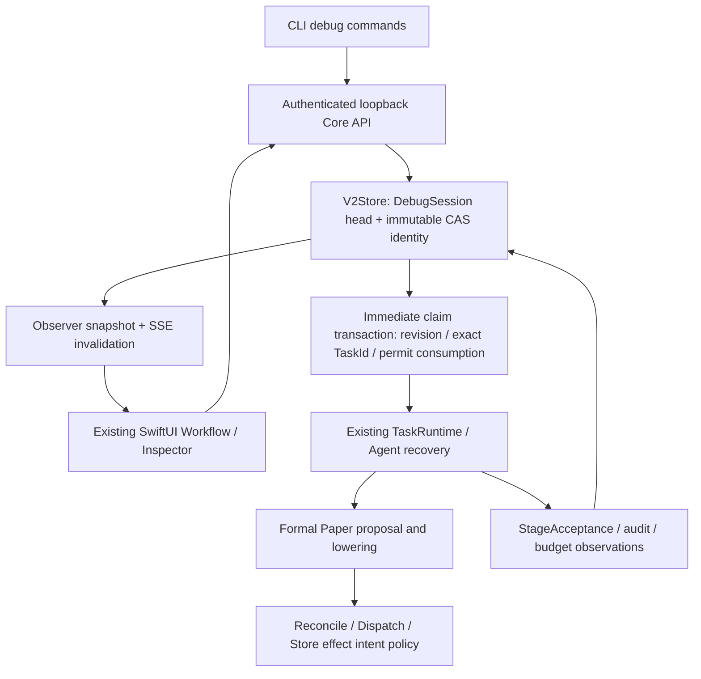

# 分流程 Debug 基础设施：第一阶段实施报告

范围：实现并离线验证调度、恢复、观测和安全基础设施。没有运行真实 LLM 全链路，没有发送真实 Paper 订单，没有执行真实跨交易日 T1/T3/T5 或学习晋升。本文中的 PASS 仅指明示的基础设施验证。

## 1. 源码事实

| 修改前事实 | 源码证据（当前文件位置） |
|---|---|
| 正式 Paper 是 Rust 固定三组 Analyst/Critic，Synthesizer 同时依赖三组 Claim/Critique；没有首轮 Planner | `crates/akzio-runtime/src/runtime/workflow.rs:247` 的 `approved_paper_proposal`，`planner/lowering.rs` 的正式 lowering |
| 旧 Debug / PaperDryRun 从 bootstrap Planner 开始，Planner 再扩展研究任务，不能代表正式 Paper 拓扑 | `crates/akzio-runtime/src/runtime/workflow.rs:7`；新的 fixture-controller 明确保留此 CI 入口 |
| 所有 worker 原先从全局合法 ready 集合 claim，没有指定 Task 的持久化放行权 | `crates/akzio-store/src/store/workflow/commits.rs:188` 的 `claim_next_task_for_workload_with_identity`；现在在同一事务中增加 Debug 条件 |
| 旧 run retry 创建新的 RunId 并重新 bootstrap，不是原 Run resume | `crates/akzio-runtime/src/runtime/replay.rs:14` |
| Agent 已有 continuation、Draft/Submit、工具回读和恢复预算，恢复必须经过 guard | `crates/akzio-research/src/agent/runtime_run.rs:159`、`runtime_type.rs:258`；本次继续调用原恢复逻辑 |
| PaperCommit 持久化 Commitment，Reconcile 才调用 PaperDispatchRuntime；真正 Broker HTTP 在 AlpacaPaper adapter | `crates/akzio-daemon/src/application/paper_execution.rs:548`、`:584`、`crates/akzio-execution/src/paper_dispatch.rs:139` |
| 原 Outcome adapter 启用条件与 auto_paper 耦合，旧完成 Run 也可能没有后续 worker | `crates/akzio-daemon/src/orchestration/bootstrap.rs:79`；现在按 outcome_processing + Alpaca adapter 判断 |
| App 已有认证 Observer snapshot、SSE、Workflow Inspector、Timeline；正式多个 Critic 曾被相同 stage.id 合并，真实 App 中触发 duplicate-key 崩溃 | `apps/Sources/ObservatoryKit/LiveData/LiveProjection.swift`、`Features/Overview/SignalUniverseLayout.swift`；现在保留唯一 TaskId |
| 原 HTTP graceful shutdown 不结束 SSE，会让 Core 停止等待、App 继续显示 Connected | `crates/akzio-daemon/src/http.rs:142`；现将关闭信号传递给两类 SSE，专门回归测试 |

没有降低 Evidence/Context/Contract、校准、风险、资金、审批、报价、Paper 幂等或学习资格要求。Domain 业务 schema 10、Contract 20、Prompt bundle 14 保持不变。

## 2. 最终设计



正式 DAG 决定合法依赖和业务内容；Debug 只控制合法节点何时被领取。身份、版本、数据集、父产物等放在不可变 RunScoped CAS；小型 `rebuild_debug_sessions` 表只放可变调度 head。Agent checkpoint 继续由原轨迹与恢复规则重建，Debug budget snapshot 只是观测记录。

Store schema 升至 16，新增 DebugRecord 和控制表。旧 running task 或有效 daemon lease 阻断升级；既有旧 Contract 检查仍保留。没有重写旧 CAS、Contract hash、Commitment 或订单序列化。

## 3. 修改文件

| 文件 / 文件组 | 内容与原因 |
|---|---|
| `crates/akzio-domain/src/debug.rs`、`artifact.rs`、`event.rs`、`lib.rs` | 统一 Debug 身份、状态、动作、Acceptance、17 类检查；受限 RunScoped DebugRecord 与生命周期事件 |
| `crates/akzio-store/src/store/debug.rs`、`store.rs`、`store/prelude.rs`、`store/blob.rs`、`lib.rs` | 持久化控制、CAS 修订、只读 inspect、脱敏、预算观察、schema 16 |
| Store `workflow/commits.rs`、`workflow/outputs.rs`、`impl_workflow.rs` | 所有 claim / 完成 / Deferred / Retry / 恢复路径统一消费、归还单步控制权 |
| Store `execution.rs`、`learning/outcome.rs`、`learning/policy.rs`、`lesson/write.rs` | effect intent 写保护、历史 Outcome worker 修复、canonical learning 隔离 |
| Store `free_validation.rs`、`free_policy_helpers.rs`、`doctor.rs` | DebugRecord 的精确 producer / 生命周期 / 引用校验，保持原业务类型校验 |
| `crates/akzio-runtime/src/runtime/task.rs` | identity-aware claim 与独立 Outcome workload 开关 |
| Daemon `debug.rs`、`http_debug.rs`、`http.rs`、`lib.rs` | 同一 prepare / inspect / control / fork / acceptance API；认证、Origin 拒绝、SSE 正常关闭 |
| Daemon `orchestration/bootstrap.rs`、`control.rs`、`workers.rs`、`health_canary.rs`、`scheduler/scheduler_core.rs` | 新隔离 Core、正式 builder 复用、旧入口边界、Outcome 与新 T0 解耦、隔离学习维护 |
| Daemon `application/paper_execution.rs`、`outcome/worker.rs` | 真正 Dispatch 前阻断、T5 隔离封存不晋升 |
| Model `lib.rs`、`responses.rs`；Research `agent/model_types.rs`、`runtime_helpers.rs`、`runtime_run.rs`、`runtime_type.rs` | 补 provider request ID、requested/actual model、ReadGrant 观测和预算；复用已有调用审计与 recovery |
| Execution `paper_dispatch.rs`、`paper.rs`、`paper/recovery_tests.rs` | Dispatch 的第二层 policy 检查；本地 TCP 券商丢 ACK 恢复测试 |
| CLI `cli/debug_commands.rs`、`main.rs`、`dispatch.rs`、`run_commands.rs`、`http_client.rs` | Debug 命令、fixture Core、原控制客户端复用；inspect 只读取已有认证 token |
| App `LiveData/DebugPayloads.swift`、`App/ObservatoryStore.swift`、`App/AppShell.swift` | Core decoder / 控制 transport、隔离 Core 连接、环境横幅和断线真实状态 |
| App `Features/Workflow/DebugWorkflowPanel.swift`、`WorkflowPage.swift` | Debug 控制、唯一 Task 行、阶段 Inspector、Acceptance、多个 Run 双时间轴 |
| App `LiveProjection.swift`、`WorkflowPresentation.swift`、`SignalUniverseLayout.swift` | 正式多角色 DAG 的节点/边/Inspector 全部保留 TaskId，修复真实 App 崩溃 |
| `apps/Tests/ObservatoryKitTests/DebugDecoderTests.swift`、`Package.swift` | 可在当前 CLT 环境执行的 Swift decoder / 身份 / 图投影检查 |
| `scripts/update_app_and_submit_debug.sh`、`apps/Scripts/build_app.sh` | 支持保留构建产物、新 bundle 路径和独立 Cargo target；沿原正式流程编译与签名 |
| `config/debug-controller-fixture.toml`、README、CONTEXT、AGENTS、本报告 | 可复现的离线入口、版本和边界说明 |

`PageSidebar.swift`、`RunStatusBar.swift`、DesignSystem 的同时发生的外观修改属于已有并行工作，保留，不计为本次 Debug 功能实现。

## 4. 新 Debug 命令

以下命令在仓库根目录执行。演示二进制保存在 `.akzio/phase1-evidence/akzio-core`；复制是为了重启时使用完全相同的 runtime identity，避免重新编译后冒充同一实验。

```bash
.akzio/phase1-evidence/akzio-core --config config/debug-controller-fixture.toml debug serve-fixture
# 第二个终端
.akzio/phase1-evidence/akzio-core --config config/debug-controller-fixture.toml debug prepare --session phase1-controller --fixture-controller
.akzio/phase1-evidence/akzio-core --config config/debug-controller-fixture.toml debug nodes c3dee75d54a546f1
.akzio/phase1-evidence/akzio-core --config config/debug-controller-fixture.toml debug step c3dee75d54a546f1 --task e0fb1908fc484470 --wait-seconds 60
.akzio/phase1-evidence/akzio-core --config config/debug-controller-fixture.toml debug inspect c3dee75d54a546f1 --task e0fb1908fc484470
.akzio/phase1-evidence/akzio-core --config config/debug-controller-fixture.toml debug step c3dee75d54a546f1 --task d490ddf583fd4d3d --wait-seconds 60
```

上面两个 Task 已成功，再执行 Step 会正确拒绝。要复现完整动作，应先 prepare 新 fixture Run，再从 nodes 取返回的唯一 ID。命令中的 `--wait-seconds` 是只读等待服务端状态，超时不撤回或重新发 permit。

其余真实实现的命令形式：

```text
akzio debug pause <run_id>
akzio debug resume <run_id>
akzio debug retry-node <run_id> --task <task_id>
akzio debug inspect <run_id> --attempt <attempt_id>
akzio debug fork <run_id> --task <successful_task_id> --reason <reason> [--experiment-id <new_run_id>]
akzio debug experiment <run_id> --reason <reason> [--experiment-id <new_run_id>]
akzio debug acceptance <run_id> --input <stage_acceptance.json>
akzio debug prepare --session YYYY-MM-DD [--paper-allowed]
```

正常真实模型 Debug 使用生产 Responses 配置、全新隔离 Store、`debug_control=true`、`auto_paper=false`，按既有 `daemon serve` 启动；不使用 serve-fixture。App 用以下环境连接指定 Core：

```bash
AKZIO_DEBUG_ENDPOINT=http://127.0.0.1:17342 \
AKZIO_DEBUG_STORE_ROOT="$PWD/.akzio/debug-controller-store" \
apps/dist/debug-phase1-ready/akzio.app/Contents/MacOS/AkzioObservatory
```

API：`GET /v1/debug/runs`、`GET /v1/debug/runs/{run}?task=...&attempt=...`，`POST /v1/debug/runs`、`/{run}/control`、`/{run}/fork`、`/{run}/acceptance`。GET inspect 同时包含 nodes、Acceptance、事件时间轴；不重复建立三套投影端点。控制请求必须提供 `expected_revision`。

## 5. Debug 状态机

| 起点 / 操作 | 条件和终点 |
|---|---|
| prepare | graph + 身份 + paused head 在同一事务发布 → Paused |
| Running → pause | 立刻阻止新 claim；已有 attempt 保持原 lease 和 future → PauseRequested |
| PauseRequested | 最后一个在途 attempt 在成功、失败、Deferred、Retry 或恢复边界关闭 → Paused；没有在途则直接 Paused |
| Paused → step TaskId | revision、Run、依赖、due time、runtime identity 合法；仅保存指定 permit → Stepping |
| Stepping → claim | 唯一 task、唯一 active attempt；与 Attempt insert 原子消费，不放行 sibling |
| Stepping → attempt 关闭 | 自动 Paused；成功、失败、Deferred 均是一调度单位，不自动重试 |
| Paused → resume | 同一身份 → Running / continuous，沿正常 DAG claim |
| Running → 无 queued/running task | Completed；若后续合法 Outcome worker 入队，恢复 continuous 或 manual 对应状态 |
| Abort | Core 内部控制动作，阻止继续放行；已有业务取消/恢复规则不被替代 |

Manual 模式最后一个 T0 节点结束仍显示 Paused，业务 workflow completed 单独展示。Outcome 的未来 due time 不是依赖伪造；未到期显示 not_due_until。修改关键代码、Contract 或模型身份后，Inspect 仍可用，执行返回 runtime_identity_changed。

## 6. Resume / Retry / Fork / New experiment

- **Resume**：同 Run、同 Task 历史和原恢复 guard；不清空预算或成功输出。crash 后过期 lease 走原 abandoned/recovery 关系，手动 step 被消费过时先停住，不自动另领 sibling。
- **Retry failed attempt**：只放行原 retry policy 已重排且 due 的失败/abandoned Task。新 epoch / Attempt 保留旧 retried/failed 历史；耗尽次数、不可重试或成功节点明确拒绝。不得借手动重试扩充业务预算。
- **Successful fork**：要求指定 Task 真正 succeeded 且有输出；新 RunId、TaskId 和 CAS 身份引用父 Run/Task/Artifact/reason。新研究图重新采集证据，不覆盖旧产物、不复制 Paper 执行权。使用正式 proposal/lowering 的非 Paper purpose 分支，因此不是把成功产物“就地重跑”。
- **New experiment**：不要求伪造成功父节点，引用父 WorkflowGraph 建立新研究身份，使用当前模型/Contract/代码，重新创建 EvidenceNeeds。CLI 和 App 有独立入口，API 复用 fork 构造器（无 task_id）。同 experiment_id 重复请求一致性校验，冲突不创建第二份。

取舍：成功 fork 与新实验只创建非 canonical 研究图；要进行正式 Paper/Outcome 调试应创建隔离的正式 Paper session。没有更改 `purpose == Paper` 来让 Debug purpose 获得 Paper/学习权限。

## 7. Paper Safety

`broker_write_policy=forbidden` 是创建时的默认值且属于不可变实验身份。普通生产 Observer 不能创建或操作 DebugSession；标记过的 Store 不能重新作为生产 Store 打开。Debug Core 禁止 `auto_paper=true` 和默认 `~/.akzio/store`。

真正拦截顺序：Reconcile 已读到合法 Accepted verdict 和 Commitment → 保存独立 Debug policy BLOCK 验收 → Deferred 并暂停。Dispatch 入口再次检查；Store `record_paper_effect_intent` 最终统一覆盖提交、取消、改价。`Business prerequisites: PASS` 只指已有上游 Accepted/Commitment；还未运行的后续报价/调度检查不据此声称通过。

显式 `--paper-allowed` 只是移除 Debug 调度限制，原审批、身份、账户、资金、报价、session、风险、幂等继续适用。禁写 session 不能被 UI 原地改成允许。

已有 crash 恢复继续使用相同 client_order_id、Commitment、effect intent 与 query/reconcile。T11 在本地 TCP 假 Broker 中真实模拟 POST 已接受但响应断开；新 adapter 实例查询原 ID 取回订单，观测到总共 **1 次 POST**。没有真实 Alpaca 网络或真实经济订单。

## 8. Outcome / Learning Isolation

`auto_paper` 控制新 T0；`outcome_processing` 与 Alpaca evidence adapter 控制已存在 Outcome。启动时查找已完成 Paper Run 的原成功 OutcomeSchedule，为缺失 worker 的历史记录幂等补排；保留原成功 attempt/output 证明，不复活失效写许可，不创建新 T0。

既有 Outcome worker 每次处理一个待完成阶段并 Deferred 到下一 due boundary。Debug Step 因此可按同一 worker Task 的实际 T1/T3/T5 阶段逐次放行，Core Inspector 显示当前 horizon。未满足真实 session、数据、cutoff 或租约要求会阻断；本阶段没有用伪造日历让它通过。

隔离 Store + run learning scope 双边界：T5 可以保留隔离的原数值/叙事，不能进入 canonical fenced policy evaluation；Active/Contested Lesson 写入和激活被 Store 拒绝。Paper purpose、sealed、风险真值和 reviewer independence 保护保持原义。没有创建另一套正式学习数据库。

实验的跨 Run 引用只在已登记隔离身份和完全相同的 EvidenceNeed 内容之间成立；Doctor 与写入事务共用精确验证。新实验复用正式 setup 生命周期事件写入 helper，因此新 EvidenceNeed 也可由事件日志完整追溯。此规则不授予 Agent 读取父 Run 材料的权限。

## 9. App 改造与实际 UI QA

扩展现有 Workflow 页面、ObserverClient、Stage Inspector 和 SSE。新增环境横幅（endpoint、Store、purpose、LLM、Broker、learning、代码），Pause/Resume/Step/Retry/Inspect/Prepare/新实验，多个 Run 的 T0 与 T1/T3/T5 时间轴，输入/ReadGrant/模型调用/Draft/Tool/Submit/输出/预算/Acceptance。

Debug 区域具备垂直滚动，可访问全部节点和展开的长调用记录；隐藏无作用的画布工具栏。readiness、step_eligible、retry_eligible、allowed_actions 和 blocked_reason 全由 Core 返回，Swift 不计算业务依赖。Acceptance 同时显示 business result 与 test result，计数并可展开 expected/actual/evidence/message。未运行的业务验收明确 NOT_RUN。脱敏由 Core 完成；API key、认证 header、Broker secret、token 和 provider encrypted_content 不投影。

实际启动签名的 macOS App，并在隔离 Core 中点击 Prepare fixture、Step Planner：Run `83d222532f414863`，Task `c914da5b6bea47df`，先 Stepping、后 Paused。CLI `app-step.json` 证实只有这一成功 Attempt，其他节点未执行。正式三 Critic 图在真实 App 中发现的两个重复键崩溃已修复，decoder/projection 检查防止回归。

最终签名版的断线/重连已实际验证，且 Core 正常退出、重启后的同一 session 和 attempts 逐项一致；记录见 `.akzio/phase1-evidence/app-after-restart.json`。App 不回退 mock；曾连接过时保留旧数据并标注 Stale / Last update / controls disabled，首次连接失败显示 Offline / UNVERIFIED。

## 10. 自动化测试

| ID / 测试名 | 验证内容 |
|---|---|
| T01 `t01_pause_prevents_new_claims_and_drains_without_cancelling` | 暂停阻止新领取，并等待在途持久化边界 |
| T02 `t02_exact_step_never_releases_sibling_or_downstream` | 精确 Task 单步；合法 sibling、下游均不抢跑 |
| T03 `t03_eight_connections_atomically_consume_one_permission` | 8 个独立 Store 连接竞争最多一个 claim |
| T04 `t04_duplicate_step_cas_and_late_replay_conflict` | 并发、重复和迟到重放 CAS 冲突 |
| T05 `t05_unsatisfied_dependency_is_blocked` | 未完成依赖不可绕过 |
| T06 `t06_pause_and_consumed_step_survive_restart_and_recovery` | 重开 Store、过期 lease、已消费 step 恢复 |
| T07 `t07_resume_keeps_success_and_requires_matching_runtime` | 成功不重跑，缺失/变化 runtime identity 不执行 |
| T08 `t08_retry_preserves_attempt_history_and_limits` | 旧失败 attempt 与新成功 attempt 同时保留 |
| T09 `t09_successful_fork_keeps_parent_outputs_and_new_lineage` | 成功 fork 的不可变输出与新 lineage |
| T10 `t10_default_policy_blocks_at_store_authority` | 默认禁写在 Store 权威层拒绝，并记录 policy BLOCK |
| T11 `t11_accepted_request_lost_ack_recovers_by_original_id_without_second_order` | 本地真实 HTTP 丢 ACK，原 client_order_id 恢复、一次 POST |
| T12 `t12_old_completed_paper_schedule_is_discovered_without_new_t0` | 新 T0 关闭时发现旧 Outcome，幂等补 worker |
| T13 `t13_isolation_cannot_be_reopened_as_production` | 标记不可取消、有效 Active Lesson 与 fenced policy 均拒绝 |
| T14 `t14_readonly_inspect_and_acceptance_keep_business_and_test_separate` | inspect 无事件写入，Rejected/PASS 分离，Acceptance 幂等 |
| T14 HTTP `t14_http_control_inspect_acceptance_match_store_and_reject_browser` | 真实 loopback API 与 Store 一致，认证、Origin、CAS、step/resume |
| `formal_prepare_reuses_approved_topology_and_forty_needs` | 13 节点、40 EvidenceNeeds、三期限、无 Planner、prepare 幂等 |
| `new_experiment_does_not_require_fabricating_a_successful_parent` | 首节点尚未执行也可建新实验，父 Run 不改 |
| `production_observer_cannot_prepare_debug` | 普通 Observer 禁止 Debug 控制 |
| `inspect_redacts_credentials_but_retains_usage_and_risk_prose` | 凭证脱敏，不误删 token usage |
| `production_constructor_rejects_live_and_loopback_before_io` | 生产 Alpaca adapter 在网络前拒绝非 Paper endpoint |
| `observer_and_run_sse_close_on_graceful_shutdown_without_changing_control` | 两类 SSE 及时关闭，Store 控制与 Task 不改变 |

Swift 3 项检查：Core readiness 必填且不推断；Decoder 保留 identity / revision / business 与 test 分离；仅允许 loopback。另用实际 Core JSON 验证三 Critic 的 Workflow 与 Overview TaskId 全部唯一。

## 11. 实际命令结果

完整 workspace 最终通过 **21 项测试（22 suites）**，包括 Doctor 覆盖的新实验、成功 fork 和双 SSE 关闭测试。当前 macOS CommandLineTools 不提供 XCTest 模块，`swift test` 的尝试失败，因此使用仓库内可执行的 Swift contract checks，不能把它描述成 XCTest 通过。

可重复的安全检查：`cargo fmt --all`、`cargo check --workspace`、`cargo clippy --workspace --all-targets`、`cargo test --workspace`、`swift run --package-path apps DebugContractChecks`。App 沿原 `scripts/update_app_and_submit_debug.sh` 编译内置 Rust core 并签名；使用 preserve 模式和新的 bundle 路径避免递归删除。

离线演示证据：`.akzio/phase1-evidence/prepare.json`、`nodes-before.json`、`step-a.json`、`inspect-a.json`、`after-restart.json`、`step-b.json`、`after-b.json`、`formal-nodes.json`、`app-step.json`。这些是 CLI/API 实际输出，不是构造的“示例成功日志”。第一次位于 target 的记录被并行打包清理；已在独立忽略目录完整重做。中间开发 Store 保留于 `.akzio/phase1-development-store`，最终演示使用全新 `.akzio/debug-controller-store` 并通过 Doctor，不改写开发中失败实验的历史。

演示 Run `c3dee75d54a546f1`：A Planner `e0fb1908fc484470` 成功 → Paused → 同二进制重启，session/attempt 逐项相同 → B Evidence `d490ddf583fd4d3d` 成功 → Paused；总计 2 Attempts，其余节点 0。正式拓扑 Run `9f5b645474ad43af` 仅 prepare，13 个节点全部 0 Attempts。


| 实际命令 | 结果与证据 |
|---|---|
| `cargo fmt --all` / `cargo fmt --all -- --check` | PASS；退出 0 |
| `cargo check --workspace` | PASS；退出 0，`cargo-check.log` |
| `cargo clippy --workspace --all-targets` | PASS（退出 0）；只有原 `akzio-learning/src/evaluation/outcomes.rs:97` 的 `too_many_arguments` 一条警告，`cargo-clippy.log` |
| `cargo test --workspace` | PASS：21 passed、22 suites，`cargo-test.log` |
| `swift run --package-path apps DebugContractChecks ...` | PASS：3 checks + 实际 Core JSON + 正式三 Critic 图唯一 ID，`swift-checks.log` |
| `scripts/update_app_and_submit_debug.sh`（preserve，新 bundle，独立 Cargo target） | PASS：Swift release、Rust release、内置 core、ad-hoc codesign 校验，`app-build-final.log` |
| `run fixture-debug`（独立 Store） | PASS：completed，`fixture-debug.json`；fixture 不是实际模型 |
| `store doctor`（含两次单步、fork、新实验、Acceptance、App 单步） | PASS：`doctor.json` 中 `ok: true` |
| 真实 macOS App 操作 | PASS：prepare、step、inspect、历史选择、Stale/禁用按钮、重连、滚动与长轨迹展开，`native-ui-qa.md` |

最终分发包：`apps/dist/debug-phase1-ready/akzio.app`。该 App 正通过显式环境连接 `.akzio/phase1-evidence/akzio-core`，Core 的测试 Store 为 `.akzio/debug-controller-store`。所有演示 Run 保持 Paused。构建后源码说明文档的更新不会修改已冻结的 Run identity；需要继续已有实验时使用其原二进制，换用重新编译的 Core 应创建新实验。

## 12. 未完成项与工程取舍

- **NOT_IMPLEMENTED（可选）**：`until` dependency closure；Agent 内部 DraftPersisted / SubmitReceived 的可暂停断点。P0 Task 调度单位已实现；Draft/Submit 仍可观察，未为断点重写稳定 Agent runtime。
- **NOT_IMPLEMENTED（有意限制）**：在成功父 Run 上就地重跑、重置耗尽预算、原地提高 Broker 权限、Debug canonical learning 晋升。这些操作由新实验或既有业务权限路径承担。
- **NOT_TESTED**：没有对用户现有生产 Store 执行 v15→v16 升级；本次验证使用隔离 Store。升级时旧 running task / 有效 daemon lease 的阻断规则属于实现约束，不能把新 Store 测试说成生产迁移演练。
- **NOT_TESTED / NOT RUN in phase 1**：真实 Responses 费用/usage、真实 Analyst/Critic/Synthesizer 全链、真实 Paper dispatch、真实跨交易日 T1/T3/T5、真实学习晋升和 Canary。基础设施不把 Fixture 标记为 real。
- **BLOCKED（工具能力）**：当前 CLT 缺 XCTest；用已运行的 Swift 可执行检查与真实原生 App QA 覆盖本阶段接口与图投影，未声称 XCTest 通过。
- Broker 丢 ACK 是本地协议模拟，不等于真实 Alpaca 故障演练。Outcome 独立推进测试证明发现/排队与控制，实际收益和跨日学习留到第二阶段。
- 默认仅支持新隔离 Store，不能接管运行中的生产 Run。该选择把控制授权与生产隔离落实在 Store，而非只靠 CLI/App。

## 13. 第二阶段准备状态

进入第二阶段时仍应使用原业务 EvidenceGate、真实时间和审批，逐步人工检查，不将本报告视为真实交易验收。


| 能力 | 状态 | 本阶段证据边界 |
|---|---|---|
| 正式 workflow 可逐阶段执行 | PASS | 复用正式 builder；13 节点、40 needs、三期限；统一 Store 控制 |
| 指定 Task 单步 | PASS | CLI / App 实际执行指定 Task |
| 多 worker 不抢跑 | PASS | 8 连接并发测试及 8 worker 演示 |
| Pause 跨重启 | PASS | 同 session / attempt 历史逐项保持 |
| Resume | PASS | 原身份恢复，成功不重跑，预算恢复不改 |
| Retry failed stage | PASS | 原 policy / due / 限额，新 Attempt 保留历史 |
| Successful stage fork | PASS | 新 Run lineage，旧输出不变，Doctor 通过 |
| Inspect | PASS | 只读 API/CLI，脱敏，Task/Attempt 定位 |
| LLM provenance 可观察 | PASS | Responses 元数据接线 + 既有审计；真实返回尚未调用 |
| Broker debug safety | PASS | Store/Dispatch 拦截 + 本地丢 ACK 恢复；没有真实订单 |
| Outcome 独立推进 | PASS | 原 Paper Schedule 发现和 worker 入口；未等实际 T1/T3/T5 |
| Learning isolation | PASS | 隔离 Store 拒绝 canonical policy / Active Lesson |
| Observer API | PASS | 认证、Origin、CAS、读写一致、SSE 停止 |
| SwiftUI Debug UI | PASS | 原生签名 App 实操，离线真实状态、滚动 Inspector |
| Acceptance persistence | PASS | 自动 NOT_RUN 与人工控制器 PASS 分离，CAS + 事件 |
| 可以进入真实 LLM 分阶段 Debug | **YES** | 仅表示基础设施就绪；不表示真实模型/Paper/学习已验收 |

交付分级：**implemented + offline-verified**。`real-Paper-verified` 与 `outcome/learning-verified` 为 **NOT RUN in phase 1**。
